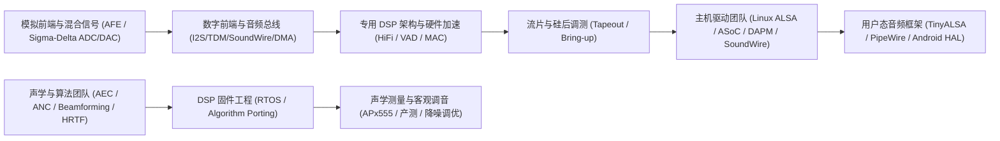

# 00 总览与学习路线（原厂视角）

从 [知识体系、掌握标准与面试追问](01-review-and-evidence-map.md) 开始；优先用 [PCM 端到端案例](../Case-Studies/06-pcm-clock-buffer-evidence.md) 练习算时钟、缓冲和供数裕量，再进入专业模块。

## 原厂研发分工与全局视角

在音频芯片原厂（如 Cirrus Logic、TI、Realtek、高通、联发科、恒玄 BES 等）与整机系统工程团队中，一款音频芯片或子系统的研发涵盖从物理微弱电信号调理到最终上层声学场景渲染的完整垂直链路：



---

## 三条原厂核心学习路线

### 路线 1：底层驱动、系统软件与 Linux 内核线（Driver & System Software Track）
- **核心目标**：精通 Linux ALSA/ASoC 框架（Machine/Platform/Codec）、DAPM 音频通路编排、DMA 环形缓冲区设计，具备秒级定位 XRUN 欠载与爆音排查能力。
- **推荐路径**：
  ```text
  01 音频总体架构 → 02 I2S/TDM/SoundWire 协议 → 05 音频 DMA 与 FIFO 缓冲
  → 09 Linux ALSA/ASoC 驱动体系 → 10 /proc/asound 与 Trace 调测
  → Labs 02 虚拟声卡驱动跟踪 → Case-Studies 01/02
  ```

### 路线 2：芯片架构、微架构与模拟混合信号线（Silicon Architecture Track）
- **核心目标**：掌握 Sigma-Delta 调制与噪声整形、双音频分数 PLL 与 Jitter 抑制、Audio DSP/TCM 微架构、ASRC 采样率转换与防爆音（Anti-POP）电路机制。
- **推荐路径**：
  ```text
  01 芯片架构与 Bring-up → 03 AFE 与 Sigma-Delta Codec → 04 Audio DSP 微架构
  → 06 双 PLL 时钟与 ASRC → 07 低功耗与防爆音 → Cross-Topics 01~04
  → Labs 01 I2S 时序波形仿真
  ```

### 路线 3：声学算法、前处理与硬件加速调优线（Acoustic & DSP Optimization Track）
- **核心目标**：掌握回声消除（AEC）、自适应波束成形（Beamforming）、主动降噪（ANC）、硬件 VAD 以及定点 DSP 汇编/内在函数算力优化与 Audio Precision 仪器调音。
- **推荐路径**：
  ```text
  01 信号链总览 → 04 音频 DSP 专有指令 → 08 AEC/ANC/降噪核心算法
  → 10 AP 仪器测试与 FFT 频域分析 → 11 TWS/车载/智能音箱场景
  → Labs 03 定点 LMS 自适应回声消除算子
  ```

### 路线 4：RTOS 嵌入式多媒体、软件编解码与大模型语音线（RTOS & Edge Voice AI Track）
- **核心目标**：掌握 minialsa 嵌入式驱动抽象、多媒体流水线（Pipeline）、MP3/AAC/Opus 格式解码与定点化、SRAM/PSRAM 异构内存裁剪（<50KB）、RISC-V 专用汇编加速，以及 WebSocket 全双工流式大模型语音交互与低延迟打断（Barge-in）。
- **推荐路径**：
  ```text
  01 芯片架构与软硬件边界 → 12 RTOS 嵌入式音频软件栈与 minialsa → 13 软件编解码/流媒体/Voice AI
  → Case-Studies 04 (<256KB RAM 智能音箱) / 05 (Wi-Fi 投屏音画同步)
  → Cross-Topics 05 (重采样高频衰减修复)
  ```

---

## 原厂工程师的四大自查准则

在审阅任何音频子系统电路设计、驱动代码或排查线上音频故障时，必须在软硬件微架构层面清晰回答以下 4 个关键问题：

1. **时钟与相位对齐（Timing & Phase）**：
   - 采样率对应的时钟基准是 24.576MHz（48kHz 系）还是 22.5792MHz（44.1kHz 系）？
   - BCLK、LRCK、MCLK 是否严格同步？是否存在不同晶振域跨时钟访问未经过 ASRC 或异步 FIFO 导致的周期性滑移（Sample Slip）与喀哒声？
2. **缓冲深度与实时时延（Buffer & Latency）**：
   - DMA Period Size 与 FIFO Watermark 如何设置？
   - 在 DDR 发生突发带宽抢占（如 GPU 渲染或 VPU 编解码）时，硬件音频 FIFO 能承受的最长服务延迟（Starvation Threshold）是多少毫秒？
3. **保真度与噪声隔离（Fidelity & Noise Isolation）**：
   - 模拟 AVDD 与数字 DVDD 是否采用隔离磁珠或独立 LDO？
   - 信号地（AGND）与数字地（DGND）是否在 Codec 底部单点星型接地？底噪（Noise Floor）是否达到 -100dBV 以下？是否存在 217Hz GSM 蜂鸣音或 1kHz USB 周期干扰？
4. **瞬态直流与防爆音（POP-Click Suppression）**：
   - 在 Codec 上电、下电或通路切换（DAPM Routing Switch）时，输出直流偏置（DC Offset）是否通过差分斜坡软启动（Soft-ramp）或零交叉检测（Zero-Crossing）平滑过渡？扬声器音圈是否受到脉冲浪涌冲击？
