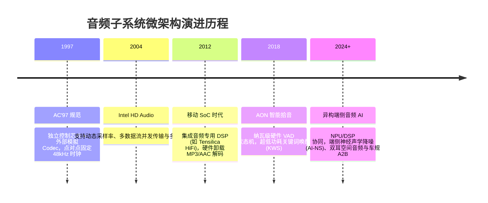
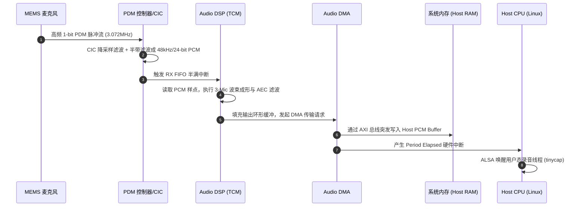

# 01 音频子系统定义与演进

## 1. 硬件解决什么问题：保真度、实时性与微瓦级能效

在现代通用计算与终端设备中，音频数据本身的标称数据吞吐率相较于视频和 3D 图形极其微小（例如双通道 48kHz/24-bit PCM 音频流带宽仅约为 $2.304\text{ Mbps}$，不到 0.3 MB/s）。然而，音频硬件面临着三项极其严苛且相互制约的工程挑战：

1. **确定性硬实时（Hard Real-Time Latency）**：人耳对声音的断续（XRUN / Underflow）与相位抖动极为敏感。哪怕产生仅 $1\text{ ms}$ 的数据缓冲饥饿，扬声器端就会产生极其刺耳的“咔哒”（Click/Pop）噪声。
2. **极高动态范围与信噪比（High Fidelity SNR/DNR）**：人耳听觉范围横跨 $20\text{ Hz} \sim 20\text{ kHz}$，动态范围超过 $120\text{ dB}$。微小的纳伏级（$\text{nV}$）电源纹波或时钟相噪都会直接转化为可闻底噪。
3. **纳瓦/微瓦级常开监听（Sub-mW Always-On Listening）**：移动终端与智能耳机需要在主处理器完全下电断电（Deep Sleep / Power-Down）的状态下，依靠专属超低功耗常开硬件（AON Domain）持续监听环境语音唤醒词（Wake Word），整机静态功耗常要求低于 $500\mu\text{W}$。

---

## 2. 硬件微架构演进：从 AC'97 到异构智能音频 SoC

### 演进各代核心架构特征对比

| 架构代际 | 核心处理单元 | 数据互联接口 | 典型功耗 | 软硬件架构复杂度 |
| :--- | :--- | :--- | :--- | :--- |
| **第一代 (AC'97 / I2S 直连)** | Host CPU 直接通过 DMA 搬运 | AC-Link / 传统 I2S | 50mW ~ 150mW | 极低：主机内核驱动直接打通 Codec |
| **第二代 (Audio DSP 协处理器)** | 专用定点/浮点 DSP (HiFi 3/4) | AXI/AHB 总线 + TDM | 15mW ~ 50mW | 中等：Host-DSP 共享内存与 RPC 消息通信 |
| **第三代 (AON 智能异构岛)** | HW VAD + NPU + 多核 DSP | MIPI SoundWire + PDM | < 1mW (AON) | 极高：跨电源域唤醒、DPCM 动态拓扑解耦 |

---

## 3. 软件可见接口：三层软件可见控制架构

在现代音频 SoC 中，软件对硬件的控制呈现清晰的分层访问结构：

1. **主机 AP 侧（Host CPU / Linux Kernel）**：
   - 可见寄存器：Audio Subsystem Reset/Clock Gating 控制器、Host-to-DSP Mailbox、音频 DMA 通道控制描述符。
   - 驱动模型：Linux ASoC（Machine/Platform/Codec）标准设备节点与 PCM 操作句柄。
2. **音频 DSP 侧（Embedded RTOS / Bare-metal）**：
   - 可见寄存器：I2S/TDM 接口状态寄存器、PDM 抽取系数寄存器、ASRC 分数比率控制字、TCM 紧耦合内存。
3. **混合信号 Codec 侧（Analog Mixed-Signal Peripheral）**：
   - 控制通路：通过 I2C / SPI / SoundWire 控制总线读写模拟 PGA 增益、偏置电压选择、Charge Pump 状态。

---

## 4. 四流全链路分析：麦克风拾音全硬件路径

---

## 5. 软硬件设计约束：PPA 与保真度平衡

- **模拟与数字面积折中**：Sigma-Delta 调制器模拟电容与电阻面积随工艺微缩并不显著，高保真模拟 AFE 往往占据音频 Die 面积的 40% 以上。
- **时序收敛与异步跨域**：I2S/TDM 时钟（BCLK/LRCK）源自专用音频 PLL，与 SoC 系统 AXI 总线时钟完全异步，跨域 FIFO 必须使用格雷码与双触发器同步。
- **功耗预算约束**：在常开待机模式下，仅保留麦克风偏置（MICBIAS）、低偏置 AFE 和极小规模数字判决逻辑，整体静态漏电控制在微安（$\mu\text{A}$）级。

---

## 6. 现场排错与调试清单

| 故障现象 | 物理层排查点 | 控制面/驱动排查点 | 根因分类 |
| :--- | :--- | :--- | :--- |
| **录音完全全零 (Silent Audio)** | 示波器抓取 PDM/I2S DATA 是否有脉冲跳变 | 查看 MICBIAS 偏置电压是否使能输出（通常 1.8V/2.8V） | 供电未使能 / 引脚复用 Pinmux 错误 |
| **音频出现金属杂音与破音** | 逻辑分析仪量测 BCLK 与 LRCK 边沿抖动 | 检查 PCM 采样位深与通道偏移配置（Slot Offset） | 时序错位 / 数据位截断未饱和 |
| **周期性喀哒声 (Click)** | 捕获时钟发现长短周期跳变 | 检查 DMA 缓冲区是否发生 Underrun/Overrun (XRUN) | 调度延迟过长 / DDR 带宽拥塞 |

---

## 7. 实验与验证推演

利用通用音频采样率公式推导 48kHz 音频流参数：
$$f_{\text{BCLK}} = f_s \times \text{Channels} \times \text{Bit-Depth}$$
当 $f_s = 48\text{ kHz}$，立体声双通道（2 Channels），单采样采用 32-bit 容器对齐（实际 24-bit 有效数据）时：
$$f_{\text{BCLK}} = 48000 \times 2 \times 32 = 3.072\text{ MHz}$$
若主系统提供 $24.576\text{ MHz}$ 晶振输入，分频系数为：
$$\text{Div} = \frac{24.576\text{ MHz}}{3.072\text{ MHz}} = 8$$
整数分频因子即可消除任何相位累积抖动，这正是芯片原厂为何必须设置 $24.576\text{ MHz}$ 专用音频主频的物理根源。
