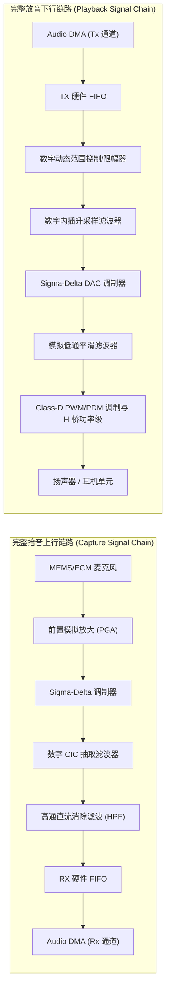

# 02 硬件架构框图与信号链路

## 1. 硬件解决什么问题：端到端模拟到数字的精准映射

音频硬件系统的根本目标是将外界连续的模拟声压波形无失真地转化为数字离散采样序列（ADC 录音链路），并将数字计算生成的离散序列还原为能够推动空气振动的连续功率电信号（DAC 放音链路）。

整个链路必须在纳秒级的时钟精度下保持采样同步，防止任何样点丢失或群延迟抖动。

---

## 2. 硬件微架构与组成：SoC 音频子系统完整 Block Diagram



### 上下行信号链关键级电路参数定义

| 信号链阶段 | 信号物理表现形式 | 核心电气/数字参数 | 硬件设计核心关切 |
| :--- | :--- | :--- | :--- |
| **模拟输入 (Mic In)** | 微弱交流电压 ($10\mu\text{V} \sim 50\text{mV}$) | 阻抗匹配、CMRR > 70dB | 防射频 (RF) 耦合与电磁干扰 |
| **调制转换 (ADC)** | 1-bit 或多 bit 极高频脉冲流 | 过采样率 OSR: 64x ~ 256x | 积分器饱和与时钟孔径抖动 |
| **数字基带 (Digital Baseband)**| 16/24/32-bit 并行 PCM 字 | 采样率 $f_s$: 8k ~ 192kHz | 字长扩展与舍入噪声整形 |
| **功率输出 (Class-D PA)** | 高压 PWM 差分方波 ($3.6\text{V} \sim 12\text{V}$) | 效率 > 90%, THD+N < 0.01% | 开关损耗与 LC 滤波 EMI 辐射 |

---

## 3. 软件可见接口：DMA 与 FIFO 控制寄存器组

在芯片设计中，音频控制器的寄存器映射如下典型结构（以通用 32-bit MMIO 规范为例）：

```c
// 音频控制器基地址定义
#define AUDIO_BASE_ADDR        0x40028000

// 寄存器偏移定义
#define AUDIO_CTRL_REG         0x00  // 控制使能寄存器
#define AUDIO_FIFO_STATUS      0x04  // FIFO 深度与溢出标志
#define AUDIO_RX_DATA_PORT     0x08  // RX 数据读端口 (FIFO POP)
#define AUDIO_TX_DATA_PORT     0x0C  // TX 数据写端口 (FIFO PUSH)
#define AUDIO_DMA_BURST_CFG    0x10  // DMA 突发传输长度与阈值配置
#define AUDIO_IRQ_MASK         0x14  // 中断掩码寄存器

// 寄存器位域定义
typedef union {
    struct {
        uint32_t rx_en         : 1;  // Bit 0: 录音通路使能
        uint32_t tx_en         : 1;  // Bit 1: 放音通路使能
        uint32_t format        : 2;  // Bit 3-2: 00=I2S, 01=Left, 10=Right, 11=TDM
        uint32_t sample_res    : 2;  // Bit 5-4: 00=16-bit, 01=24-bit, 10=32-bit
        uint32_t loopback      : 1;  // Bit 6: 数字内部回环自测使能
        uint32_t reserved      : 25;
    } bits;
    uint32_t val;
} audio_ctrl_reg_t;
```

---

## 4. 四流全链路分析：音频放音（Playback）控制与数据推进流

1. **配置控制流**：Host CPU 通过 AXI-Lite 总线配置 `AUDIO_CTRL_REG`，配置采样率 $48\text{kHz}$、位深 24-bit，并激活 DMA 通道。
2. **描述符地址流**：DMA 控制器从系统 DDR 加载 Scatter-Gather 描述符链表，解析出当前待读取的物理内存基地址与缓冲区长度。
3. **数据搬运流**：DMA 主控发起 64-byte AXI 突发读请求，将 DDR 中的 PCM 数据批量推送到音频发送缓冲 `TX_FIFO`。
4. **事件中断流**：当 DMA 传输完成一个周期的缓冲区数据（Period Elapsed），硬件产生脉冲中断上报 CPU GIC，触发 Linux ALSA 内核回调通知应用程序写入下一帧。

---

## 5. 软硬件设计约束

- **FIFO 深度防饥饿裕量**：SoC 总线在重负载时可能出现长达 $200\mu\text{s}$ 的仲裁等待。若 FIFO 深度仅有 16 样点，在 48kHz 立体声下仅能维持约 $166\mu\text{s}$，必然引发 Underrun。工业级设计通常将硬件 FIFO 设置为至少 64~128 级深。
- **高通滤波器（HPF）截止频率**：ADC 转换后包含微小的直流分量（DC Offset）。数字链路首级必须串接一阶 IIR 高通滤波器，将截止频率设置在 $2\text{ Hz} \sim 5\text{ Hz}$，消除直流偏置防止后续功放喇叭冲程饱和。

---

## 6. 现场排错与调试清单

- **现象：录音出来有持续的嗡嗡声（50Hz/100Hz 交流工频干扰）**
  1. 用示波器测量模拟输入地线是否存在地电位抬升。
  2. 检查麦克风外壳是否良好接地，排查差分拾音线路（MIC+ / MIC-）是否对称走线。
- **现象：播放大音量音乐时喇叭劈音失真严重**
  1. 检查数字域增益是否超过 0 dBFS，引发硬截断（Hard Clipping）。
  2. 启动硬件 DRC（动态范围控制），将阈值设定在 $-1\text{ dBFS}$。

---

## 7. 实验与验证推演：数字高通滤波方程

消除直流偏置的一阶数字高通滤波器差分方程为：
$$y[n] = \alpha \cdot y[n-1] + \alpha \cdot (x[n] - x[n-1])$$
其中系数 $\alpha$ 与截止频率 $f_c$ 和采样率 $f_s$ 的数学映射为：
$$\alpha = \frac{1}{1 + 2\pi \frac{f_c}{f_s}}$$
当 $f_s = 48000\text{ Hz}, f_c = 5\text{ Hz}$ 时：
$$\alpha = \frac{1}{1 + 2\pi \frac{5}{48000}} \approx 0.999346$$
在定点 32-bit DSP 中，$\alpha$ 转化为 Q31 定点格式进行乘累加计算：
$$\alpha_{\text{Q31}} = \text{round}(0.999346 \times 2^{31}) = 2146077583 = \text{0x7FEA8B8F}$$
确保在定点计算中不损失低频相位响应。
