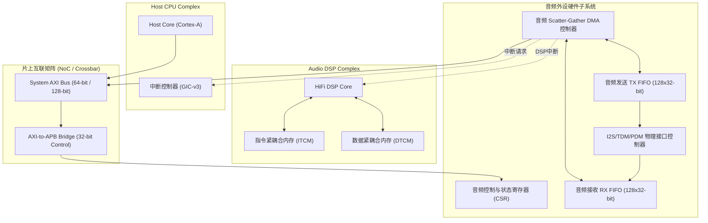

# 03 寄存器空间与总线互联

## 1. 硬件解决什么问题：控制面与高频数据面的物理隔离

音频硬件在 SoC 架构中同时具备两种截然不同的总线通信需求：
1. **控制面（Control Plane）**：主机 CPU（ARM Cortex-A）或安全管理核需要配置音频采样率、声道使能、增益系数、电源状态等低频元数据。要求访问低延迟、寄存器语义强、总线仲裁简单。
2. **数据面（Data Plane）**：PCM 音频流、PDM 脉冲流和 ASRC 插值数据需要以严格的时钟节拍在芯片内外搬运，若直接由 CPU 执行 MMIO 轮询或中断读写，将导致 CPU 频繁被打断并剧烈消耗总线带宽。

因此，现代芯片将控制面挂接在轻量级 AXI-Lite/APB 慢速外设总线上，而数据面则由专有音频 DMA（Audio DMA Engine）直接接入 64-bit/128-bit 高速 AXI 主干总线或 DSP 专用 TCM 总线。

---

## 2. 硬件微架构与组成：总线互联与 MMIO 空间布局



### 寄存器物理地址空间划分（典型 64KB 音频外设 MMIO 空间）

| 偏移地址区间 | 功能模块 | 访问权限 | 典型功能说明 |
| :--- | :--- | :--- | :--- |
| `0x0000 ~ 0x00FF` | Audio Global & Clock Control | Read / Write | 模块全局软复位、音频 PLL 时钟选择、门控时钟使能 |
| `0x0100 ~ 0x01FF` | I2S/TDM Controller 0 (Primary) | Read / Write | 协议格式选择、BCLK/LRCK 分频系数、声道掩码 |
| `0x0200 ~ 0x02FF` | I2S/TDM Controller 1 (Secondary)| Read / Write | 辅助音频接口（如蓝牙语音 SCO/PCM 通道） |
| `0x0300 ~ 0x03FF` | PDM Controller (DMIC Interface) | Read / Write | CIC 降采样比选择、高通滤波参数、增益调节 |
| `0x0400 ~ 0x07FF` | Audio Scatter-Gather DMA Engine | Read / Write | 描述符链表指针、突发传输长度、通道状态 |
| `0x0800 ~ 0x0FFF` | Hardware FIFO Data Window | Read / Write | FIFO 直读直写端口（CPU 调试与无 DMA 场景） |
| `0x1000 ~ 0x1FFF` | Hardware VAD Accelerator | Read / Write | 频段能量阈值、自适应底噪追踪寄存器 |

---

## 3. 软件可见接口：关键寄存器位域定义

```c
// 音频外设全局控制寄存器: AUDIO_GLB_CTRL (Offset: 0x0000)
#define REG_AUDIO_GLB_CTRL        (*(volatile uint32_t *)(AUDIO_BASE + 0x0000))
#define BM_AUDIO_SW_RESET         (1U << 0)   // 写 1 复位所有数字逻辑，硬件自动清零
#define BM_AUDIO_CLK_EN           (1U << 1)   // 音频子系统根时钟使能
#define BM_AUDIO_PLL_SEL          (1U << 2)   // 0: 24.576MHz (48k系), 1: 22.5792MHz (44.1k系)
#define BM_AUDIO_BUS_TIMEOUT_EN   (1U << 3)   // 总线无响应防挂死保护使能

// FIFO 状态寄存器: AUDIO_FIFO_STAT (Offset: 0x0008)
#define REG_AUDIO_FIFO_STAT       (*(volatile uint32_t *)(AUDIO_BASE + 0x0008))
#define GET_TX_FIFO_LEVEL(val)    (((val) >> 0) & 0xFF)  // 当前 TX FIFO 存量样点数
#define GET_RX_FIFO_LEVEL(val)    (((val) >> 8) & 0xFF)  // 当前 RX FIFO 存量样点数
#define BM_TX_UNDERRUN            (1U << 16)             // TX 欠载下溢（扬声器出现爆音）
#define BM_RX_OVERRUN             (1U << 17)             // RX 满载溢出（录音样点丢失）
```

---

## 4. 四流全链路分析：DMA 与 CPU 控制交汇流

1. **控制流**：Linux ALSA 驱动通过 APB 接口写入 `REG_AUDIO_GLB_CTRL` 激活时钟，设置 `AUDIO_PLL_SEL` 锁定 48kHz 系列基准。
2. **地址流**：DMA 读写控制器通过 AXI Master 端口向系统 NoC 发出读取命令，地址由 DMA 描述符的 `src_addr` 提供（指向系统 DDR 中的 PCM 物理内存页）。
3. **数据流**：PCM 音频流从 DDR 经过 AXI Read 通道到达 DMA，并送入 TX FIFO。TX FIFO 经过并串转换器由 SDATA 引脚移位送出。
4. **事件流**：若 AXI 总线因高优先级 GPU/DDR 刷新产生长时间仲裁等待，导致 TX FIFO 计数减至 0，硬件状态机立即锁存 `BM_TX_UNDERRUN`，并向 CPU GIC 和 DSP 触发严重错误中断。

---

## 5. 软硬件设计约束

- **总线时钟与音频时钟的异步跨界**：APB 寄存器总线通常运行在 $100\text{ MHz} \sim 200\text{ MHz}$，而音频控制逻辑运行在 $24.576\text{ MHz}$ 或更低的位时钟（如 $3.072\text{ MHz}$）。写控制寄存器后必须加入至少 2 个音频时钟周期的握手同步（Handshake Synchronization），避免寄存器写入竞态。
- **总线防死锁机制（Bus Hang Protection）**：若外部 Codec 未提供 BCLK/LRCK 且配置为从模式（Slave Mode），音频控制器的写数据端口不得阻断 AXI 总线响应，必须在 256 周期后返回 `SLVERR`（Slave Error）中断以保证主系统内核不发生 Kernel Panic。

---

## 6. 现场排错与调试清单

- **故障：CPU 读写音频寄存器引发系统总线超时挂死（Bus Hang / Kernel Panic）**
  1. 检查音频子系统模块时钟门控（Clock Gate）是否未打开。
  2. 检查音频复位信号是否处于持续拉低（Active-Low）的硬复位状态。
  3. 排查 AXI-to-APB 桥接器是否收到未对齐访问（如对 32-bit 寄存器执行 8-bit/16-bit 乱序写）。

---

## 7. 实验与验证推演：DMA 带宽占用计算

对于一个全双工 8 通道、96kHz 采样率、32-bit 字长（实际 24-bit 填充）的高解析度音频系统：
$$\text{Bandwidth}_{\text{Audio}} = 96000 \times 8 \times 4\text{ Bytes} \times 2 \text{ (全双工 TX+RX)} = 6.144\text{ MB/s}$$
相比于 DDR4/LPDDR5 动辄数十 GB/s 的总吞吐，音频带宽仅占 $0.05\%$ 不到。但其对**访问延迟（Latency）**极其敏感，突发传输请求一旦被阻塞超过：
$$t_{\text{starve}} = \frac{\text{FIFO\_Depth}}{\text{Sample\_Rate} \times \text{Channels}} = \frac{128}{96000 \times 8} \approx 166.7\mu\text{s}$$
系统便会发生硬件欠载（Underrun）。因此在 AXI NoC QoS 配置中，必须将 Audio DMA 通道的优先级配置为 High-Priority（高优先级），抢占普通批处理访问。
