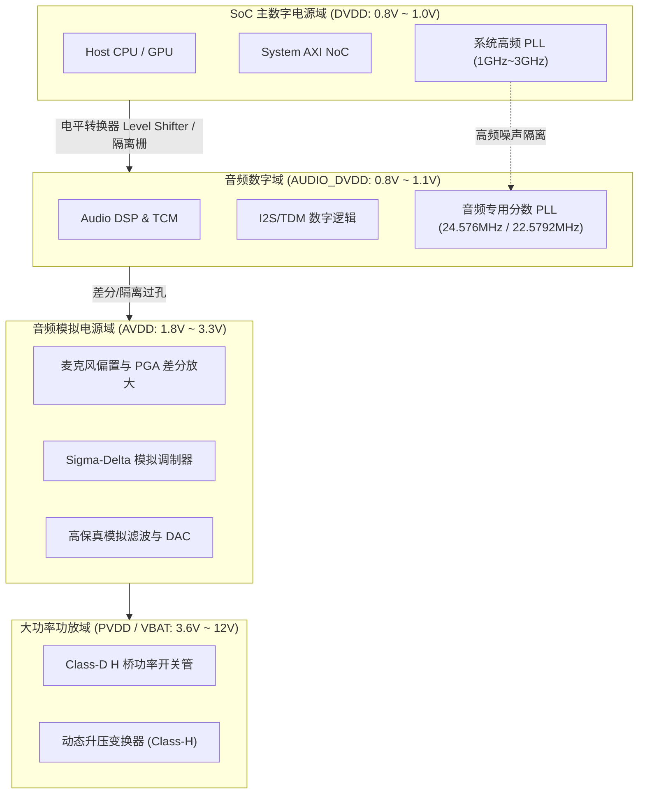

# 04 混合信号时钟与电源域隔离

## 1. 硬件解决什么问题：微弱模拟音频信号对抗数字开关噪声

音频系统的输入信号（如微型麦克风）振幅往往只有几个毫伏甚至数十微伏（$10\mu\text{V} \sim 50\text{mV}$）。而同一颗 SoC 内部的 CPU、GPU 和数字逻辑在吉赫兹（GHz）频率下高速翻转，瞬态电流 $\frac{di}{dt}$ 在电源和地网络上引起数百毫伏的数字开关毛刺（Ground Bounce & Supply Ripple）。

若隔离设计不当，这些高频噪声会直接通过衬底耦合、寄生电容和共用地阻抗侵入模拟音频前端，在扬声器中产生刺耳的“嘶嘶声”（Hiss）、高频嗡鸣以及与 CPU 算力负载直接相关的底噪调制。

---

## 2. 硬件微架构与组成：四域物理隔离拓扑



### 关键电源域与地参考定义

| 电源轨名称 | 典型工作电压 | 允许纹波上限 ($V_{\text{ripple}}$) | 供电拓扑与滤波要求 |
| :--- | :--- | :--- | :--- |
| **DVDD (Core)** | 0.8V ~ 1.0V | 50mVp-p | DC-DC 开关电源，数字逻辑翻转 |
| **AUDIO_DVDD** | 0.8V ~ 1.1V | 10mVp-p | 独立 LDO 或磁珠隔离 LC 滤波 |
| **AVDD (Analog)**| 1.8V ~ 3.3V | **< 10uVrms (20Hz~20kHz)** | 超低噪声高 PSRR 专用 LDO 供电 |
| **MICBIAS** | 1.8V ~ 2.8V | **< 2uVrms (A-Weighted)** | 内部电荷泵 + 极深片上 LDO 净化 |
| **PVDD (Power)** | 3.6V ~ 12V | 200mVp-p | 电池直供或升压 DC-DC，走线粗且远离 AFE |

---

## 3. 软件可见接口：电源域与低功耗控制寄存器

```c
// 音频低功耗与域控制寄存器: AUDIO_PWR_DOMAIN_CTRL (Offset: 0x0020)
#define REG_AUDIO_PWR_CTRL        (*(volatile uint32_t *)(AUDIO_BASE + 0x0020))
#define BM_AVDD_LDO_EN            (1U << 0)  // 模拟 AVDD 内部 LDO 使能
#define BM_MICBIAS_OUT_EN         (1U << 1)  // 麦克风偏置电荷泵与输出使能
#define BM_DSP_POWER_GATE         (1U << 2)  // 1: DSP 核心硬件掉电隔离
#define BM_ANALOG_ISOLATE         (1U << 3)  // 模数接口隔离栅使能（掉电保护）
#define BM_LOW_POWER_SNOOZE       (1U << 4)  // 进入微安级超低功耗常开监听状态
```

---

## 4. 四流全链路分析：模拟前端偏置建立与充放电流

1. **电源控制流**：Linux 驱动在音频开启时，首先向 PMIC 发出 I2C 指令开启 AVDD 模拟轨，随后使能 Codec 片内低噪声 LDO。
2. **偏置充电物理流**：芯片内部带隙基准源（Bandgap Reference）产生 $V_{\text{REF}} = \frac{1}{2} \text{AVDD}$ 的共模参考电压（VCM）。电荷流入外部去耦电容（通常 $1\mu\text{F} \sim 10\mu\text{F}$）。
3. **隔离解耦流**：当 VCM 稳定后，软件解除 `BM_ANALOG_ISOLATE` 隔离栅，使数字抽取滤波器与模拟调制器接口开始同步。
4. **中断反馈流**：若外部模拟供电发生跌落或短路，模拟监控电路通过低压检测（LVD）产生紧急中断，硬件立即自动将扬声器输出下拉至高阻态，避免烧毁喇叭。

---

## 5. 接地与回流：先看器件要求和电流路径

AGND/DGND 引脚命名不意味着必须切割 PCB 地平面。很多混合信号设计适合连续、低阻抗地平面，通过元器件分区和走线控制回流；只有目标器件参考设计明确要求时，才采用相应分割与连接方案。不要随意在地回路串磁珠，也不能假定 EPAD 永远是唯一接地点。

高速信号应保持连续参考路径，避免跨越地缝。PSRR 随频率、偏置和负载变化；若希望把 100 mV 同频纹波压至 10 µV，理想幅度预算需要 80 dB 抑制，但这不是所有 AFE 必须满足的通用规格。

参考：[Analog Devices 对混合信号地平面的说明](https://www.analog.com/en/resources/faqs/faq_dds_digital_and_analog_gnd_planes.html)。

---

## 6. 现场排错与调试清单

- **故障：录音时发现明显的 217Hz 周期性电磁蜂鸣（GSM/LTE 突发射频干扰）**
  1. 麦克风偏置引脚（MICBIAS）外部退耦电容是否紧靠芯片管脚放置（走线寄生电感过大）。
  2. 麦克风差分输入对是否在 PCB 内层走线并由完整的 AGND 参考平面包夹屏蔽。
- **故障：CPU 满载时，耳机能明显听到伴随计算节奏的滋滋声（Coil Whine / Ground Modulation）**
  1. 检查大电流数字回流是否与 DAC/耳放敏感参考路径共享阻抗，按目标板卡接地方案排查。
  2. 示波器交流耦合量测耳放负端地电位，确认是否存在与 CPU 动态电流同步的跳变。

---

## 7. 实验与验证推演：动态范围与热噪声极限

模拟前端的热噪声（Johnson-Nyquist Noise）理论下限公式为：
$$V_n = \sqrt{4 k_B T R \Delta f}$$
其中波尔兹曼常数 $k_B = 1.38 \times 10^{-23}\text{ J/K}$，室温 $T = 300\text{ K}$，音频带宽 $\Delta f = 20\text{ kHz}$。若输入级等效电阻为 $1\text{ k}\Omega$：
$$V_n = \sqrt{4 \times 1.38 \times 10^{-23} \times 300 \times 1000 \times 20000} \approx 0.575\mu\text{Vrms} = -124.8\text{ dBV}$$
这意味着，即使在最理想的无干扰模拟设计中，当信号满量程电压为 $1\text{ Vrms}$（$0\text{ dBV}$）时，输入级热噪声决定的最大动态范围理论极限约为 $124.8\text{ dB}$。任何数模串扰如果超过 $1\mu\text{V}$，都会直接将动态范围拉低到 $115\text{ dB}$ 以下。
