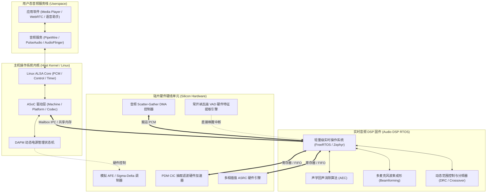

# 05 软硬件分工与分层边界

## 1. 硬件解决什么问题：硬件加速、DSP 固件与 Host 驱动的职责切分

在现代智能音频系统中，一个声学功能（如智能扬声器消除啸叫或 TWS 耳机主动降噪）可以在纯硬件逻辑、DSP 固件或主 CPU 操作系统驱动中实现。

清晰界定三者的分层职责，是决定系统**端到端时延、电池续航、开发迭代速度与系统稳定性**的关键。

---

## 2. 硬件微架构与组成：四层系统职责拓扑



### 软硬件各层技术选型与职责边界划分

| 系统层次 | 驻留计算单元 | 响应延迟要求 | 核心处理职责与边界 |
| :--- | :--- | :--- | :--- |
| **硅片硬线层** | 专有 ASIC 数字逻辑 | **< 10 微秒 ($\mu\text{s}$)** | 采样率超高（MHz级）的固定计算（CIC抽取、ASRC插值、时钟相位锁相、VAD能量阈值比较） |
| **DSP 固件层** | 紧耦合 DSP (HiFi/CEVA) | **1 ~ 5 毫秒 (ms)** | 密集浮点/定点声学前处理（AEC、自适应滤波、麦克风阵列波束、ANC降噪系数迭代） |
| **主机内核层** | Host CPU (Linux) | **5 ~ 20 毫秒 (ms)** | 设备生命周期、时钟与电源树（DAPM）、DMA 环形缓冲区指针维护、总线枚举 |
| **用户态服务层**| Host CPU (Userspace) | **20 ~ 100 毫秒 (ms)** | 声卡混音（Software Mixing）、多音频流路由、策略分发、音频编解码（MP3/AAC/FLAC） |

---

## 3. 软件可见接口：Host 与 DSP 间 RPC 消息协议

主机 CPU 与 Audio DSP 之间通常采用基于**共享内存（Shared Memory）+ 硬件 Mailbox 中断**的高效 IPC 通信机制：

```c
// Host-DSP 间控制消息头部定义
typedef struct {
    uint32_t msg_id;         // 消息唯一标识符
    uint32_t cmd;            // 命令字 (如 AUDIO_CMD_SET_VOLUME, AUDIO_CMD_LOAD_ALG)
    uint32_t payload_size;   // 载荷字节长度
    uint32_t status;         // 执行状态返回码 (0: SUCCESS, 其它: ERR_CODE)
} __attribute__((packed)) audio_ipc_header_t;

// 音量调节载荷
typedef struct {
    audio_ipc_header_t hdr;
    uint32_t stream_type;    // 音频流类型 (0: Media, 1: Voice Call, 2: System Ring)
    int32_t  gain_q24;       // Q24 定点增益格式 (-96dB ~ +12dB)
    uint32_t ramp_time_ms;   // 增益平滑平铺时间 (软淡入淡出防止爆音)
} __attribute__((packed)) audio_set_volume_msg_t;
```

---

## 4. 四流全链路分析：全双工语音通话场景下的分层协作

1. **上行拾音流**：
   - 麦克风信号经硬件 CIC 抽取滤波输出 48kHz PCM；
   - DSP 固件执行多麦波束拾音与 AEC（消除本地播放的声音）；
   - DSP 将去噪后的单声道纯净人声写入共享内存 Ring Buffer；
   - 主机内核 DMA 触发中断，ALSA 将音频帧交付用户态 WebRTC 通话线程。
2. **下行播放流**：
   - 用户态解码远端通话语音（如 Opus 解码），写入 ALSA PCM 节点；
   - 内核 Platform 驱动通过 DMA 将下行数据推送至 DSP；
   - DSP 固件一方面将下行信号推入 DAC 进行功率输出，另一方面**实时拷贝一份副本送入 AEC 作为回声消除参考信号（AEC Reference Signal）**。

---

## 5. 软硬件设计约束

- **参考信号（Loopback Reference）严禁丢帧与漂移**：AEC 算法的收敛速度完全取决于参考信号与扬声器实际输出的严格时钟同步。若参考信号在 Host 或 DSP 软件搬运中出现任何丢帧，AEC 自适应滤波器将立即发散，导致通话对端听到自己极响的回声。
- **DSP 算力墙与内存瓶颈**：Audio DSP 的 ITCM/DTCM 典型容量通常在 256KB ~ 1MB。复杂的深度学习降噪算法（AI-NS）必须在定点化（INT8/INT16）压缩后才能部署在片上 SRAM 中，避免频繁读写片外 DDR 产生巨大的功耗。

---

## 6. 现场排错与调试清单

- **故障：拨打电话时对端能听到明显的自己的声音（回声严重泄露）**
  1. 检查参考信号通路（AEC Echo Reference）是否被开启并正确绑定到硬件 DAC 输出镜像。
  2. 验证参考信号与麦克风采集信号之间的群延迟（Delay Offset）是否固定；若存在动态跳变，说明 DMA 存在丢帧。
- **故障：Host 发送 IPC 指令给 DSP 后无响应超时**
  1. 查看硬件 Mailbox 状态寄存器是否满载未清除。
  2. 检查 DSP 固件是否因除零异常或空指针陷入了 HardFault 死循环。

---

## 7. 实验与验证推演：分层时延分解

计算端到端音频麦克风输入到应用层捕获的理论系统最小延迟：
$$t_{\text{total}} = t_{\text{AFE+CIC}} + t_{\text{DSP\_Frame}} + t_{\text{DMA\_Period}} + t_{\text{ALSA\_Buffer}}$$
若配置参数如下：
- $t_{\text{AFE+CIC}}$（硬件抽取组延迟）：约 $0.4\text{ ms}$
- $t_{\text{DSP\_Frame}}$（算法以 128 样点为一个处理帧）：$\frac{128}{48000} \approx 2.67\text{ ms}$
- $t_{\text{DMA\_Period}}$（DMA 设置为 2 个周期，每周期 128 样点）：$2.67\text{ ms}$
- $t_{\text{ALSA\_Buffer}}$（ALSA 用户态上下文切换与调度）：约 $1.0\text{ ms}$
$$t_{\text{total}} \approx 0.4 + 2.67 + 2.67 + 1.0 = 6.74\text{ ms}$$
这表明在优化极限下，现代嵌入式 Linux 系统麦克风到用户态的端到端时延可压进 $10\text{ ms}$ 以内。
