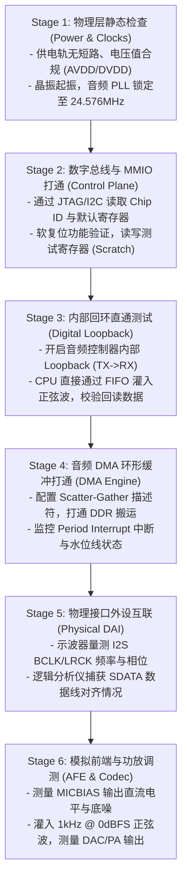

# 06 音频芯片 Bring-up 全流程

## 1. 硬件解决什么问题：从第一颗工程硅片到声学子系统跑通

芯片流片（Tapeout）回片后的硅后调测（Silicon Bring-up）阶段，音频子系统往往是调试风险最高、软硬件交叉最密集的模块之一。

音频同时包含高灵敏度模拟电路（AFE/LDO）、数字时钟树（Fractional PLL）、总线控制和复杂的 Linux 驱动。必须采用严密递进的阶梯式调试方法论，避免因盲目加电烧毁芯片或误判故障。

---

## 2. 硬件微架构与组成：Bring-up 阶梯式递进流程



---

## 3. 软件可见接口：Bring-up 常用底层诊断命令序列

```bash
# 1. 检查 Linux 内核下音频声卡与 PCM 节点是否注册
cat /proc/asound/cards
cat /proc/asound/pcm

# 2. 读取音频控制器关键寄存器状态 (使用 devmem2 调试工具)
devmem2 0x40028000 w              # 读取全局控制寄存器
devmem2 0x40028004 w              # 读取时钟与 PLL 状态
devmem2 0x40028008 w              # 读取 FIFO 状态与错误标志

# 3. 启用内部数字正弦波自测发生器 (硬件内置 1kHz 测试音)
devmem2 0x40028000 w 0x00000043   # 使能 TX, RX 及 Digital Loopback

# 4. 用户态直接录放音打通验证 (绕开复杂用户态框架)
tinyplay /test_1k.wav -D 0 -d 0   # 通过声卡 0、设备 0 播放单音
tinycap /rec.wav -D 0 -d 0 -c 2 -r 48000 -b 16  # 录制双声道音频
```

---

## 4. 四流全链路分析：Stage 3 数字内部回环验证流

在不外接任何外部 Codec 或麦克风的情况下，验证数字基带控制器与总线核心逻辑：
1. **控制配置**：驱动配置 `AUDIO_CTRL_REG.loopback = 1`，硬件多路选择器（MUX）将发送移位寄存器输出与接收移位寄存器输入在芯片内部短接。
2. **数据发送**：CPU 往 `AUDIO_TX_DATA_PORT` 写入预设递增序列（如 `0x1000`, `0x2000`, `0x3000`）。
3. **硬件流转**：TX FIFO 数据经过并串转换，通过内部短接走线移位送入 RX FIFO。
4. **比对校验**：CPU 从 `AUDIO_RX_DATA_PORT` 读取数据。若读取数据与写入完全一致，则证明：**数字时钟分频、位深截取、移位逻辑、FIFO 充放电及寄存器读写通道 100% 正常**。

---

## 5. 软硬件设计约束

- **上电时序阶梯限制**：通常要求数字 DVDD 必须先于或与模拟 AVDD 同时上电，严禁出现 AVDD 高电平而 DVDD 完全为 0V 的状态，否则会在片内 ESD 保护二极管形成寄生正向导通，引发高额漏电甚至**芯片闩锁效应（Latch-up）**烧毁。
- **时钟锁定等待时间（PLL Lock Time）**：软件在配置音频 PLL 倍频寄存器后，必须轮询 `PLL_STATUS.locked` 标志位，通常需要等待 $100\mu\text{s} \sim 1\text{ ms}$。严禁在时钟未完全锁定时使能下游数字逻辑。

---

## 6. 现场排错与调试清单

- **故障：播放 1kHz 正弦波时，输出变成类似 882Hz 的低沉音调且声音失真**
  1. 查看主音频 PLL 配置基准是否错误设为了 44.1kHz 系列（22.5792MHz / 24.576MHz 混淆）。
  2. 示波器测量 LRCK 实际波形频率：若显示为 44.1kHz，但播放文件标称为 48kHz，则属于时钟源配置错误。
- **故障：使用 tinyplay 播放瞬间，整个终端 Hang 死，无内核崩溃日志**
  1. 示波器抓取 I2S BCLK 和 LRCK：若处于持续低电平无翻转，说明时钟未使能。
  2. 检查控制器是否配置为 Slave 模式但外部 Codec 未给时钟，导致 DMA 传输一直等待时钟脉冲而永久阻塞。

---

## 7. 实验与验证推演：正弦波测试表生成

在没有外部音频文件时，DSP 或驱动工程师可在内存中直接预置标准 1kHz @ 48kHz 采样率的正弦波数值查找表（16-bit PCM）：
$$x[n] = A \cdot \sin\left(2\pi \cdot \frac{1000}{48000} \cdot n\right) = A \cdot \sin\left(\frac{\pi}{24} \cdot n\right)$$
周期长度为 $N = \frac{48000}{1000} = 48$ 个采样点。当满量程幅度 $A = 32767$（0 dBFS）时，前几个特征样点推演值：
- $n = 0: x[0] = 0$
- $n = 1: x[1] = 32767 \times \sin(7.5^\circ) \approx 4277$
- $n = 2: x[2] = 32767 \times \sin(15^\circ) \approx 8481$
- $n = 6: x[6] = 32767 \times \sin(45^\circ) \approx 23170$
- $n = 12: x[12] = 32767 \times \sin(90^\circ) = 32767$
将此数组循环填入 DMA 缓冲区，通过示波器量测 DAC 输出引脚即可观测到完美的 $1.000\text{ kHz}$ 平滑模拟正弦波。
