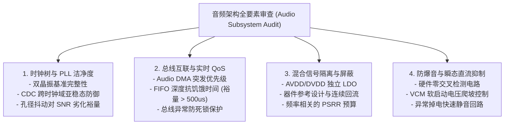
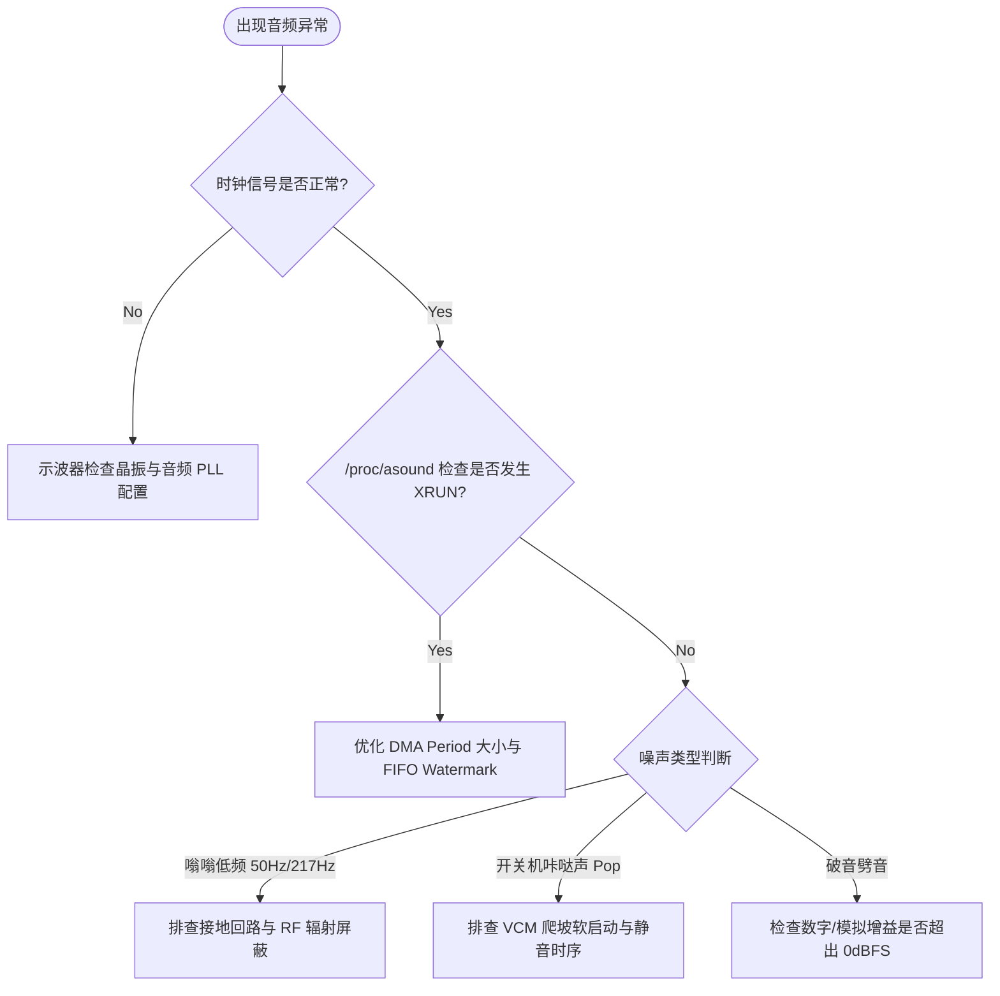

# 07 架构审阅与自测清单

## 1. 硬件解决什么问题：原厂芯片流片前与量产前架构把关

音频子系统跨越模拟、数字、嵌入式固件与操作系统多层，任何一处设计漏洞（如时钟跨域亚稳态、未对齐的 DMA 突发、缺少零交叉检测的功放使能）都会直接导致量产终端声学品质缺陷。

原厂架构师在流片前（RTL Freeze）与系统量产前，必须通过标准化的自检清单对设计进行全方位审阅。

---

## 2. 硬件微架构自审维度

---

## 3. 芯片原厂架构自测核对表（Checklist）

### A. 时钟与同步设计审查
- [ ] **双主时钟源支持**：系统是否具备两路独立物理时钟源（$24.576\text{ MHz}$ 对应 $48\text{k}/96\text{k}/192\text{k}$；$22.5792\text{ MHz}$ 对应 $44.1\text{k}/88.2\text{k}$）？
- [ ] **异步 FIFO 保护**：总线时钟域（AXI）与音频采样时钟域（BCLK）之间是否采用经过严格断言（Assertion）验证的双端口格雷码异步 FIFO？
- [ ] **ASRC 硬件能力**：在蓝牙音频（8k/16k/44.1k）与本地多媒体（48k）混音时，是否具备专用硬件 ASRC 卸载 CPU 算力？

### B. 总线与存储缓冲审查
- [ ] **抗带宽饥饿时间**：当 DDR 发生 GPU 刷屏或 NPU 模型加载产生最大可能仲裁延迟（如 $250\mu\text{s}$）时，TX/RX FIFO 水位线是否仍能维持输出不产生 Underrun？
- [ ] **Scatter-Gather 自动链接**：DMA 引擎是否支持硬件链表循环自加载（Circular Ring Buffer），无需 CPU 每周期介入更新指针？

### C. 模拟前端与声学指标审查
- [ ] **底噪目标达标**：耳机输出通道 A 加权本底噪声是否满足 $< 3\mu\text{Vrms}$（动态范围 $> 105\text{ dB}$）？
- [ ] **THD+N 抑制**：全量程 $1\text{ kHz}$ 输出时总谐波失真加噪声是否小于 $0.005\%$？
- [ ] **MICBIAS 独立滤波**：MEMS 麦克风偏置电源是否具备专有超低噪声输出引脚，避免共用系统模拟 AVDD？

---

## 4. 现场快速自测排查流程图

---

## 5. 实验与验证推演：FIFO 饥饿裕量自检模型

定义系统安全裕量系数 $K_{\text{margin}}$：
$$K_{\text{margin}} = \frac{t_{\text{FIFO\_Hold}}}{t_{\text{Worst\_Bus\_Latency}}}$$
其中：
- $t_{\text{FIFO\_Hold}} = \frac{N_{\text{FIFO}}}{f_s \times C}$（$N_{\text{FIFO}}$ 为有效样点深度，$f_s$ 为采样率，$C$ 为声道数）
- $t_{\text{Worst\_Bus\_Latency}}$ 为最坏总线仲裁等待时间（通常由 DDR 控制器调度策略决定）。

**原厂合格准则**：在整机峰值压力测试（CPU + GPU + VPU 满载跑压力用例）下，必须保证：
$$K_{\text{margin}} \ge 2.0$$
若 $K_{\text{margin}} < 1.0$，该硬件架构在流片评审中将被一票否决。
