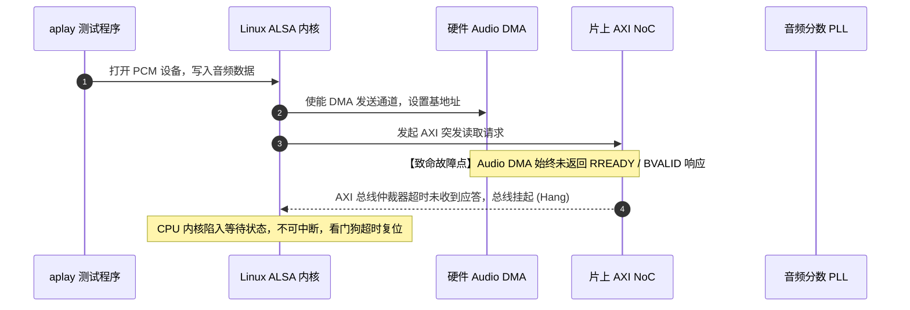

# 08 启动挂死与时钟失锁案例

## 1. 案例背景：新芯片 Bring-up 时播放音频系统全面死锁

在某款 12nm 智能座舱应用处理器样片首次上电回片测试中，软件工程师加载 Linux ALSA 驱动并执行 `aplay sample.wav` 播放测试音。系统出现以下灾难性故障：
1. 终端立即无响应，串口停止输出；
2. 几秒后触发硬件看门狗（Watchdog Reset）导致整机重启；
3. 偶发不重启时，示波器抓取耳机输出端出现巨大的高频尖啸刺耳杂音。

---

## 2. 调试定位全过程与波形分析



### 深入分析排查三部曲

1. **JTAG 挂接寄存器分析**：
   - 挂死瞬间使用 Lauterbach JTAG 查看 CPU 程序指针，发现停留在内核外设写函数的汇编循环中。
   - 读取音频全局时钟状态寄存器 `AUDIO_CLK_STATUS (0x40028004)`，读出值为 `0x00000000`（音频根时钟处于关闭未使能状态）。
2. **示波器时钟波形量测**：
   - 探头搭在芯片外部音频专用晶振引脚，测量到正常 $24.000\text{ MHz}$ 参考输入；
   - 测量片上 PLL 产生的内部音频时钟分频输出测试引脚，发现输出为一条平直的直线（$0\text{ V}$），PLL 根本未起振锁定。
3. **时钟树配置比对**：
   - 查看驱动源码中的 PLL 锁相环初始化配置寄存器：
   ```c
   // 驱动工程师错误写入的配置
   writel(0x00010040, PLL_AUDIO_CFG0); // 仅写入了分频系数，未使能 PLL 内部偏置电流电路
   writel(0x00000001, PLL_AUDIO_EN);   // 使能 PLL
   // 缺少等待锁定的轮询逻辑，紧接着直接使能了下游音频控制器逻辑！
   ```

---

## 3. 根因剖析（Root Cause）

该故障由两个层面的设计缺陷共同交织引起：

1. **软件时序违规**：
   - 模拟 PLL 模块在激活后，内部压控振荡器（VCO）和电荷泵需要至少 $300\mu\text{s}$ 的充放电时间才能达到锁定状态（Lock State）。
   - 驱动代码在使能 PLL 后没有检查 `PLL_STATUS.locked` 标志位，立即解除了音频 DMA 控制器的软复位。
2. **硬件总线防御缺陷**：
   - 音频 DMA 控制器内部的 AXI 从机接口状态机设计依赖音频采样时钟驱动其握手状态机。
   - 当采样时钟不存在时，AXI 读请求到达从机接口无法推进状态机，导致 `ARREADY` 信号永远为低电平（从机永远不就绪）。
   - AXI 总线互联矩阵未配置超时断开保护（Bus Timeout Breaker），导致整个 CPU 主干总线陷入永久挂死。

---

## 4. 解决方案与修复代码

### 软件驱动加固修复

在驱动中增加显式锁定等待与超时保护：

```c
int audio_pll_enable_safe(void __iomem *pll_base)
{
    uint32_t val;
    int timeout = 5000; // 最大等待 5ms

    // 1. 使能 PLL 模拟偏置
    writel(PLL_BIAS_EN | PLL_CONFIG_DEFAULT, pll_base + PLL_CFG_OFFSET);
    udelay(50);

    // 2. 使能 PLL 输出
    writel(PLL_ENABLE_BIT, pll_base + PLL_CTRL_OFFSET);

    // 3. 严格轮询锁定状态
    do {
        val = readl(pll_base + PLL_STAT_OFFSET);
        if (val & PLL_LOCKED_BIT)
            break;
        udelay(10);
    } while (--timeout > 0);

    if (timeout == 0) {
        pr_err("CRITICAL: Audio PLL failed to lock! Aborting.\n");
        return -ETIMEDOUT;
    }

    // 4. 只有在锁定成功后，才使能下游外设门控时钟
    writel(AUDIO_CLK_GATE_OPEN, pll_base + AUDIO_GATE_OFFSET);
    return 0;
}
```

### 硬件 RTL 加固修复（后续 ECO 流片改进）

1. **总线接口时钟解耦**：AXI 从机握手状态机必须完全运行在系统总线时钟域（`axi_clk`），不得混用音频采样时钟（`audio_bclk`）。两者之间通过异步 FIFO 隔离。
2. **硬件超时响应**：若内部音频逻辑无时钟响应，AXI 接口在计数 128 个总线周期后强制拉高 `RVALID` 并返回 `DECERR`（Decode Error），释放总线并触发中断，决不允许拖死系统总线。
