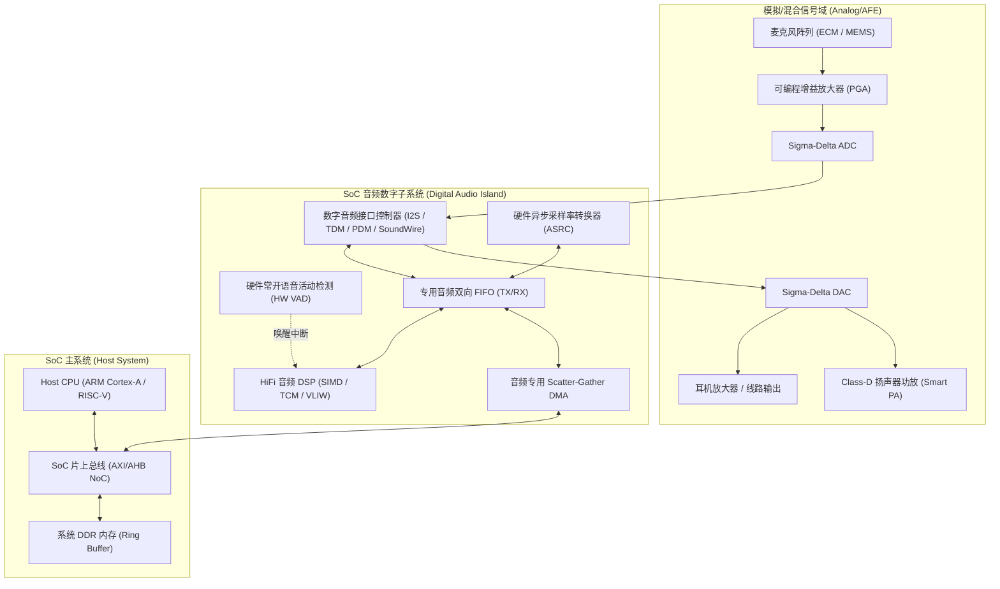

# 01 音频子系统总体架构

## 模块导读与原厂定位

现代高性能应用处理器（Application Processor, AP）与智能音频 SoC（如 TWS 耳机芯片、智能音箱主控、智能座舱车规芯片）中，音频子系统（Audio Subsystem）是一个集成了超低功耗常开（Always-On）、极高信号保真度（High-Fidelity）、复杂混合信号（Mixed-Signal AFE）以及严苛实时性（Hard Real-Time）的异构系统。

本模块从芯片原厂系统架构师视角出发，拆解音频子系统的硬件拓扑、数据流通道、混合信号隔离与软硬件协同边界。

---

## 模块文章索引

1. [音频子系统定义与演进](01-audio-subsystem-fundamentals.md)：从经典 PC 声卡到现代异构智能音频 SoC 架构跃迁与 PPA 权衡
2. [硬件架构框图与信号链路](02-block-diagram-signal-chain.md)：端到端全链路信号打通：从声波拾取、模拟调理到数字扬声器驱动
3. [寄存器空间与总线互联](03-audio-interfaces-memory-map.md)：控制面 MMIO 寄存器组划分、数据面直接挂接与 Mailbox 核间通信
4. [混合信号时钟与电源域隔离](04-clock-power-domain-partition.md)：AVDD/DVDD 隔离、星型接地、音频双晶振域与基底噪声防御
5. [软硬件分工与分层边界](05-hardware-software-boundary.md)：硬件硬线加速器、DSP 固件实时算法与 Host Linux 驱动职责切分
6. [音频芯片 Bring-up 全流程](06-audio-soc-bringup-flow.md)：硅后上电、时钟锁定、模拟通路回路直通与数字回环打通
7. [架构审阅与自测清单](07-review-debug-self-test.md)：原厂芯片架构师级审查自检表与关键声学性能指标验证
8. [启动挂死与时钟失锁案例](08-cases-debug.md)：实战案例：音频子系统总线超时挂死与 PLL 频偏导致杂音故障根因
9. [全链路时延与总线开销推演](09-engineering-analysis.md)：音频信号流端到端微秒级延迟预算与 DDR 带宽突发占用数学推导
