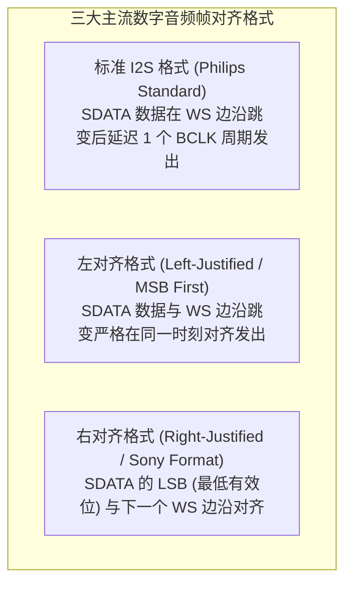
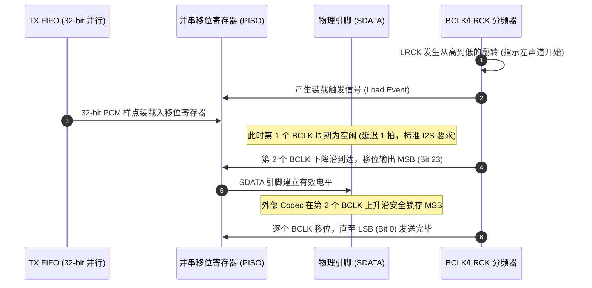

# 01 I2S 协议时序与传输格式

## 1. 硬件解决什么问题：点对点数字立体声标准传输

在 1980 年代以前，音频设备之间的连接多依赖模拟线缆，极易受环境电磁干扰与衰减劣化。飞利浦（Philips）在 1986 年推出了 I2S（Inter-IC Sound）总线规范，旨在解决同一 PCB 板内数字音频处理器与 DAC/ADC 之间的点对点无损数字传输。

通过将**位时钟（BCLK）**、**帧时钟（LRCK/WS）**与**串行数据线（SDATA）**物理分离，彻底消除了传输介质引起的相位时基抖动对采样精度的影响。

---

## 2. 硬件微架构与三大主流传输格式

I2S 接口由三根核心信号线组成（主设备还可输出主系统时钟 MCLK）：
- **BCLK (Continuous Serial Clock)**：位时钟，每个脉冲对应 SDATA 上的一个数据 bit。
- **WS / LRCK (Word Select / Left-Right Clock)**：字选择/左右声道时钟，其频率严格等于音频采样率 $f_s$。
- **SDATA (Serial Data)**：二进制补码形式传输的串行音频数据，MSB（最高有效位）优先。



### 格式电气与对齐时序详细对比

| 格式标准 | WS/LRCK 极性定义 | SDATA 首位有效位起始位置 | 接收端容错与灵活性 |
| :--- | :--- | :--- | :--- |
| **标准 I2S (Philips)** | **低电平 = 左声道，高电平 = 右声道** | **WS 边沿跳变后的第 2 个 BCLK 上升沿** (延迟 1 周期) | 极高：即使 BCLK 周期数大于数据位深，后续位补零也不影响解码 |
| **左对齐 (Left-Justified)** | **高电平 = 左声道，低电平 = 右声道** | **WS 边沿跳变当刻的第 1 个 BCLK 上升沿** | 较高：数据位紧靠帧头，忽略尾部未使用的 BCLK 时钟 |
| **右对齐 (Right-Justified)**| **高电平 = 左声道，低电平 = 右声道** | 取决于数据位深（LSB 对齐到 WS 翻转前最后 1 个 BCLK） | 较低：发送端与接收端必须严格硬编码相同的位深（如 16/24-bit） |

---

## 3. 软件可见接口：DAI 格式配置寄存器

在 Linux ASoC 驱动中，I2S 模式通常通过 `snd_soc_dai_set_fmt()` 接口进行动态配置。对应底层音频控制器的寄存器位域如下：

```c
// I2S 接口模式控制寄存器: I2S_FORMAT_CTRL (Offset: 0x0104)
#define REG_I2S_FMT_CTRL          (*(volatile uint32_t *)(I2S0_BASE + 0x0104))

// 格式配置掩码
#define I2S_FMT_PHILIPS           (0U << 0)  // 标准 I2S (延迟 1 BCLK)
#define I2S_FMT_LEFT_J            (1U << 0)  // 左对齐
#define I2S_FMT_RIGHT_J           (2U << 0)  // 右对齐
#define I2S_FMT_DSP_A             (3U << 0)  // TDM / DSP Mode A

// 时钟主从模式配置
#define I2S_MODE_MASTER           (1U << 4)  // SoC 作为 Master 输出 BCLK/LRCK
#define I2S_MODE_SLAVE            (0U << 4)  // SoC 作为 Slave 由外部 Codec 提供时钟

// 时钟极性配置
#define I2S_CLK_INV_BCLK          (1U << 8)  // 下降沿采样 / 上升沿驱动
#define I2S_CLK_INV_LRCK          (1U << 9)  // LRCK 极性翻转
```

---

## 4. 四流全链路分析：标准 I2S 移位硬件流水线



---

## 5. 软硬件设计约束

- **主从模式冲突防御**：系统拓扑中**必须且只能有一个 Master 驱动 BCLK/LRCK**。若 SoC 与外部 Codec 同时配置为 Master，两端的输出缓冲器（Output Drivers）将发生电气对冲短路，烧毁 IO Pad。
- **BCLK 与 LRCK 整数倍率匹配**：设每个声道槽位宽度为 32 个 BCLK，双声道一帧必须严格包含 64 个 BCLK：
$$f_{\text{BCLK}} = 64 \times f_{\text{LRCK}} = 64 \times f_s$$
若分频器计数溢出或丢失脉冲，接收端移位状态机将无法定位新的一帧，引发声道反相或数据整体位移。

---

## 6. 现场排错与调试清单

- **故障：播放立体声音乐，左右声道完全反了（人声应在左侧却出现在右侧）**
  1. 检查控制器 `I2S_CLK_INV_LRCK` 极性位：标准 I2S 要求低电平为左声道，若配置为高电平则声道反转。
  2. 检查发送端是否误配为左对齐（左对齐默认高电平为左声道），导致协议不匹配。
- **故障：声音伴随极其严重的破音失真，如同高位截断**
  1. 示波器抓取 BCLK 与 SDATA：确认数据是在下降沿驱动并在上升沿采样。
  2. 若极性配置反了（采样时钟与数据跳变沿重合），将引发建立保持时间违规（Setup/Hold Violation），读取到大量亚稳态错误位。

---

## 7. 实验与验证推演：时序裕量计算

对于标准 48kHz / 64 BCLK 系统：
$$T_{\text{BCLK}} = \frac{1}{64 \times 48000} = \frac{1}{3.072\text{ MHz}} \approx 325.5\text{ ns}$$
高低电平半周期各占约 $162.7\text{ ns}$。
若采样点设置在上升沿，芯片输出端在下降沿发射数据：
- 发射端引脚输出延迟：$t_{\text{co}} \approx 12\text{ ns}$；
- PCB 走线延迟（$15\text{ cm}$ 走线）：$t_{\text{flight}} \approx 1\text{ ns}$；
- 接收端建立时间要求：$t_{\text{setup}} = 10\text{ ns}$。
实际建立时间裕量为：
$$t_{\text{margin}} = \frac{T_{\text{BCLK}}}{2} - t_{\text{co}} - t_{\text{flight}} - t_{\text{setup}} = 162.7 - 12 - 1 - 10 = 139.7\text{ ns}$$
裕量充沛（$>100\text{ ns}$），这解释了为何普通 I2S 接口在低频下极具抗干扰能力与稳定性。
