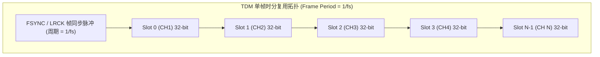

# 02 TDM 多声道时分复用协议

## 1. 硬件解决什么问题：多麦克风阵列与多音区扬声器的高效级联

标准 I2S 仅能传输立体声双通道音频。当应用场景升级为 4 麦克风阵列拾音、7.1 环绕声家庭影院或智能座舱 16 声道扬声器功放时，若继续采用 I2S 直连，SoC 将需要 8~16 根独立的数据线，严重消耗芯片引脚资源（Pin-count）与 PCB 走线面积。

**TDM（Time Division Multiplexing，时分复用）**通过在单根物理数据线上划分若干个时间槽位（Time Slots），在单个帧时钟周期内轮流传输多通道音频，极大地压缩了芯片物理引脚开销。

---

## 2. 硬件微架构与组成：TDM 帧结构与时序



### 两种关键的 TDM 帧同步脉冲模式

1. **DSP Mode A (Mode A / Short Frame Sync)**：
   - 帧同步脉冲（FSYNC）仅持续 **1 个 BCLK 周期**。
   - 数据（Slot 0 的 MSB）在 FSYNC 脉冲结束后的**第 2 个 BCLK 边沿**开始输出（类似标准 I2S 的 1-BCLK 延迟）。
2. **DSP Mode B (Mode B)**：
   - 帧同步脉冲同样持续 1 个 BCLK 周期，但数据（Slot 0 的 MSB）在 FSYNC 出现的**同一 BCLK 周期**同步发出（无延迟）。
3. **Long Frame Sync (长帧同步)**：
   - FSYNC 信号高电平持续时间等于整个 Slot 0 的宽度（如持续 16 或 32 个 BCLK）。

---

## 3. 软件可见接口：TDM 槽位分配与通道掩码寄存器

```c
// TDM 控制寄存器: TDM_CTRL (Offset: 0x0110)
#define REG_TDM_CTRL              (*(volatile uint32_t *)(I2S0_BASE + 0x0110))
#define TDM_SLOT_NUM_8            (7U << 0)   // 槽位总数 (配置值 = N - 1，此处表示 8 槽位)
#define TDM_SLOT_WIDTH_32         (31U << 4)  // 单槽位宽度 (32 BCLKs)
#define TDM_SYNC_SHORT            (0U << 10)  // 短帧同步 (1 BCLK 宽度)
#define TDM_SYNC_LONG             (1U << 10)  // 长帧同步 (1 Slot 宽度)

// TDM 声道使能掩码: TDM_CH_MASK (Offset: 0x0114)
#define REG_TDM_CH_MASK           (*(volatile uint32_t *)(I2S0_BASE + 0x0114))
// 例如使能 Slot 0, 1, 2, 3 (4 麦克风)，禁用 4, 5, 6, 7:
// REG_TDM_CH_MASK = 0x0000000F;
```

---

## 4. 四流全链路分析：8 声道 TDM 麦克风阵列数据采集流

1. **时钟同步流**：SoC 作为 Master 输出 $f_{\text{FSYNC}} = 48\text{ kHz}$，位时钟 $f_{\text{BCLK}} = 8 \times 32 \times 48000 = 12.288\text{ MHz}$。
2. **数据时分时序流**：
   - Slot 0 ($0 \sim 31\text{ BCLK}$): 芯片 1 释放总线，麦克风 1 驱动输出 24-bit 语音；
   - Slot 1 ($32 \sim 63\text{ BCLK}$): 麦克风 2 驱动输出语音；
   - ...直至 Slot 7 结束，完成一个周期的轮询采样。
3. **DMA 多通道解复用流**：Audio DMA 控制器包含硬件解交织引擎（De-interleaver），自动将单根 SDATA 上的 8 声道交织数据解开为 8 块独立的单声道内存缓冲区，供声学波束成形算法直接访问。

---

## 5. 软硬件设计约束

- **高频总线容性负载与反射**：在 8 通道 32-bit TDM 系统中，BCLK 高达 $12.288\text{ MHz}$，16 通道时高达 $24.576\text{ MHz}$。长距离走线必须串联阻尼电阻（通常 $22\Omega \sim 33\Omega$），防止信号反射过冲导致接收端出现双时钟脉冲误触发。
- **高阻态释放时间（Bus Tri-state Timing）**：当多个外设挂在同一根 SDATA 线上时，各设备在自己专属 Slot 结束后必须在半个 BCLK 周期内迅速进入高阻态（Hi-Z），否则与下一个 Slot 发送芯片产生总线冲突（Bus Contention）。

---

## 6. 现场排错与调试清单

- **故障：麦克风阵列录音，通道 1 正常，通道 2 混入了通道 1 的尾音，通道 3 杂音**
  1. 逻辑分析仪抓取 SDATA：检查 Slot 间是否存在驱动未及时释放导致的高低电平交叠冲突。
  2. 检查驱动中 `TDM_SLOT_WIDTH` 与外部 Codec 的 Slot Width 是否严格一致（如一方设为 24-bit，另一方设为 32-bit，导致后续所有声道槽位边界全部错位）。

---

## 7. 实验与验证推演：BCLK 速率与传输距离

TDM 传输速率公式为：
$$f_{\text{BCLK}} = N_{\text{slots}} \times W_{\text{slot}} \times f_s$$
对于车载 16 声道、96kHz 高采样系统，单槽位 32-bit：
$$f_{\text{BCLK}} = 16 \times 32 \times 96000 = 49.152\text{ MHz}$$
此时一个 BCLK 周期仅有：
$$T_{\text{BCLK}} = \frac{1}{49.152\text{ MHz}} \approx 20.34\text{ ns}$$
时钟信号上升时间通常 $< 3\text{ ns}$。根据传输线理论，当走线延迟 $t_{\text{delay}} > \frac{t_{\text{rise}}}{6}$ 时必须视作微带传输线处理：
$$L_{\text{critical}} = \frac{t_{\text{rise}}}{6 \times 6\text{ ns/m}} = \frac{3}{36} \approx 0.083\text{ m} = 8.3\text{ cm}$$
推论：**当 TDM 速率逼近 50MHz 时，PCB 走线超过 8cm 必须做严格的 $50\Omega$ 特抗控制与端接匹配**，否则将因信号完整性恶化而无法稳定通信。
