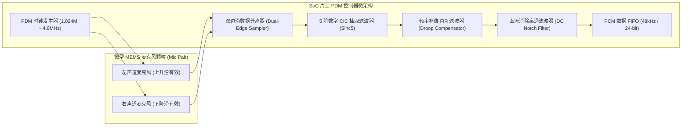

# 03 PDM 数字麦克风与抽取滤波

## 1. 硬件解决什么问题：微型化 MEMS 麦克风极简直连

在智能手机、TWS 耳机和智能穿戴设备中，空间极其寸土寸金。传统的模拟麦克风需要专用的偏置电容、前置差分放大器与外部屏蔽线，不仅占用可观的 PCB 面积，且在射频天线（Wi-Fi/5G/蓝牙）的高功率近场辐射下极易耦合出 TDMA 蜂鸣杂音。

**PDM（Pulse Density Modulation，脉冲密度调制）**将 Sigma-Delta 调制器直接集成在微型 MEMS 麦克风颗粒内部，仅通过一根时钟线（CLK）和一根数据线（DATA），即可抗干扰地传输极高过采样率的 1-bit 数字音频流。

---

## 2. 硬件微架构与组成：片上 PDM 控制器与 CIC 抽取滤波



### PDM 核心参数与工作模式

| 麦克风模式 | PDM 时钟频率 ($f_{\text{pdm}}$) | 过采样率 (OSR) | 输出 PCM 采样率 | 适用场景与功耗特性 |
| :--- | :--- | :--- | :--- | :--- |
| **超低功耗常开模式** | $768\text{ kHz}$ | 48x | $16\text{ kHz}$ | 语音唤醒监听 (AON KWS)，功耗 $< 200\mu\text{W}$ |
| **标准音质模式** | $1.536\text{ MHz}$ | 32x | $48\text{ kHz}$ | 普通语音通话与录音 |
| **高保真高解析模式** | $3.072\text{ MHz} \sim 4.8\text{ MHz}$ | 64x ~ 100x | $48\text{ kHz} \sim 96\text{ kHz}$ | 专业拾音与 ANC 降噪麦克风输入 |

---

## 3. 软件可见接口：CIC 抽取与增益配置寄存器

```c
// PDM 控制器配置寄存器: PDM_CTRL (Offset: 0x0300)
#define REG_PDM_CTRL              (*(volatile uint32_t *)(AUDIO_BASE + 0x0300))
#define PDM_OSR_SEL_64            (2U << 0)   // 降采样率 OSR 选择: 64倍
#define PDM_CIC_ORDER_5           (1U << 4)   // 采用 5 阶 CIC (Sinc5) 滤波器
#define PDM_HPF_ENABLE            (1U << 8)   // 开启直流高通滤波器
#define PDM_DUAL_EDGE_EN          (1U << 12)  // 使能单线双麦克风双沿复用

// PDM 数字音量增益寄存器: PDM_VOL_CTRL (Offset: 0x0308)
#define REG_PDM_VOL_CTRL          (*(volatile uint32_t *)(AUDIO_BASE + 0x0308))
// 增益以 0.5dB 为步进，0x00 为 0dB，0x20 为 +16dB，0xE0 为 -16dB
```

---

## 4. 四流全链路分析：单线双麦（Dual-Edge Multiplexing）时序流

PDM 规范支持在单根 DATA 线上通过极性区分挂接两颗麦克风：
1. **时钟分发**：SoC 输出连续的对称方波 PDM_CLK（如 3.072MHz）。
2. **左麦克风驱动**：当 CLK 处于**高电平期间**，左声道麦克风（引脚配置 L/R=GND）内部输出级开启，在 CLK 上升沿将数据位驱动到 DATA 线上；当 CLK 为低电平时，左麦克风输出进入高阻态。
3. **右麦克风驱动**：当 CLK 处于**低电平期间**，右声道麦克风（引脚配置 L/R=VDD）输出级开启，在 CLK 下降沿驱动数据位；高电平时进入高阻态。
4. **片内采样解耦**：SoC 接口电路分别在时钟上升沿与下降沿锁存数据，将其切分为独立的左通道和右通道 1-bit 高速脉冲流，并行送入两组独立的 CIC 抽取滤波器。

---

## 5. 软硬件设计约束

- **CIC 通带衰减补偿（Passband Droop Compensation）**：CIC 滤波器的幅频响应呈现 Sinc 函数特性：
$$|H(f)| = \left| \frac{\sin(\pi f / f_s)}{\pi f / f_s} \right|^K$$
在音频频带边缘（如 15kHz ~ 20kHz 处），Sinc5 滤波器将产生多达 $2\text{ dB} \sim 4\text{ dB}$ 的高频滚降衰减。数字硬件中必须紧随一组反 Sinc（Inverse-Sinc）FIR 均衡滤波器进行高频提升补偿，以保证音频频响平直度在 $\pm 0.1\text{ dB}$ 范围内。
- **走线寄生电容对微弱输出的衰减**：MEMS 麦克风输出驱动能力极弱（典型输出电流仅几百 $\mu\text{A}$）。若 PDM 数据线走线寄生电容超过 $30\text{ pF}$，方波上升沿将变成缓坡，导致 SoC 接收端双边沿锁存出现严重串扰。

---

## 6. 现场排错与调试清单

- **故障：单线双麦配置下，录音发现左右声道声音完全混合并伴随高频破音**
  1. 检查两颗麦克风的 L/R 配置引脚：是否两颗都误接到了 GND 或 VDD，导致两个麦克风在同一时钟边沿同时抢占总线。
  2. 示波器抓取 DATA 引脚：若波形在边沿交替处出现台阶状中间电压（如 0.9V），证明两个输出驱动管发生总线冲突。

---

## 7. 实验与验证推演：CIC 抽取位宽增长推导

对于 $K$ 阶、抽取比为 $R$ 的 CIC 抽取滤波器，输入为 1-bit，其输出端的最大动态范围位宽增长（Bit Growth）公式为：
$$B_{\text{out}} = B_{\text{in}} + \lceil K \cdot \log_2(R) \rceil$$
若采用 5 阶 CIC（$K = 5$），过采样抽取比 $R = 64$（由 3.072MHz 抽取至 48kHz）：
$$B_{\text{out}} = 1 + \lceil 5 \cdot \log_2(64) \rceil = 1 + \lceil 5 \times 6 \rceil = 31\text{ bits}$$
推论：为了保证在累加抽取过程中不发生中间算术溢出，**硬件 CIC 累加器流水线内部必须维持至少 31-bit 的全精度寄存器位宽**，随后在截取输出级加入噪声整形截断（Dithered Truncation）至 24-bit 输出。
