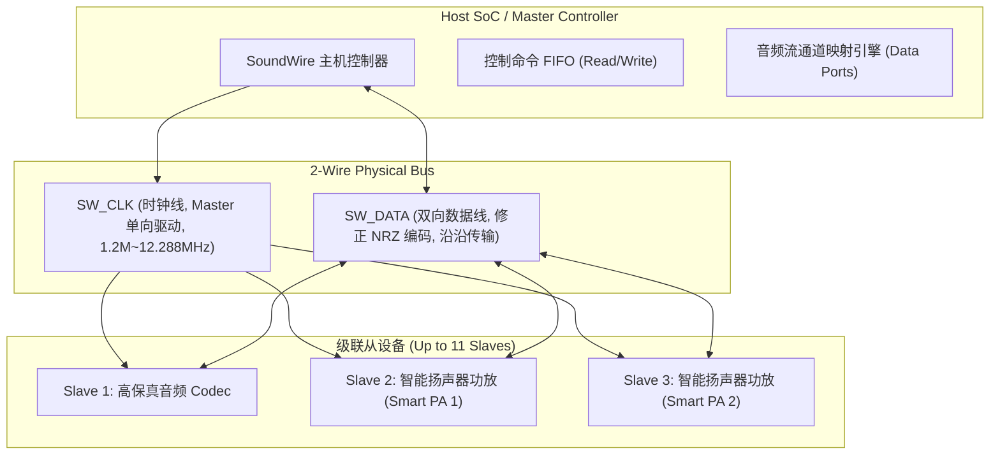

# 04 MIPI SoundWire 总线协议架构

## 1. 硬件解决什么问题：多设备、统一控制与音频的极简双线总线

在现代复杂移动设备中，传统架构通常需要 I2C/SPI 总线传输控制配置命令，辅以 I2S/TDM 总线传输音频数据，外加中断引脚（IRQ）与时钟线，连接一颗智能 Codec 和多颗功放往往需要消耗 8~12 根物理走线。

由 MIPI 联盟制定的 **SoundWire 规范**彻底颠覆了这种离散拓扑：**仅需一根时钟线（SW_CLK）和一根双向数据线（SW_DATA）**，即可实现多达 11 个从设备的级联互联，同时统一承载纳秒级控制报文、多声道音频流、设备中断上报与动态电源控制。

---

## 2. 硬件微架构与组成：SoundWire 物理层与帧结构



### 帧结构与时空复用矩阵

SoundWire 采用严格同步的二维二维矩阵帧结构（Frame Matrix）：
- **行数（Rows）**：可配置为 48 至 640 行；
- **列数（Columns）**：固定可配置为 2 至 16 列；
- 矩阵由两大部分组成：
  1. **Control Word（控制字，位于第 0 列）**：传输从设备注册枚举、读写控制寄存器、Ping 命令与中断事件；
  2. **Payload / Data Ports（有效载荷音频数据列）**：划分为若干个通道样点，以无缝字节流承载各设备音频采样。

---

## 3. 软件可见接口：Linux 内核 SoundWire 设备树节点与数据流配置

```dts
// 典型 Linux Device Tree SoundWire 控制器与从设备声明
soundwire@4002c000 {
    compatible = "vendor,soundwire-master-v1";
    reg = <0x4002c000 0x1000>;
    interrupts = <GIC_SPI 45 IRQ_TYPE_LEVEL_HIGH>;
    clock-frequency = <12288000>;

    // 从设备 1: Codec (MIPI 厂商 ID + 设备编号)
    codec: audio-codec@0:1:025d:0711:00 {
        compatible = "sdw:01025d071100";
        reg = <0 1>; // 逻辑设备地址
        mipi-sdw,wake-up = <1>;
    };

    // 从设备 2: 智能低音功放 Smart PA
    smart_pa: amp@0:2:025d:0810:00 {
        compatible = "sdw:01025d081000";
        reg = <0 2>;
    };
};
```

---

## 4. 四流全链路分析：控制与音频复合流转时序

1. **从设备自动挂载流（Enumeration Flow）**：
   - 上电时，Master 广播 `PING` 帧；从设备在 SW_DATA 线上返回自身固化的 48-bit 唯一设备识别码（Device ID）；
   - Master 控制器自动为该从设备分配一个动态逻辑地址（Logical Address，如 $1 \sim 11$）。
2. **控制交互流**：CPU 在控制字列发起寄存器读写指令，单帧内即可完成对功放增益的设定。
3. **音频数据流**：Master 将 48kHz 立体声音频映射到 Data Port 1，占用特定行/列交叉点；Codec 从设备仅在约定的时间窗口抽取属于自己的音频数据。
4. **中断响应流**：当 Smart PA 发生过热报警时，在控制字的特定时隙拉低总线产生 Attention 中断，Master 立即发起查询并降额保护。

---

## 5. 软硬件设计约束

- **物理层修整非归零编码（Modified NRZ / BCLK 边缘）**：SW_DATA 传输采用特殊的无毛刺双边沿编码，在时钟上升沿与下降沿均可锁存数据，有效传输吞吐达到时钟频率的 2 倍。
- **总线时钟门控唤醒（Clock Stop Protocol）**：为了极致省电，SoundWire 允许 Master 完全停止 SW_CLK 时钟进入 Clock-Stop 模式。从设备可通过在 SW_DATA 上拉低电平产生异步唤醒脉冲通知 Master 重启时钟。

---

## 6. 现场排错与调试清单

- **故障：SoundWire 总线从设备无法枚举（Device Not Found）**
  1. 测量 SW_CLK 实际波形：确认时钟频率是否在从设备支持的初始基频（通常初始为 1.2MHz 或 9.6MHz）范围内。
  2. 检查 SW_DATA 走线是否有过大的下拉电容，导致上电自拉高阻抗未能达到高电平门限。
- **故障：播放音频时出现偶发微弱破音，总线报 CRC 校验错误**
  1. 查看控制字返回中的 `PARITY_ERR` 标志：若奇偶校验位连续报错，说明总线受到高频干扰。
  2. 降低 SoundWire 总线速率或优化总线走线等长匹配。

---

## 7. 实验与验证推演：总线有效带宽利用率模型

设 SoundWire 帧矩阵配置为 $R = 64$ 行，$C = 16$ 列，时钟频率 $f_{\text{CLK}} = 12.288\text{ MHz}$。
单帧的总比特容量为：
$$B_{\text{frame}} = R \times C = 64 \times 16 = 1024\text{ bits}$$
每帧持续时间：
$$T_{\text{frame}} = \frac{B_{\text{frame}}}{2 \times f_{\text{CLK}}} = \frac{1024}{2 \times 12.288 \times 10^6} \approx 41.67\mu\text{s}$$
对应的帧频严格为：
$$f_{\text{frame}} = \frac{1}{T_{\text{frame}}} = 24000\text{ Hz}$$
第 0 列作为控制与同步开销（占 $\frac{1}{16} = 6.25\%$ 带宽），剩余的 15 列全部用于有效音频负载。
总有效音频数据净荷带宽为：
$$\text{BW}_{\text{audio}} = 2 \times 12.288\text{ Mbps} \times \frac{15}{16} = 23.04\text{ Mbps}$$
推论：**一条双线 SoundWire 总线即可轻松同时传输 4 通道 96kHz/24-bit 麦克风录音 + 2 通道 192kHz/24-bit 扬声器播放**，并富裕充足的控制带宽。
