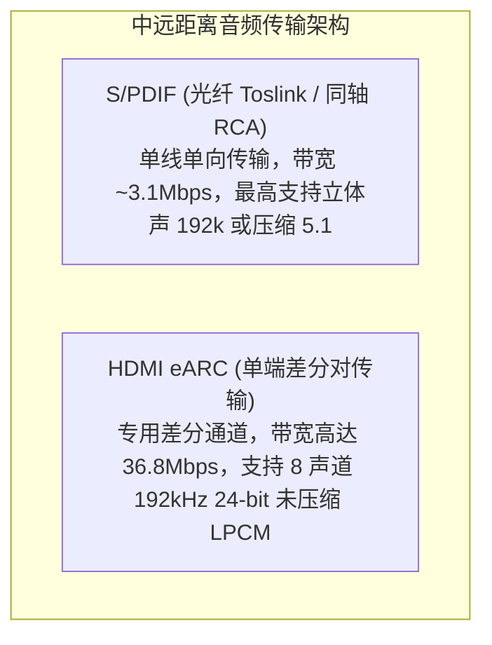

# 05 S/PDIF 与 HDMI eARC 接口

## 1. 硬件解决什么问题：家庭影院与专业音响的长距离无损传输

在客厅影音系统、电视条形音箱（Soundbar）和专业调音台场景中，设备之间的物理互联距离通常长达数米。低压 CMOS 电平的 I2S/TDM 接口在长线缆上因寄生电容和高频衰减，传输距离无法超过 20 厘米。

**S/PDIF（Sony/Philips Digital Interface）**与 **HDMI eARC（Enhanced Audio Return Channel）**专为中远距离音响互连设计，通过自带时钟恢复的高保真编码机制，实现了家庭影院级多声道高保真音频与全景声（Dolby Atmos / DTS:X）的无损长途传输。

---

## 2. 硬件微架构与组成：BMC 编码与 eARC 物理通道



### 1. 双相标记编码（Biphase Mark Code, BMC）
S/PDIF 采用经典的 BMC 自同步线路编码：
- 每个音频数据 bit 的起始边界**必然发生一次电平跳变**；
- 传输逻辑 `1` 时，在半周期处**额外追加一次翻转**；
- 传输逻辑 `0` 时，半周期处**保持电平不变**。
- **根本价值**：接收端无需任何外部时钟线，仅通过单根线缆的边沿检测（DPLL）即可 100% 完美提取恢复出时钟与数据，且彻底消除了直流偏置分量。

---

## 3. 软件可见接口：S/PDIF 子帧与通道状态（Channel Status）寄存器

S/PDIF 传输的一个音频子帧（Sub-frame）固定包含 32 个时隙（Timeslots）：
- `Bits 0-3`：前导码（Preamble B/M/W，打破 BMC 规则，用于标识左右声道与块起始）；
- `Bits 4-27`：24-bit 音频数据有效载荷；
- `Bit 28`：有效性标志（Validity bit）；
- `Bit 29`：用户数据位（User bit）；
- `Bit 30`：通道状态位（Channel Status bit，携带采样率、专业/民用版权标记）；
- `Bit 31`：奇偶校验位（Parity bit）。

```c
// S/PDIF 发送通道状态寄存器: SPDIF_CH_STAT (Offset: 0x0180)
#define REG_SPDIF_CH_STAT         (*(volatile uint32_t *)(SPDIF_BASE + 0x0180))
#define SPDIF_CONSUMER_MODE       (0U << 0)   // 0: 民用模式 (Consumer), 1: 专业模式 (Professional)
#define SPDIF_NON_AUDIO_LPCM      (0U << 1)   // 0: 线性 PCM 音频, 1: 压缩数据流 (Dolby/DTS)
#define SPDIF_FS_48000            (2U << 24)  // 采样率标识: 48kHz
```

---

## 4. 四流全链路分析：HDMI eARC 链路握手与音频流转

1. **链路发现流**：TV 与 Soundbar 通过 HDMI 线缆上的 eARC 数据差分对进行半双工低速链路握手（Discovery & HPD）。
2. **能力协商流**：Soundbar 通过 eARC Data 通道向 TV 发送其支持的音频格式列表（EDID / Audio Data Block），告知支持 8 通道 192k LPCM 及 Dolby TrueHD。
3. **数据反传流**：TV 内部的音频引擎通过片上专用 eARC TX 控制器，将当前播放影片的原生全景声音轨以 36.8Mbps 的高速差分共模信号沿 HDMI 线缆反向传输至 Soundbar。
4. **状态反馈流**：Soundbar 实时将心跳包与音量调节指令回传 TV，保持双向同步。

---

## 5. 软硬件设计约束

- **时钟恢复抖动容限（Clock Recovery Jitter）**：S/PDIF 光纤接收模块（Toslink Photoreceiver）存在微秒级的光电转换延迟抖动。接收芯片内部的数字锁相环（DPLL）必须具备优良的高频低通滤波特性，防止恢复出的时钟直接驱动 DAC 引起信噪比恶化。
- **版权与保护机制（SCMS）**：民用 S/PDIF 必须遵守串行复制管理系统（SCMS）协议，在 Channel Status 中强制置位复制权限标记。

---

## 6. 现场排错与调试清单

- **故障：电视通过光纤连接音箱，播放 PCM 立体声正常，切换到 5.1 环绕声时音箱发出一片白噪声刺耳啸叫**
  1. 检查 S/PDIF 控制器中的 `SPDIF_NON_AUDIO` 标志位：传输 AC-3/DTS 压缩位流时，必须将该位置 1。
  2. 若该位为 0，接收端 DAC 会将经过压缩编码的二进制伪随机位流当做 PCM 样点直接进行模拟功率输出，引发毁灭性的全量程白噪声。

---

## 7. 实验与验证推演：S/PDIF 物理线速率计算

在标准 S/PDIF 立体声传输中：
- 采样率 $f_s = 192\text{ kHz}$；
- 每个采样点包含 2 个子帧（左右声道），每子帧固定 32 个时钟槽位；
- 采用 BMC 编码，每个 slot 需要 2 次电平跳变。
物理信号线基频计算为：
$$f_{\text{SPDIF\_Baud}} = 192000 \times 2 \times 32 \times 2 = 24.576\text{ Mbps}$$
推论：**传输 192kHz S/PDIF 音频要求同轴线缆或光纤接收头具备至少 25MHz 的信号带宽响应**。若采用普通低速塑料光纤，脉冲上升沿严重劣化，将引发高误码率甚至无法锁相。
