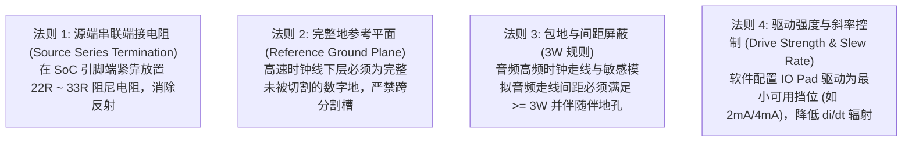

# 06 物理接口设计与信号完整性规范

## 1. 硬件解决什么问题：解决高频音频时钟与数据走线的信号完整性缺陷

许多音频系统工程师误认为“音频是低频信号，无需考虑高速 PCB 走线设计”。然而事实恰恰相反：
虽然音频声音在 $20\text{ Hz} \sim 20\text{ kHz}$，但传输音频的 **BCLK、MCLK 时钟频率高达 12MHz ~ 50MHz**，其方波脉冲的上升沿（Rise Time $t_r$）通常只有 $1\text{ ns} \sim 3\text{ ns}$。

高频谐波分量可扩展至数百兆赫兹，若布线不当，将引发严峻的**反射过冲、时钟抖动累积与对微弱模拟音频的严重辐射串扰**。

---

## 2. 硬件微架构与信号完整性四大黄金法则



---

## 3. 软件可见接口：芯片 IO Pad 驱动能力与斜率配置

现代芯片原厂的音频 GPIO 控制器均提供可编程的驱动电流与转换速率（Slew Rate）控制寄存器：

```c
// 音频引脚 IO 复用与电器属性寄存器: PIN_CFG_I2S_BCLK (Offset: 0x0810)
#define REG_PIN_I2S_BCLK_CFG      (*(volatile uint32_t *)(IOMUX_BASE + 0x0810))
#define PAD_DRIVE_2MA             (0U << 4)   // 2mA 弱驱动 (推荐，抑制 EMI 辐射)
#define PAD_DRIVE_4MA             (1U << 4)   // 4mA 标准驱动
#define PAD_DRIVE_12MA            (3U << 4)   // 12mA 强驱动 (产生严重振铃过冲，禁用)
#define PAD_SLEW_RATE_SLOW        (1U << 8)   // 慢斜率 (缓和上升沿，大幅降低高频噪声)
#define PAD_PULL_DOWN             (1U << 2)   // 下拉电阻 (防止悬空漏电)
```

---

## 4. 四流全链路分析：反射振铃与双重触发产生机理

1. **时钟跳变流**：SoC IO Pad 内部推挽管导通，向传输线注入高速脉冲（$t_r = 1.5\text{ ns}$）。
2. **阻抗不连续流**：当脉冲行进至未做端接的接收芯片引脚端（输入阻抗近似无穷大开路），反射系数 $\Gamma = +1$。
3. **反射叠加流**：反射波返回源端叠加，在时钟波形平坦区激荡出剧烈的阻尼振铃（Ringing）与下冲。
4. **硬件误判故障流**：振铃谷底跌破逻辑高电平门限阈值（$V_{\text{IH}} = 0.7 V_{\text{DD}}$），接收端施密特触发器将其误判定为产生了一次虚假的额外时钟脉冲（False Double Clocking），导致音频通道计数错位。

---

## 5. 软硬件设计约束

- **走线等长约束**：在 I2S/TDM 接口中，BCLK、LRCK 与 SDATA 走线长度差必须控制在：
$$\Delta L \le 20\text{ mm}$$
确保数据在时钟采样有效沿到达时，满足建立时间裕量。
- **电平转换芯片（Level Shifter）选型约束**：当 SoC（1.8V）连接 3.3V 外部 Codec 时，严禁使用基于 I2C 架构的双向带上拉电阻的自动感应电平转换芯片（如 TXS0108E）。必须采用具备方向控制引脚的高速单向 CMOS 缓冲芯片（如 74LVC1T45），否则其内部加速单稳态电路会在音频时钟上激发出鬼脉冲。

---

## 6. 现场排错与调试清单

- **故障：示波器观察 BCLK 时钟波形，高低电平顶部均有高达 1V 以上的剧烈尖峰振铃**
  1. 在源端串入一个 $22\Omega$ 或 $33\Omega$ 的无感金属膜贴片电阻。
  2. 软件将该引脚的 Pad Slew Rate 配置由 Fast 改为 Slow。
- **故障：录音通道偶发单声道爆音，抓波形发现数据线电平抬高**
  1. 检查时钟与数据走线是否平行长距离并排走线，引发了容性容性串扰（Cross-talk）。

---

## 7. 实验与验证推演：阻尼端接匹配电阻取值推导

PCB 微带线特性阻抗公式为：
$$Z_0 \approx \frac{87}{\sqrt{\epsilon_r + 1.41}} \ln\left( \frac{5.98 h}{0.8 w + t} \right)$$
在标准 FR4 板材（$\epsilon_r \approx 4.2$）上，典型的 5mil 线宽微带线阻抗 $Z_0 \approx 50\Omega$。
若芯片内部推挽驱动管导通内阻为：
$$R_{\text{driver}} \approx 20\Omega$$
为了实现完美的源端阻抗匹配，消除一次反射波：
$$R_{\text{term}} = Z_0 - R_{\text{driver}} = 50\Omega - 20\Omega = 30\Omega$$
这就是工程实践中，音频总线串联电阻首选 **$27\Omega$ 或 $33\Omega$** 的理论依据。
