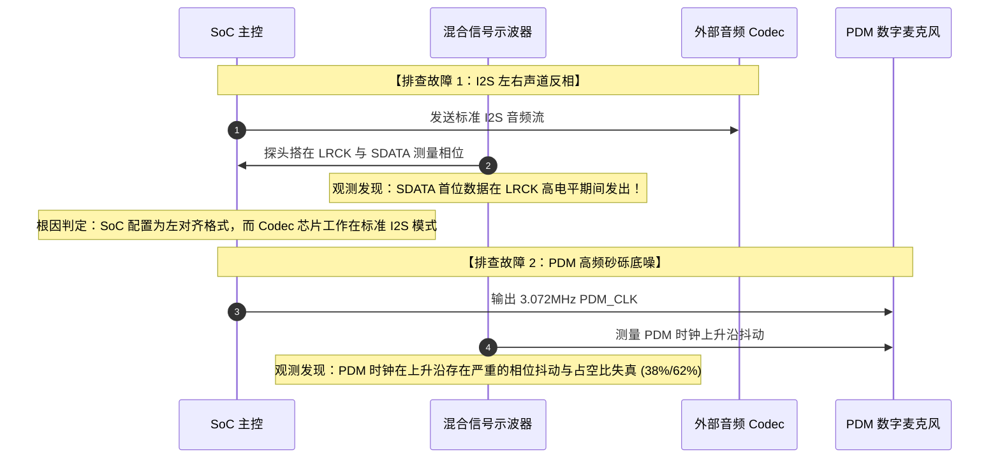

# 07 I2S 相位错位与 PDM 噪声排查

## 1. 案例背景：左右声道反转与高频砂砾底噪双重故障

在某款智能音箱产品的试产调测中，声学工程师反馈了两个严重的音频物理层缺陷：
1. 播放杜比立体声定位测试音时，原本应该从“左音箱”发出的声音全部固定由“右音箱”发出，原本右侧声音由左侧发出（左右声道颠倒）。
2. 在使用数字麦克风拾音时，人声清晰度良好，但在安静环境下回听录音文件，背景始终附带着一种沙沙的微弱“高频砂砾感杂音”（Grit Noise），FFT 频谱显示在 12kHz 以上底噪异常抬升。

---

## 2. 调试定位全过程与波形深入分析



### 1. I2S 左右声道反转排查
- 捕获 I2S LRCK 信号：LRCK 频率为 $48.000\text{ kHz}$。
- **协议冲突点**：
  - SoC 端的 Linux 驱动设置了 `SND_SOC_DAIFMT_LEFT_J`（左对齐），在左对齐规范中，**高电平代表左声道**；
  - 外部音频 DAC 芯片的物理配置引脚却被硬件上拉固定在“标准 I2S 模式”（Philips Standard），在标准 I2S 中，**低电平代表左声道**。
  - DAC 芯片将高电平期间的数据判定为左声道，因此将本属于右声道的数据路由到了左扬声器，引发全系统声道镜像反转。

### 2. PDM 砂砾底噪排查
- 使用示波器高带宽探头观测 PDM_CLK，发现占空比为严重失真的 $38\% / 62\%$，且眼图上存在周期性的时钟抖动（Jitter）。
- 查看 SoC 时钟树配置：硬件工程师为了省电，将 PDM 时钟源挂接在了一个系统高频分数分频器（Fractional Divider）上，采用动态跳步（Pulse-Swallowing）生成 $3.072\text{ MHz}$。
- 跳步分频器引入了周期性的确定性抖动（Deterministic Jitter），直接调制了 MEMS 麦克风内部 Sigma-Delta 调制器的采样时刻，破坏了高频噪声整形的零点分布，导致高频带外量化噪声泄漏进人耳可听频段。

---

## 3. 根因剖析与解决措施

### 修复 1：统一 I2S 对齐协议
修改 Linux 内核 Machine Driver 中的 DAI 格式定义，强制声明为 Philips 标准 I2S：

```c
static struct snd_soc_dai_link board_dai_links[] = {
    {
        .name = "HiFi Audio",
        .stream_name = "Primary Playback",
        .cpu_dai_name = "soc-i2s.0",
        .codec_dai_name = "demo-codec-hifi",
        // 关键修复：由 SND_SOC_DAIFMT_LEFT_J 修正为 SND_SOC_DAIFMT_I2S
        .dai_fmt = SND_SOC_DAIFMT_I2S |
                   SND_SOC_DAIFMT_NB_NF |
                   SND_SOC_DAIFMT_CBS_CFS,
    },
};
```

### 修复 2：时钟树重构与 PLL 直出
将 PDM 控制器的根时钟切离跳步分频器，改为由专用低抖动音频 PLL（24.576MHz）经过纯硬件偶数分频器（8 分频）直接生成：
$$f_{\text{PDM}} = \frac{24.576\text{ MHz}}{8} = 3.072\text{ MHz}$$
占空比恢复严格的 $50.0\% / 50.0\%$，时钟抖动降至 $15\text{ ps}$ RMS 以下。

---

## 4. 验证结果

1. 声道相位：播放测试音，左声道与右声道方位完全精准，相位相关系数从 -1.0 恢复至 +1.0。
2. 声学底噪：麦克风频响曲线在 12kHz~20kHz 恢复平坦，A 加权整机录音信噪比（SNR）由 $58\text{ dB}$ 大幅提升至 $69\text{ dB}$，高频砂砾感杂音彻底消除。
