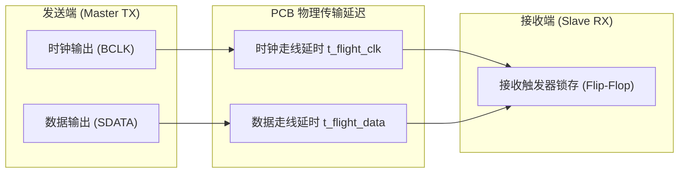

# 08 TDM 时钟抖动与带宽极限推演

## 1. 硬件解决什么问题：多通道物理传输的建立保持时序容限模型

在车载音频总线和高端多通道音频处理器设计中，多路 TDM 声道集中在单根物理线上传输。随着通道数激增（如 16 或 32 声道）与高采样率普及，位时钟 BCLK 的频率持续推高。

当总线速率达到数十兆赫兹时，**时钟抖动（Clock Jitter）、PCB 走线延时以及芯片输出建立时间（Setup Time）**将严重挤压数据锁存的安全裕量。本节对 TDM 物理极限进行严密推演。

---

## 2. 建立时间与保持时间数学模型

### 关键时序参数定义
- $T_{\text{BCLK}}$：位时钟完整周期；
- $t_{\text{co, max}}$：发送芯片时钟有效沿到数据稳定输出的最大延迟；
- $t_{\text{co, min}}$：发送芯片时钟有效沿到数据开始变化的最早保持时间；
- $t_{\text{setup}}$：接收芯片触发器所需的最小建立时间；
- $t_{\text{hold}}$：接收芯片触发器所需的最小保持时间；
- $t_{\text{skew}}$：数据线与时钟线由于 PCB 长度不均导致的飞行时间偏差：$t_{\text{skew}} = |t_{\text{flight, data}} - t_{\text{flight, clk}}|$；
- $t_{\text{jitter}}$：时钟信号峰峰值周期抖动（Peak-to-Peak Jitter）。

---

## 3. 建立保持时间边界方程式

为了保证数据 100% 被可靠采集中不发生亚稳态，必须同时满足两大边界不等式：

### 1. 建立时间裕量不等式（Setup Margin）
$$T_{\text{BCLK}} \ge t_{\text{co, max}} + t_{\text{setup}} + t_{\text{skew}} + t_{\text{jitter}} + M_{\text{setup}}$$
其中 $M_{\text{setup}}$ 为工程设计安全裕量（要求 $M_{\text{setup}} \ge 2.0\text{ ns}$）。

### 2. 保持时间裕量不等式（Hold Margin）
$$t_{\text{co, min}} - t_{\text{skew}} - t_{\text{jitter}} \ge t_{\text{hold}} + M_{\text{hold}}$$

---

## 4. 极限工况参数代入推演

考虑一个严苛的车载 TDM-16 系统（16 声道、96kHz 采样率、单槽位 32-bit）：
$$f_{\text{BCLK}} = 16 \times 32 \times 96000 = 49.152\text{ MHz}$$
位时钟周期为：
$$T_{\text{BCLK}} = \frac{1}{49.152\text{ MHz}} \approx 20.345\text{ ns}$$
查阅典型车规级 Codec 数据手册获取典型微架构参数：
- $t_{\text{co, max}} = 11.5\text{ ns}$；$t_{\text{co, min}} = 3.0\text{ ns}$；
- $t_{\text{setup}} = 4.0\text{ ns}$；$t_{\text{hold}} = 2.0\text{ ns}$；
- 设 PCB 严格等长，走线偏差 $< 5\text{ mm}$，故 $t_{\text{skew}} \approx 0.03\text{ ns}$；
- 设时钟源抖动 $t_{\text{jitter}} = 1.2\text{ ns}$。

### 求解建立时间裕量：
$$M_{\text{setup}} = 20.345 - (11.5 + 4.0 + 0.03 + 1.2) = 20.345 - 16.73 = \mathbf{3.615\text{ ns}}$$
**结论**：建立时间裕量为 $3.615\text{ ns} > 2.0\text{ ns}$，时序能够收敛。

### 求解系统支持的最高物理极限通道数：
当保持 $M_{\text{setup}} = 2.0\text{ ns}$ 时，所允许的最小 $T_{\text{BCLK}}$ 为：
$$T_{\text{BCLK, min}} = 16.73 + 2.0 = 18.73\text{ ns} \implies f_{\text{BCLK, max}} \approx 53.39\text{ MHz}$$
若试图在 96kHz 下扩展到 32 通道，其理论时钟将需要：
$$f_{\text{BCLK}} = 32 \times 32 \times 96000 = 98.304\text{ MHz} \implies T_{\text{BCLK}} = 10.17\text{ ns}$$
由于 $10.17\text{ ns} < 18.73\text{ ns}$，建立时间发生极其严重的 **-8.56 ns 负裕量时序违规**。

---

## 5. 架构指导准则

推论：**在传统的单端 CMOS 电平下，基于单根 SDATA 的 TDM 总线物理极限通常无法逾越 16 声道 @ 96kHz（或 32 声道 @ 48kHz）**。
当系统通道数突破 16 声道以上时，架构师必须采取以下演进路线之一：
1. 采用**多数据线 TDM 并行（Multi-line TDM / TDM-x4）**；
2. 升级为差分高速网络总线（如 **ADI A2B 汽车音频总线** 或以太网 **AVB/TSN**）。
