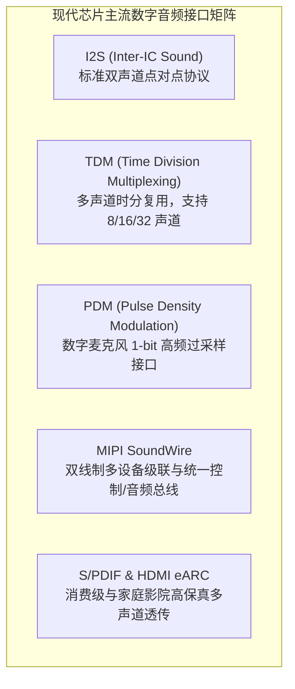

# 02 硬件接口与时序协议

## 模块导读与原厂定位

数字音频接口是连接片内数字信号处理核心与片外编解码器（Codec）、智能功放（Smart PA）、数字麦克风（DMIC）以及车载/耳机传感器的物理高速神经脉络。

在芯片原厂设计中，音频接口不仅需要支持从几十 kHz 到数十 MHz 的灵活物理速率，还要严格解决时钟抖动容限、建立保持时间（Setup/Hold Time）、通道槽位对齐与多设备互联同步。

---

## 模块文章索引

1. [I2S 协议时序与传输格式](01-i2s-protocol-timing.md)：BCLK/LRCK/SDATA 物理时序、飞利浦标准 vs 左对齐 vs 右对齐的逐位解析
2. [TDM 多声道时分复用协议](02-tdm-multichannel-slot.md)：时分槽位 Slot 划分、短帧/长帧同步模式与车载/麦克风阵列拓扑
3. [PDM 数字麦克风与抽取滤波](03-pdm-dmic-cic-decimation.md)：1-bit Sigma-Delta 脉冲密度调制、双声道边沿复用与片上数字 CIC 抽取
4. [MIPI SoundWire 总线协议架构](04-soundwire-protocol-architecture.md)：双线 Clock/Data 架构、控制/音频复合数据帧、动态槽位分配与自动枚举
5. [S/PDIF 与 HDMI eARC 接口](05-spdif-hdmi-earc.md)：双相标记编码（BMC）、通道状态位（Channel Status）与未压缩多声道 LPCM/位流透传
6. [物理接口设计与信号完整性规范](06-interface-engineering-guide.md)：PCB 阻抗匹配、时钟建立保持裕量、防串扰走线与电平转换规范
7. [I2S 相位错位与 PDM 噪声排查](07-cases-debug.md)：实战案例：LRCK 采样点错位导致左右声道交换与 PDM 时钟边缘抖动杂音定位
8. [TDM 时钟抖动与带宽极限推演](08-engineering-analysis.md)：多声道高采样率下 BCLK 速率极限、建立保持裕量与传输距离物理推演
