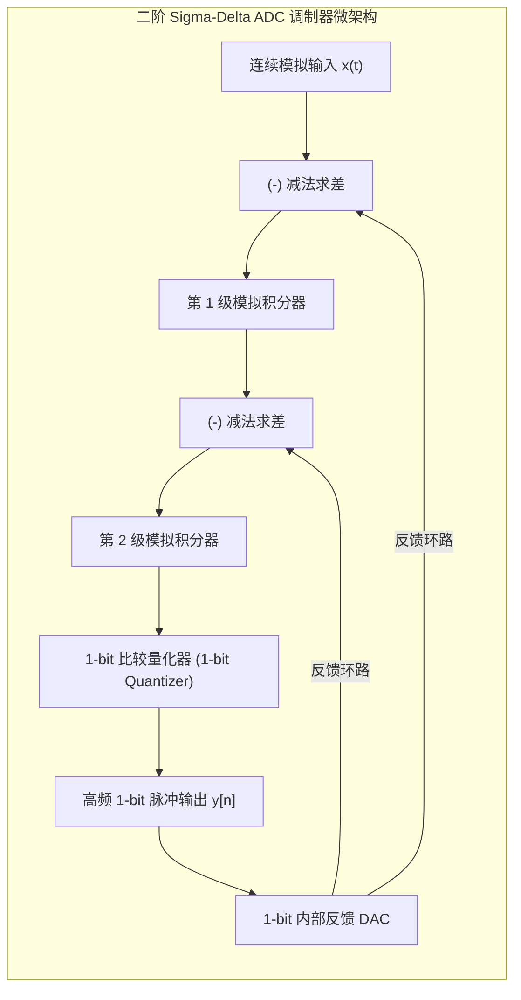

# 01 Sigma-Delta ADC 与 DAC 架构

## 1. 硬件解决什么问题：用高速 1-bit 开关换取极致的 24-bit 分辨率

音频 ADC 的有效精度取决于噪声、失真、带宽、输入条件与实现，不能用架构名称断言 SAR 无法超过 16-bit。已有 24-bit SAR 产品，但标称位宽也不等于 24-bit ENOB；应按指定条件下的 SINAD 计算有效位数。ΣΔ 常以过采样、噪声整形及数字滤波换取带内性能，代价包括群延迟与带外噪声管理。

参考：[AD4630-24 原厂产品资料](https://www.analog.com/en/products/ad4630-24.html)。

**Sigma-Delta（$\Sigma\Delta$）转换器**通过两大革命性架构创新：**过采样（Oversampling）**与**噪声整形（Noise Shaping）**，将极其粗糙的低分辨率（甚至 1-bit）量化器输出的高频高量化噪声“推”到人耳听不见的超高频带外，从而在音频带内实现高达 $110\text{ dB} \sim 130\text{ dB}$ 的惊人动态范围。

---

## 2. 硬件微架构与组成：二阶 Sigma-Delta 调制器



### 调制器信号传输函数（STF）与噪声传输函数（NTF）
在 $z$ 域离散时间模型中，二阶调制器的系统方程表示为：
$$Y(z) = z^{-2} X(z) + (1 - z^{-1})^2 E(z)$$
- **信号传输函数（Signal Transfer Function, STF）**：$STF(z) = z^{-2}$（纯延迟，信号无失真全通）。
- **噪声传输函数（Noise Transfer Function, NTF）**：$NTF(z) = (1 - z^{-1})^2$（二阶高通微分器）。
- **物理本质**：量化噪声 $E(z)$ 乘以了一个高阶差分算子 $(1 - z^{-1})^L$。在低频音频信号段（$z \approx 1$），噪声被强力压制归零；高量化噪声全被搬移至高频带外。

---

## 3. 软件可见接口：过采样率与滤波器滚降配置

```c
// Codec ADC/DAC 调制器控制寄存器: CODEC_SDM_CTRL (Offset: 0x0204)
#define REG_CODEC_SDM_CTRL        (*(volatile uint32_t *)(CODEC_BASE + 0x0204))
#define SDM_OSR_64X               (0U << 0)  // 过采样率 64倍 (低功耗)
#define SDM_OSR_128X              (1U << 0)  // 过采样率 128倍 (标准)
#define SDM_OSR_256X              (2U << 0)  // 过采样率 256倍 (高保真高解析)
#define SDM_DITHER_ENABLE         (1U << 4)  // 调制器加入伪随机抖动信号 (消除极限环振荡)
#define SDM_DEM_ENABLE            (1U << 5)  // 动态元件匹配 (DEM) 使能 (多bit DAC 消除失配)
```

---

## 4. 四流全链路分析：多 bit Sigma-Delta DAC 数字升采样流

1. **PCM 输入流**：系统输入 48kHz / 24-bit PCM 音频流。
2. **多级半带插值流**：数字插值滤波器（Half-Band FIR Filter）将数据连续翻倍升采样：
   $$48\text{ kHz} \xrightarrow{2x} 96\text{ kHz} \xrightarrow{2x} 192\text{ kHz} \xrightarrow{16x} 3.072\text{ MHz (64x OSR)}$$
3. **数字调制器噪声整形流**：数字 Sigma-Delta 调制器将 24-bit 宽字长转换为 5-bit（32 个电平）高速脉冲流，同时将量化误差推向高频。
4. **动态元件匹配（DEM）流**：DEM 状态机打乱 32 个片上内部温度计编码电流源的使用顺序，将元器件制造工艺失配误差转化为高频白噪声。
5. **模拟连续平滑流**：低通模拟重建滤波器（Reconstruction Filter）滤除 3MHz 以上带外脉冲成分，还原为平滑细腻的纯模拟声波。

---

## 5. 软硬件设计约束

- **调制器极限环振荡（Limit Cycles / Idling Tones）**：当输入信号为零或直流微弱偏置时，非线性量化器会陷入确定性的周期性循环模式，在音频频带内激发出刺耳的单音啸叫（Idle Tone）。硬件中**必须注入极微弱的伪随机抖动（Dither）**以破坏极限环。
- **积分器运放压摆率（Slew Rate）与带宽约束**：第一级积分器运放的单位增益带宽（GBW）必须达到采样时钟频率的至少 5 倍以上，否则大信号输入时积分器产生非线性压摆受限失真，严重恶化 THD。

---

## 6. 现场排错与调试清单

- **故障：录音或放音在极安静背景下能听到微弱的高频鸟鸣声或啸叫（Idle Tone）**
  1. 检查 Codec 寄存器中的 `SDM_DITHER_ENABLE` 是否被意外关闭。
  2. 微调 ADC 模拟前端的直流偏移补偿寄存器（DC Offset Calibration）。
- **故障：大信号输入时，ADC 突然输出全 1 或死锁为全 0 且无法自动恢复**
  1. 调制器发生积分器过载饱和（Modulator Overload）。
  2. 触发了高阶调制器的不稳定发散，必须写入软复位位使积分器电容放电复位，并减小前置增益。

---

## 7. 实验与验证推演：过采样增益与理论 SNR 公式

对于 $L$ 阶 Sigma-Delta 调制器，过采样率为 $\text{OSR} = \frac{f_s^{\text{mod}}}{2 f_0}$（$f_0$ 为音频截止频率 20kHz）。其带内量化噪声方差为：
$$\sigma_{qy}^2 \approx \frac{\Delta^2}{12} \cdot \frac{\pi^{2L}}{2L + 1} \cdot \left( \frac{1}{\text{OSR}} \right)^{2L + 1}$$
由此推导理想理论信噪比增长关系：
- 每当 **过采样率 OSR 翻倍**：
  - 0 阶普通 ADC（无噪声整形）：信噪比仅增加 $3\text{ dB}$（提高 0.5 bit）；
  - 1 阶 Sigma-Delta：信噪比增加 $9\text{ dB}$（提高 1.5 bits）；
  - 2 阶 Sigma-Delta：信噪比增加 $15\text{ dB}$（提高 2.5 bits）；
  - 3 阶 Sigma-Delta：信噪比增加 $21\text{ dB}$（提高 3.5 bits）。
这直观揭示了：**仅需采用 3 阶调制器与 128 倍过采样，硬件即可从原本仅有几个 bit 的粗糙量化器中提取出超过 115 dB 的发烧级保真度**。
