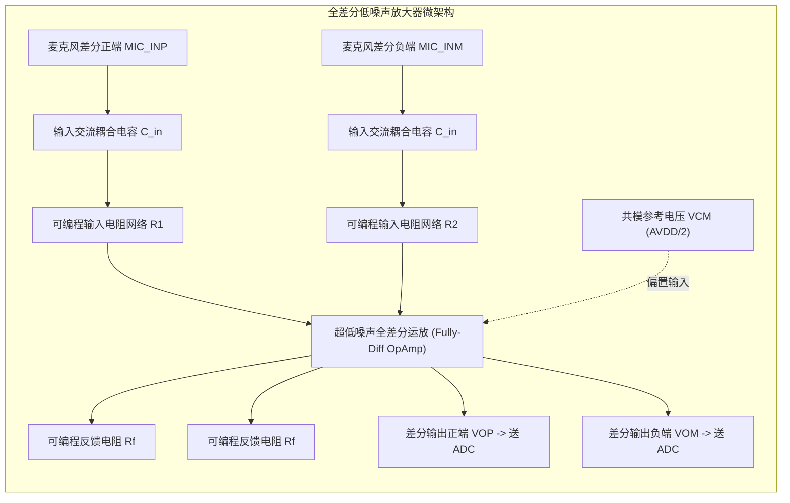

# 02 模拟前端 AFE 与麦克风前置放大

## 1. 硬件解决什么问题：微弱差分声学信号提取与共模噪声抵消

驻极体麦克风（ECM）或模拟 MEMS 麦克风输出的音频电压通常仅有几个毫伏（$1\text{ mV} \sim 20\text{ mV}$）。如果直接送入 ADC 采样，将严重损失量化有效动态范围（仅能利用 ADC 顶端几个有效 bit）。

模拟前端（AFE）负责在最前端对微弱音频信号进行**高保真全差分放大（PGA）**，并在复杂的板级环境中抑制来自射频天线、开关电源和地电位波动的共模电磁干扰。

---

## 2. 硬件微架构与组成：全差分可编程增益放大器（PGA）



### 全差分架构的三大压倒性工程优势
1. **共模抑制比（CMRR > 80dB）**：任何空间辐射耦合到两根对称走线上的噪声都是同相位的共模信号，在全差分放大器内部被完全相减抵消。
2. **消除偶次谐波失真（Even Harmonic Cancellation）**：全差分拓扑的对称传递函数在数学上彻底抵消了二次谐波（$2f_0$）、四次谐波等非线性偶次失真，使 THD 获得质的跃升。
3. **输出动态电压摆幅翻倍**：单端架构最大摆幅为 $V_{\text{DD}}$，差分正负双向摆动使最大峰峰值摆幅翻倍至 $2V_{\text{DD}}$，理论最大动态范围额外提升 $6\text{ dB}$。

---

## 3. 软件可见接口：PGA 增益阶梯控制寄存器

```c
// 模拟前端增益与通道控制: CODEC_AFE_CTRL (Offset: 0x0210)
#define REG_CODEC_AFE_CTRL       (*(volatile uint32_t *)(CODEC_BASE + 0x0210))
#define AFE_PGA_GAIN_MASK         (0x1FU << 0) // 5-bit 可编程增益控制
// 增益范围: 0dB 到 +30dB，以 1dB 为步进
#define AFE_GAIN_0DB              (0x00U)
#define AFE_GAIN_12DB             (0x0CU)
#define AFE_GAIN_24DB             (0x18U)
#define AFE_DIFF_MODE_EN          (1U << 6)    // 1: 全差分输入, 0: 准差分/单端
#define AFE_MUTE_EN               (1U << 7)    // 硬件模拟开关静音
```

---

## 4. 四流全链路分析：软件自动增益控制（AGC）闭环流

1. **采样反馈流**：数字基带峰值检测器持续监测当前 ADC 采样值的能量幅值。
2. **阈值判决流**：当人声由远及近声压剧增，数字样点峰值逼近 $-3\text{ dBFS}$（饱和边缘）时，触发数字 AGC 算法。
3. **阶梯调节流**：驱动或硬件自动状态机改写 `REG_CODEC_AFE_CTRL.bits.gain`，以每次 $1\text{ dB}$ 的步长在**零交叉时刻（Zero-Crossing Point）**平滑下调模拟增益。
4. **效果流转**：模拟输入端电压被等比例衰减，避免 ADC 积分器发生硬削波破音。

---

## 5. 软硬件设计约束

- **等效输入噪声（EIN - Equivalent Input Noise）**：微型麦克风前置放大器的 EIN 必须满足 $< -120\text{ dBu}$（A 加权），以确保哪怕在极轻柔的微声细语下，放大器自身的晶体管散粒噪声与热噪声也不会掩盖语音信号。
- **输入交流电容与低频截止点**：外部输入电容 $C_{\text{in}}$ 与 PGA 输入电阻 $R_{\text{in}}$ 构成高通滤波器，截止频率为：
$$f_{\text{cutoff}} = \frac{1}{2\pi R_{\text{in}} C_{\text{in}}}$$
若增益设为高挡时 $R_{\text{in}}$ 变小，若电容取值不当会导致低频音频（如低音人声、大提琴）发生显著的低频衰减相移。

---

## 6. 现场排错与调试清单

- **故障：录音音量调大时，扬声器中伴随着刺耳的“咔咔”台阶爆音**
  1. 检查增益切换是否在信号任意相位随机发生。
  2. 开启硬件 `ZERO_CROSSING_EN`（零交叉检测），确保增益档位仅在模拟音频信号电压穿过 0V 地电位的一瞬间平滑跳变。
- **故障：单端麦克风录音底噪极大，且用手触摸产品外壳时底噪发生剧变**
  1. 未使用差分走线，PCB 上的地阻抗噪声直接串入输入端。
  2. 采用伪差分（Pseudo-differential）接法：MIC- 接地线必须单点接回 Codec 的模拟地管脚，严禁就近就地打孔接大铜皮。

---

## 7. 实验与验证推演：共模抑制比（CMRR）计算

设模拟输入差分信号为 $V_d = V_{\text{INP}} - V_{\text{INM}}$，共模干扰噪声为 $V_c = \frac{V_{\text{INP}} + V_{\text{INM}}}{2}$。
放大器差分增益为 $A_d$，共模放大增益为 $A_c$。共模抑制比定义为：
$$\text{CMRR} = 20 \log_{10} \left( \frac{A_d}{A_c} \right)$$
若芯片在 $1\text{ kHz}$ 处的标称 CMRR 为 $80\text{ dB}$，且差分放大倍数设为 $A_d = 20\text{ dB}$（10 倍）。
则共模增益为：
$$A_c = 20\text{ dB} - 80\text{ dB} = -60\text{ dB} = 0.001$$
推论：当板级开关电源在两根麦克风走线上激发出高达 $100\text{ mV}$ 的高频共模纹波时，经差分放大后在输出端残留的噪声仅为：
$$V_{\text{noise, out}} = 100\text{ mV} \times 0.001 = 0.1\text{ mV} = 100\mu\text{V}$$
被大幅压制在底噪阈值之下，有力验证了差分前置放大的抗噪能力。
