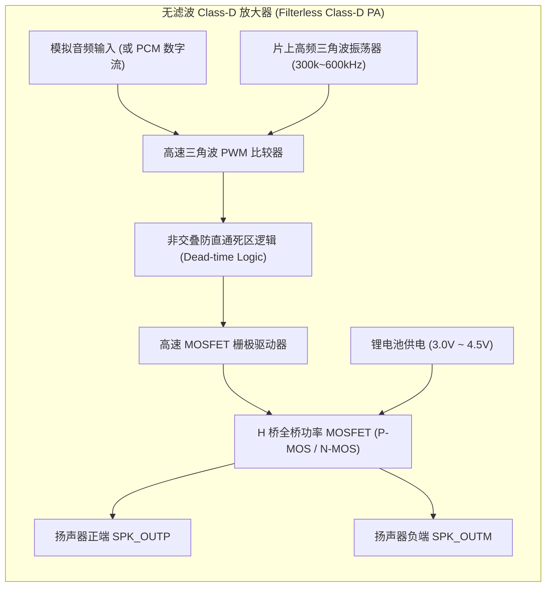

# 03 音频功率放大器 Class-D/AB/H

## 1. 硬件解决什么问题：微弱电压信号到驱动空气的声学大功率变换

DAC 输出的音频模拟信号通常仅具备伏级电压与毫安级驱动能力（输出功率仅几毫瓦），无法推动微型扬声器音圈（典型阻抗 $4\Omega$ 或 $8\Omega$）剧烈震动发声。

音频功率放大器（Power Amplifier, PA）的核心任务是在保持高保真度、低失真的前提下，以**极高的能效转换比（Efficiency > 90%）**将电池直流电能转换为高电压、大电流的交流音频能量驱动扬声器。

---

## 2. 硬件微架构与组成：Class-D 功率放大器微架构



### 三大主流音频功放拓扑技术对比

| 功放类型 | 工作原理与晶体管导通状态 | 理论最大效率 | 典型 THD+N | 核心优缺点与典型应用 |
| :--- | :--- | :--- | :--- | :--- |
| **Class-AB** | 输出互补晶体管工作在放大线性区（半周期导通） | $50\% \sim 65\%$ | **极佳 (< 0.001%)** | **优点**：零高频 EMI 开关噪声，音质温润细腻；<br/>**缺点**：严重发热耗电，仅用于高端耳放。 |
| **Class-D** | 功率开关管以数百 kHz 运行在全导通/全截止开关态 | **$88\% \sim 93\%$** | 良好 (0.01%~0.03%)| **优点**：极低发热、体积小、省电；<br/>**缺点**：存在强烈的 PWM 开关辐射，需防 EMI。 |
| **Class-H** | 智能追踪音频包络动态升压供电的 Class-D | **> 85% 全功率域** | 良好 | **优点**：小音量时降压省电，大音量时瞬间升压至 10V+ 防破音；智能手机首选。 |

---

## 3. 软件可见接口：智能功放（Smart PA）寄存器控制

现代智能功放通常挂接在 I2C 控制总线上，并集成片上 DSP 监控电路：

```c
// 智能功放控制寄存器: SMART_PA_CTRL (I2C Slave Addr: 0x34)
#define REG_SPA_CHIP_ID          0x00  // 芯片厂商与硬件版本号
#define REG_SPA_POWER_CTRL       0x01  // 电源与工作模式 (0: 待机, 1: 正常工作, 2: 静音)
#define REG_SPA_BOOST_VOLT       0x02  // Class-H 升压目标设定 (00: 6.5V, 01: 8.5V, 10: 11.0V)
#define REG_SPA_IV_SENSE_EN      0x03  // 开启实时音圈电流/电压检测反馈 (IV-Sense)
#define REG_SPA_FAULT_STATUS     0x04  // 故障状态: 过流(OCP)、过温(OTP)、过压(OVP)
```

---

## 4. 四流全链路分析：无滤波（Filterless）调制与电感低通滤波

1. **调制流**：三角波发生器产生 $500\text{ kHz}$ 高频载波；音频正弦波与其调制生成占空比随振幅动态变化的差分 PWM 方波。
2. **功率放大流**：低导通内阻（$R_{\text{DSON}} < 100\text{m}\Omega$）的 H 桥功率管高速交替通断，将方波幅度放大至电池电压满幅（如 $4.2\text{ V}$）。
3. **声学换能与空间低通滤波流**：
   - 传统 Class-D 需要外挂笨重的 LC 低通滤波器；
   - 现代微型扬声器自身音圈具有显著的**寄生电感（通常几十 $\mu\text{H}$）与机械惯性**；
   - 扬声器音圈自身直接充当了一阶低通滤波器，滤平 $500\text{ kHz}$ 高频 PWM 脉冲，仅让平滑的音频低频电流穿透并推动振膜发声。

---

## 5. 软硬件设计约束

- **死区时间（Dead-time）控制**：H 桥同侧上管和下管严禁在同一时刻导通，否则将造成电池正负极直接短路烧毁芯片（Shoot-Through Current）。驱动电路必须插入几纳秒的死区时间，但死区时间过长又会引入过零交越失真（Crossover Distortion）。
- **EMI 辐射抑制与边沿斜率平衡**：PWM 开关边沿越陡峭，功放效率越高，但高频 EMI 辐射越严重。工业界通常采用扩频调制（Spread Spectrum）与自适应边沿压摆率控制，使功放顺利通过 FCC/CE 辐射认证。

---

## 6. 现场排错与调试清单

- **故障：整机播放音乐时，调频收音机（FM）或手机 LTE 低频段天线接收灵敏度断崖式下跌**
  1. 功放 PWM 开关频率谐波直击射频接收频段。
  2. 开启 Class-D 的扩频时钟调制功能（Spread Spectrum），将集中的能量尖峰分散打平在整个频带上。
  3. 扬声器输出走线尽可能贴近 PCB 缩短长度，必要时在输出端追加铁氧体磁珠（Ferrite Beads）。

---

## 7. 实验与验证推演：BTL 桥接负载输出功率理论推导

在单端供电（SE）模式下，扬声器一端接地，最大理论不失真正弦波峰峰值电压为 $V_{\text{BAT}}$，有效值（RMS）为：
$$V_{\text{rms, SE}} = \frac{V_{\text{BAT}}}{2\sqrt{2}}$$
根据功率公式 $P = \frac{V_{\text{rms}}^2}{R_{\text{SPK}}}$：
$$P_{\text{SE}} = \frac{V_{\text{BAT}}^2}{8 R_{\text{SPK}}}$$
在全桥 BTL（Bridge-Tied Load）拓扑下，扬声器两端均由反相方波驱动，等效最大差分峰峰值电压翻倍至 $2 V_{\text{BAT}}$：
$$V_{\text{rms, BTL}} = \frac{V_{\text{BAT}}}{\sqrt{2}}$$
此时最大输出功率为：
$$P_{\text{BTL}} = \frac{V_{\text{BAT}}^2}{2 R_{\text{SPK}}} = 4 \times P_{\text{SE}}$$
**计算推演**：设锂电池供电 $V_{\text{BAT}} = 4.2\text{ V}$，扬声器阻抗 $R_{\text{SPK}} = 8\Omega$：
$$P_{\text{BTL}} = \frac{4.2^2}{2 \times 8} = \frac{17.64}{16} \approx 1.10\text{ W}$$
若采用 Class-H 动态升压芯片将供电轨升至 $8.4\text{ V}$：
$$P_{\text{Boost}} = \frac{8.4^2}{2 \times 8} = \frac{70.56}{16} \approx 4.41\text{ W}$$
功率直接跃升了 **4 倍**，这解释了为什么现代轻薄智能手机能够发出震撼澎湃低音的物理秘密。
