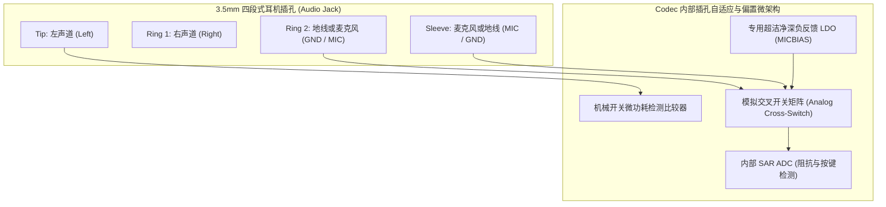

# 04 耳机插孔检测与 MICBIAS 电路

## 1. 硬件解决什么问题：多标准耳机兼容、阻抗测量与超洁净拾音偏置

传统的 3.5mm 音频插孔看似结构简单，实则隐藏着复杂的软硬件工程兼容性难题：
1. **OMTP 与 CTIA 行业标准冲突**：国际标准 CTIA（Apple/大部分安卓）与国标 OMTP 的地线（GND）和麦克风线（MIC）引脚定义完全相反。若用户插错，会导致声音中置人声完全抵消空洞，麦克风无法拾音。
2. **耳机插入/拔出状态检测**：必须在微秒级时间内感知机械触点通断，避免拔出瞬间因浮空产生巨大的刺耳爆音。
3. **麦克风偏置电源洁净度**：驻极体麦克风内部 FET 放大管直接由外部 MICBIAS 电源偏置。MICBIAS 上哪怕有 $5\mu\text{V}$ 的纹波，都会被内部晶体管放大数十倍直接变成底噪。

---

## 2. 硬件微架构与组成：自动识别与超低噪声偏置架构



### 两种国际耳机引脚定义规范对比

| 机械触点引脚 | CTIA 国际标准（现代绝大多数手机/PC） | OMTP 标准（早期诺基亚/部分国标） |
| :--- | :--- | :--- |
| **Tip (尖端)** | 左声道输出 (Left Audio) | 左声道输出 (Left Audio) |
| **Ring 1 (第一环)** | 右声道输出 (Right Audio) | 右声道输出 (Right Audio) |
| **Ring 2 (第二环)** | **系统音频地线 (GND)** | **麦克风信号与偏置 (MIC)** |
| **Sleeve (套筒尾端)**| **麦克风信号与偏置 (MIC)** | **系统音频地线 (GND)** |

---

## 3. 软件可见接口：插孔中断与按键阻抗寄存器

```c
// 耳麦状态与阻抗检测寄存器: JACK_STATUS_REG (Offset: 0x0280)
#define REG_JACK_STAT             (*(volatile uint32_t *)(CODEC_BASE + 0x0280))
#define JACK_INSERT_IRQ           (1U << 0)  // 耳机插入中断标志
#define JACK_REMOVE_IRQ           (1U << 1)  // 耳机拔出中断标志
#define JACK_TYPE_3POLE           (0U << 4)  // 普通 3 段式立体声耳机 (无麦)
#define JACK_TYPE_4POLE_CTIA      (1U << 4)  // 4 段式 CTIA 耳麦
#define JACK_TYPE_4POLE_OMTP      (2U << 4)  // 4 段式 OMTP 耳麦
#define GET_KEY_PRESSED(val)      (((val) >> 8) & 0x07) // 线控按键识别 (Play/Vol+/Vol-)
```

---

## 4. 四流全链路分析：全自动极性切换与线控按键识别流

1. **机械触发流**：耳机插入插孔瞬间，机械弹片闭合，引发内部极低功耗下拉电阻触发中断，通知 CPU。
2. **偏置施加流**：内部 LDO 向 Ring 2 输出微弱偏置电流，内部 SAR ADC 测量回路阻抗：
   - 若电阻直接近 0 欧姆：判定该引脚为地（GND）；
   - 若呈现约 $1\text{ k}\Omega \sim 3\text{ k}\Omega$ 的阻抗特性：判定该引脚为驻极体麦克风（MIC）。
3. **交叉开关翻转流**：若检测到插入的是 OMTP 耳机，硬件自动控制片内低阻抗模拟开关阵列（MOS Switch，导通电阻 $< 0.1\Omega$），将内部音频地与麦克风通道物理交叉互换，使用户完全无感正常使用。
4. **线控按键判定流**：当用户按下耳机线控上的“播放/暂停”按键时，外部电阻将麦克风线路对地短路，SAR ADC 电压读数骤降至接近 0V，驱动立即上报 Linux Input 子系统的 `KEY_PLAYPAUSE` 事件。

---

## 5. 软硬件设计约束

- **MICBIAS 极致电源抑制比与滤波**：MICBIAS 通常提供 1.8V 或 2.8V 电压，要求在 $20\text{ Hz} \sim 20\text{ kHz}$ 带宽内的噪声小于 **$2\mu\text{Vrms}$**。外部引脚必须紧靠配置一颗高频低 ESR 陶瓷电容（$1\mu\text{F} \sim 2.2\mu\text{F}$），严禁省略。
- **插孔防静电（ESD）防护**：耳机插孔暴露于外界，极易受到人体静电直接放电（接触放电 $\pm 8\text{ kV}$，空气放电 $\pm 15\text{ kV}$）。在进入 Codec 之前，必须串接专用的超低结电容（$< 0.5\text{ pF}$）双向 TVS 静电保护二极管，防止结电容过大引起高频音频失真。

---

## 6. 现场排错与调试清单

- **故障：插入 4 段式耳机后，听音乐感觉没有低音，人声非常微弱空洞，但按住耳机上的麦克风通话键声音突然正常**
  1. 典型的 OMTP/CTIA 极性不匹配（接地端漂空在麦克风回路上）。
  2. 检查 Codec 芯片是否未开启自动极性检测，或者 PCB 上的接地开关阻抗过大（$> 1\Omega$）。
- **故障：耳机刚插上一半时，喇叭发出刺耳的短路“啪啪”爆音**
  1. 插入过程中，插针金属节段会短暂地将左声道或右声道输出直接短路到地。
  2. 软件驱动必须在收到机械插入事件后，先延迟 $150\text{ ms} \sim 200\text{ ms}$ 等待机械物理触点完全稳定，再解除耳放静音输出。

---

## 7. 实验与验证推演：线控多按键电压分压梯级推算

在 CTIA 标准中，三个线控按键（Vol+、Play/Pause、Vol-）通过内部并联不同阻值的电阻到麦克风线实现区分：
- $R_{\text{bias}} = 2.2\text{ k}\Omega$（内部偏置电阻，上拉到 $V_{\text{bias}} = 2.8\text{ V}$）；
- 麦克风空闲等效阻抗 $R_{\text{mic}} \approx 2.0\text{ k}\Omega$。
空闲时麦克风引脚直流电压为：
$$V_{\text{idle}} = 2.8\text{ V} \times \frac{2.0}{2.0 + 2.2} = 1.333\text{ V}$$
不同按键按下时并联的阻抗与 ADC 采集电压推演：
1. **按键 1 (Play/Pause: 直接短路)**：$R_{\text{key1}} = 0\Omega \implies V_{\text{key1}} = 0.00\text{ V}$（ADC 读数 $0 \sim 0.2\text{ V}$）；
2. **按键 2 (Volume +: 并联 240 欧姆)**：
   $$R_{\text{eq}} = 240\Omega \parallel 2000\Omega \approx 214\Omega \implies V_{\text{key2}} = 2.8 \times \frac{214}{214 + 2200} \approx 0.248\text{ V}$$
3. **按键 3 (Volume -: 并联 600 欧姆)**：
   $$R_{\text{eq}} = 600\Omega \parallel 2000\Omega \approx 461\Omega \implies V_{\text{key3}} = 2.8 \times \frac{461}{461 + 2200} \approx 0.485\text{ V}$$
软件驱动仅需在 SAR ADC 采样端划分 4 个比较电压阈值窗口，即可用单根导线无误识别出 3 个独立多媒体按键。
