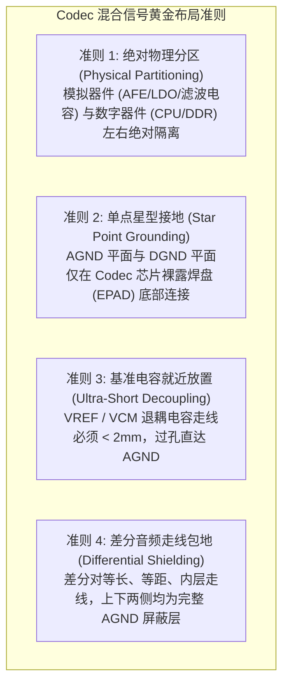

# 05 Codec 混合信号工程设计规范

## 1. 硬件解决什么问题：数模混合板级设计的抗电磁干扰规范

Codec 芯片是整块系统 PCB 上最敏感、最脆弱的混合信号核心。它同时处理纳伏级的模拟微弱音频与数十安培、纳秒级翻转的数字开关电流。

经验不足的硬件设计往往导致数模串扰、地回路环流和底噪严重超标。遵循严苛的芯片级与板级混合信号工程规范，是产品通过 Hi-Res 音频认证的基础。

---

## 2. 硬件微架构与 PCB 物理布局规范

---

## 3. 关键供电轨走线与器件选型标准

| 电源引脚 | 建议滤波拓扑 | 允许最大走线寄生电阻 | 电容选型与介质要求 |
| :--- | :--- | :--- | :--- |
| **VREF / VCM** | 独立退耦至 AGND | $< 0.05\Omega$ | **低漏电 X7R / NP0 陶瓷电容**，严禁使用 Y5V 介质 |
| **AVDD** | 磁珠 (Ferrite Bead) + LC $\pi$ 型滤波 | $< 0.1\Omega$ | 10uF 钽电容/低ESR陶瓷 + 0.1uF 高频滤波 |
| **MICBIAS** | 独立外引专用滤波 | $< 0.1\Omega$ | 2.2uF 陶瓷电容，严禁有任何高频数字线穿越下方 |
| **PVDD (PA供电)** | 宽铜皮（> 40mil）直连电池 | $< 0.03\Omega$ | 大容量储能电解/固态电容（22uF~47uF）吸收瞬态大电流 |

---

## 4. 四流全链路分析：地弹（Ground Bounce）如何侵入模拟音频

1. **数字翻转流**：CPU 与 DDR 内存总线在时钟沿同时发生 64 位宽逻辑跳变，瞬态电流 $\Delta I = 3\text{ A}$，在 $\Delta t = 1\text{ ns}$ 内完成。
2. **寄生电感感抗流**：数字地平面的过孔与引线存在微小的寄生电感 $L \approx 1\text{ nH}$：
$$V_{\text{bounce}} = L \cdot \frac{di}{dt} = 10^{-9} \times \frac{3}{10^{-9}} = 3\text{ V}$$
产生高达数伏的瞬间高频毛刺。
3. **回路污染流**：若模拟地与数字地大面积混杂相连，该地弹电流将流经模拟 Codec 输入端的参考地，直接叠加在麦克风微弱信号上，在音频中产生刺耳的“数字啸叫底噪”。

---

## 5. 软硬件设计约束

- **禁止任何数字信号穿越模拟地缝隙**：若在 PCB 上对 AGND 与 DGND 进行了物理开槽分割，**严禁任何数字信号线（包括 I2C、I2S、GPIO）跨越分割槽**。跨越开槽会导致信号回流路径极度扩大，形成巨大的天线发射高频 EMI。
- **晶振位置约束**：音频专用晶振必须紧贴 Codec 放置，外壳良好接地，晶振底部严禁走任何信号线。

---

## 6. 现场排错与调试清单

- **排查表：产品底噪（Noise Floor）超出预期 10dB 以上**
  1. 使用近场磁场探头（Near-Field Probe）探测 Codec 周围，寻找噪声热点。
  2. 检查 VREF 参考基准电容的接地端是否误打孔连到了数字地，导致基准电压被数字噪声调制。
  3. 检查扬声器输出差分走线是否破坏了对称性，导致共模噪声无法互相抵消。
