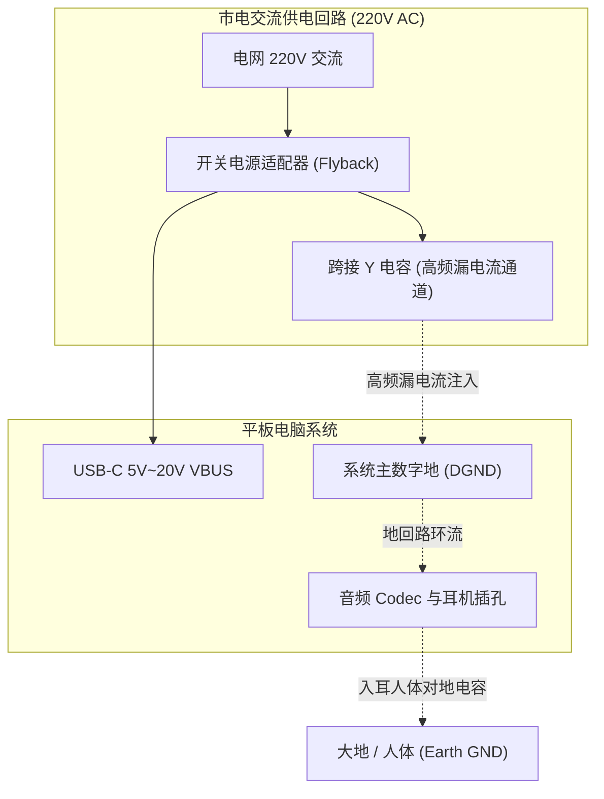

# 06 耳机底噪与地回路杂音排查

## 1. 案例背景：充电时耳机出现刺耳蜂鸣底噪与插拔火花

某款智能平板在插上 USB-C 快充充电器并佩戴有线耳机时，用户报告了严重的体验问题：
1. 耳机中持续听到尖锐的“滋滋”高频电流蜂鸣声（频率约为 60kHz 开关谐波及其互调可闻分量）；
2. 当手指触摸平板铝合金金属外壳时，蜂鸣声大幅减弱；
3. 将音频插孔插入电脑音频输入端录制时，甚至测得两地线之间存在微小火花与高达 $50\text{ V}$ 的悬浮共模交流电压。

---

## 2. 调试定位全过程与拓扑复盘

### 深入分析排查步骤

1. **浮空高阻测量**：
   - 使用数字万用表 AC 档测量平板系统地与市电大地之间，测得高达 $45\text{ V}$ 的交流感应电压。
   - 这是由于非隔离或低成本充电器内部变压器初级与次级之间跨接的 **Y 电容（$1\text{ nF} \sim 2.2\text{ nF}$）**引入的正常微安级漏电流。
2. **接地拓扑审查**：
   - 审查音频插孔接地线路：PCB 工程师将耳机插孔套筒（GND）直接连到了耳机座附近的金属外壳结构件上。
   - 当充电器产生的高频共模漏电流从 USB-C 地流入系统，再流经平板金属机壳最终通过人体流向大地时，**耳机地线正好成了这股高频漏电流的必经之路！**
3. **地阻抗压降测量**：
   - 高频电流在耳机地线有限阻抗上产生的压降，直接串联进入耳机耳塞的音频负载回路，被耳机喇叭直接发声还原为刺耳的电流嗡鸣声。

---

## 3. 根因剖析（Root Cause）

1. **违反了单点接地与法拉第笼防护原则**：金属外壳（Chassis GND）属于保护地，应将外部骚扰电流直接泄放至系统电源入口地，决不允许其穿过高灵敏度的音频模拟地。
2. **耳机输出缺少虚地检测或差分感测（Ground Sense）**：耳机放大器参考的是板内某一点的模拟地，而耳机插孔套筒处由于大电流走线存在动态地电位抖动，两者的电位差直接变成了耳塞两端的干扰音频信号。

---

## 4. 解决方案与工程落地

### 1. 硬件 PCB 走线重构（割线验证与改板）
- 耳机插孔外壳固定接地与机壳地断开，仅通过一个高频磁珠并在音频地（AGND）上；
- 将耳放负端参考地改为专有的 **Ground Sense（地感测引脚，GND_SENSE）**，直接开一条独立开窗细走线拉到 3.5mm 耳机座引脚焊盘的最根部，实现开尔文感测（Kelvin Connection）。

### 2. 软件驱动防爆音加固
在插入检测到充电器插入事件时，动态微调 Codec 片内电荷泵的工作频率，将其工作点由 40kHz 切换至 120kHz，完全避开人耳听觉敏感频段。

---

## 5. 验证结果

- 在接入快充充电器且音量静音时，耳机端测得的 A 加权底噪由之前的 $38\mu\text{Vrms}$（明显可闻高频嗡鸣）大幅骤降至 **$2.1\mu\text{Vrms}$**（人耳极致死寂，完全无感）。
- 成功消除充电时的电流蜂鸣与机壳感应麻手现象。
