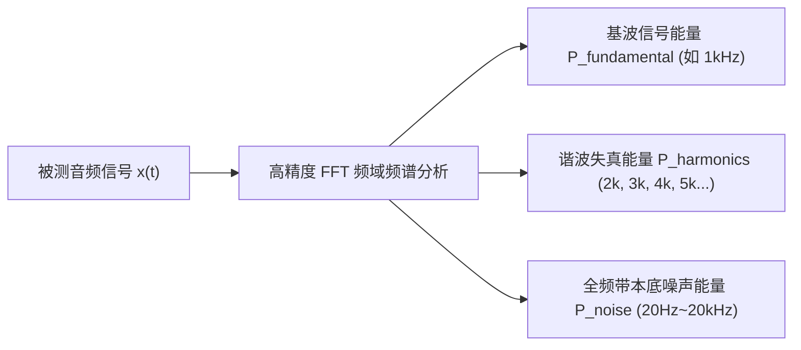

# 07 THD+N 与动态范围理论推导

## 1. 硬件解决什么问题：音频模拟保真度四大客观指标的数学定义

在芯片数据手册与 Audio Precision 仪器测试报告中，衡量音频 Codec 品质的四个最权威指标是：**信噪比（SNR）**、**总谐波失真加噪声（THD+N）**、**动态范围（DNR）**与**声道分离度（Crosstalk）**。

理解其背后的数学本质与理论推导，是评估芯片物理性能天花板的基础。

---

## 2. 傅里叶级数分解与信号能量模型

设时域输出信号 $x(t)$ 经过傅里叶级数展开为：
$$x(t) = A_1 \cos(2\pi f_0 t + \phi_1) + \sum_{k=2}^{\infty} A_k \cos(2\pi k f_0 t + \phi_k) + n(t)$$
其中：
- $A_1$ 为基波（Fundamental，标准测试中通常为 $1.000\text{ kHz}$ 单音）有效振幅；
- $A_k$ 为各次非线性谐波（Harmonics：$2\text{ kHz}, 3\text{ kHz}, 4\text{ kHz} \dots$）振幅；
- $n(t)$ 为全频带热噪声、散粒噪声与量化噪声之和。

---

## 3. 四大核心指标严密数学方程式

### 1. 总谐波失真加噪声（THD+N）
衡量信号经过放大或转换后产生的全部杂波与失真占纯基波的能量百分比：
$$\text{THD+N} = \frac{\sqrt{\sum_{k=2}^{\infty} A_k^2 + V_{\text{noise}}^2}}{A_1}$$
用分贝（dB）表示：
$$\text{THD+N (dB)} = 20 \log_{10}\left( \frac{\sqrt{\sum_{k=2}^{\infty} A_k^2 + V_{\text{noise}}^2}}{A_1} \right)$$
**原厂优秀门限**：发烧级 Codec 的 THD+N 通常需要达到 **$<-100\text{ dB}$（即 $< 0.001\%$）**。

### 2. 动态范围（Dynamic Range, DNR）
系统所能传输的满量程无失真最大信号（Full-Scale Signal $V_{\text{FS}}$）与系统本底最小噪声（Noise Floor $V_{\text{noise}}$）的比值：
$$\text{DNR} = 20 \log_{10}\left( \frac{V_{\text{FS}}}{\sqrt{V_{\text{noise, A-weighted}}^2}} \right)$$
注：标准测试通常灌入 $-60\text{ dBFS}$ 的微弱信号，测量输出信号与噪声比值再加上 $60\text{ dB}$，以避免芯片内部自能动静音（Auto-Mute）电路伪造虚假高指标。

### 3. 声道串扰（Crosstalk / Channel Separation）
在一个声道输入满量程信号时，由于芯片内部引脚寄生电容或 PCB 耦合泄露到相邻另一个未发声声道的信号分量：
$$\text{Crosstalk (dB)} = 20 \log_{10}\left( \frac{V_{\text{unwanted}}}{V_{\text{wanted}}} \right)$$
工业标准通常要求低于 $-90\text{ dB}$。

---

## 4. 理想 $N$-bit 均匀量化 ADC 信噪比数学推导

量化阶距为 $q = \frac{V_{\text{FS}}}{2^N}$。量化误差均匀分布在 $[-\frac{q}{2}, +\frac{q}{2}]$ 之间。
量化噪声平均功率方差为：
$$P_q = \int_{-q/2}^{+q/2} e^2 \cdot \frac{1}{q} de = \left[ \frac{e^3}{3q} \right]_{-q/2}^{+q/2} = \frac{q^2}{12}$$
满量程纯正弦波信号有效值 RMS 为 $V_{\text{rms}} = \frac{V_{\text{FS}}}{2\sqrt{2}} = \frac{2^N q}{2\sqrt{2}}$。
信号总功率为：
$$P_s = V_{\text{rms}}^2 = \frac{2^{2N} q^2}{8}$$
由此推导经典理论最大信噪比（SNR）：
$$\text{SNR} = 10 \log_{10}\left( \frac{P_s}{P_q} \right) = 10 \log_{10}\left( \frac{2^{2N} q^2 / 8}{q^2 / 12} \right) = 10 \log_{10}\left( 1.5 \times 2^{2N} \right)$$
$$\text{SNR} = 10 \log_{10}(1.5) + 20 N \log_{10}(2) \approx 1.76 + 6.02 N\text{ (dB)}$$

---

## 5. 工程推论与位深等效表

根据黄金公式 $\text{SNR} = 6.02 N + 1.76\text{ dB}$：

| 标称位数 | 理论极限 SNR | 工业界实际芯片指标 (ENOB) | 瓶颈原因 |
| :--- | :--- | :--- | :--- |
| **16-bit** | $98.08\text{ dB}$ | 94 ~ 96 dB (ENOB ≈ 15.6) | 接近理论极限，易于实现 |
| **24-bit** | $146.24\text{ dB}$ | 108 ~ 125 dB (ENOB ≈ 18 ~ 20) | **受限于晶体管热噪声与基准源抖动**，物理世界无法达到 146dB |
| **32-bit** | $194.40\text{ dB}$ | 125 ~ 132 dB (ENOB ≈ 21 ~ 22) | 额外低位全为热噪声，主要用于内部数字算法消除截断舍入误差 |

结论：市场上标称的 32-bit 高解析音频，其有效位数（ENOB）由于物理热噪声限制永远无法超过 23 bit。32-bit 的核心价值在于**数字 DSP 滤波与音频混音运算中避免舍入截断误差的级联累积**。
