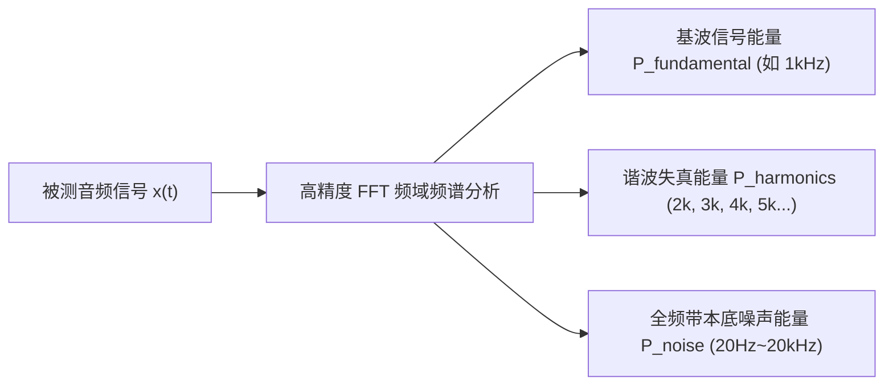

# 07 THD+N 与动态范围理论推导

## 1. 硬件解决什么问题：音频模拟保真度四大客观指标的数学定义

在芯片数据手册与 Audio Precision 仪器测试报告中，常用 **信噪比（SNR）**、**总谐波失真加噪声（THD+N）**、**动态范围（DNR）**与**声道分离度（Crosstalk）**评估音频 Codec。

下面说明这些指标的计算方式，以及理想量化模型与实测结果的区别。

---

## 2. 傅里叶级数分解与信号能量模型

```mermaid
graph LR
    IN_SIGNAL["被测音频信号 x(t)"] --> FFT["高精度 FFT 频域频谱分析"]
    FFT --> P_FUND["基波信号能量 P_fundamental (如 1kHz)"]
    FFT --> P_HARM["谐波失真能量 P_harmonics (2k, 3k, 4k, 5k...)"]
    FFT --> P_NOISE["全频带本底噪声能量 P_noise (20Hz~20kHz)"]
```

设时域输出信号 $x(t)$ 经过傅里叶级数展开为：
$$x(t) = A_1 \cos(2\pi f_0 t + \phi_1) + \sum_{k=2}^{\infty} A_k \cos(2\pi k f_0 t + \phi_k) + n(t)$$
其中：
- $A_1$ 为基波（Fundamental，标准测试中通常为 $1.000\text{ kHz}$ 单音）有效振幅；
- $A_k$ 为各次非线性谐波（Harmonics：$2\text{ kHz}, 3\text{ kHz}, 4\text{ kHz} \dots$）振幅；
- $n(t)$ 为全频带热噪声、散粒噪声与量化噪声之和。

---

## 3. 四大核心指标严密数学方程式

### 1. 总谐波失真加噪声（THD+N）
衡量信号经过放大或转换后产生的全部杂波与失真占纯基波的能量百分比：
$$\text{THD+N} = \frac{\sqrt{\sum_{k=2}^{\infty} A_k^2 + V_{\text{noise}}^2}}{A_1}$$
用分贝（dB）表示：
$$\text{THD+N (dB)} = 20 \log_{10}\left( \frac{\sqrt{\sum_{k=2}^{\infty} A_k^2 + V_{\text{noise}}^2}}{A_1} \right)$$
**示例目标**：若产品要求 THD+N **$<-100\text{ dB}$（即 $< 0.001\%$）**，还需注明频率、幅度、负载、带宽与加权方式。

### 2. 动态范围（Dynamic Range, DNR）
系统所能传输的满量程无失真最大信号（Full-Scale Signal $V_{\text{FS}}$）与系统本底最小噪声（Noise Floor $V_{\text{noise}}$）的比值：
$$\text{DNR} = 20 \log_{10}\left( \frac{V_{\text{FS}}}{\sqrt{V_{\text{noise, A-weighted}}^2}} \right)$$
注：标准测试通常灌入 $-60\text{ dBFS}$ 的微弱信号，测量输出信号与噪声比值再加上 $60\text{ dB}$，以避免芯片内部自能动静音（Auto-Mute）电路伪造虚假高指标。

### 3. 声道串扰（Crosstalk / Channel Separation）
在一个声道输入满量程信号时，由于芯片内部引脚寄生电容或 PCB 耦合泄露到相邻另一个未发声声道的信号分量：
$$\text{Crosstalk (dB)} = 20 \log_{10}\left( \frac{V_{\text{unwanted}}}{V_{\text{wanted}}} \right)$$
此处以低于 $-90\text{ dB}$ 为设计目标，实际要求取决于产品与测试条件。

---

## 4. 理想 $N$-bit 均匀量化 ADC 信噪比数学推导

量化阶距为 $q = \frac{V_{\text{FS}}}{2^N}$。量化误差均匀分布在 $[-\frac{q}{2}, +\frac{q}{2}]$ 之间。
量化噪声平均功率方差为：
$$P_q = \int_{-q/2}^{+q/2} e^2 \cdot \frac{1}{q} de = \left[ \frac{e^3}{3q} \right]_{-q/2}^{+q/2} = \frac{q^2}{12}$$
满量程纯正弦波信号有效值 RMS 为 $V_{\text{rms}} = \frac{V_{\text{FS}}}{2\sqrt{2}} = \frac{2^N q}{2\sqrt{2}}$。
信号总功率为：
$$P_s = V_{\text{rms}}^2 = \frac{2^{2N} q^2}{8}$$
由此推导经典理论最大信噪比（SNR）：
$$\text{SNR} = 10 \log_{10}\left( \frac{P_s}{P_q} \right) = 10 \log_{10}\left( \frac{2^{2N} q^2 / 8}{q^2 / 12} \right) = 10 \log_{10}\left( 1.5 \times 2^{2N} \right)$$
$$\text{SNR} = 10 \log_{10}(1.5) + 20 N \log_{10}(2) \approx 1.76 + 6.02 N\text{ (dB)}$$

---

## 5. 工程推论与位深等效表

下面用理想量化模型 $\text{SNR} = 6.02 N + 1.76\text{ dB}$ 比较位数与信噪比。表中的 SNR 范围用于举例，不代表各类器件的统一上限。ENOB 由 SINAD 换算，不能直接用 SNR 代替。参见 [Analog Devices MT-001](https://www.analog.com/media/en/training-seminars/tutorials/MT-001.pdf) 与 [MT-003](https://www.analog.com/media/en/training-seminars/tutorials/MT-003.pdf)。

| 标称位数 | 理想量化 SNR | 示例 SNR 范围 | 影响因素 |
| :--- | :--- | :--- | :--- |
| **16-bit** | $98.08\text{ dB}$ | 94 ~ 96 dB | 还需核对带宽、输入与测量条件 |
| **24-bit** | $146.24\text{ dB}$ | 108 ~ 125 dB | 热噪声、失真与时钟抖动等会使实测结果低于理想量化模型 |
| **32-bit** | $194.40\text{ dB}$ | 125 ~ 132 dB | 输出字长与模拟有效分辨率需分别评估 |

结论：32-bit 接口或数据格式不等于 32-bit 模拟有效分辨率，也不能从本表推出 ENOB 永远低于 23 bit。有效分辨率取决于输入范围、测量带宽、失真与噪声；数字处理使用更宽字长可以减少舍入与截断误差的累积。
