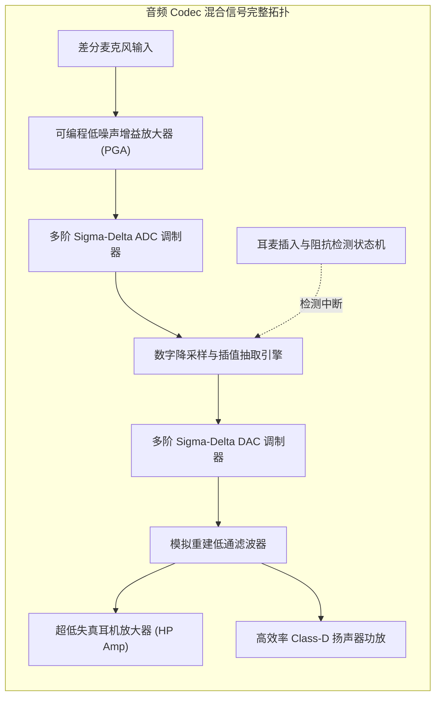

# 03 模拟前端与 Codec 架构

## 模块导读与原厂定位

音频编解码器（Audio Codec）是物理模拟现实世界与数字二进制计算世界之间的混合信号桥梁。它集成了极低噪声前置放大器（LNA/PGA）、高阶 Sigma-Delta 模数与数模转换器（ADC/DAC）、高效率功率放大器（Class-D/AB PA）以及高精度插入检测阻抗测量电路。

在芯片原厂中，Codec 的微架构设计直接决定了整机的信噪比（SNR）、动态范围（DNR）、总谐波失真（THD+N）以及无播放时的底噪极限。

---

## 模块文章索引

1. [Sigma-Delta ADC 与 DAC 架构](01-adc-dac-sigma-delta.md)：过采样技术（OSR）、高阶噪声整形（Noise Shaping）多阶调制器与动态元件匹配（DEM）
2. [模拟前端 AFE 与麦克风前置放大](02-analog-frontend-pga-lna.md)：全差分低噪声放大器（LNA）、可编程增益放大（PGA）与共模抑制比（CMRR）
3. [音频功率放大器 Class-D/AB/H](03-audio-amplifier-class-d-ab.md)：Class-D PWM/PDM 调制、无滤波架构（Filterless）、Class-AB 保真度与 Class-H 动态升压轨
4. [耳机插孔检测与 MICBIAS 电路](04-jack-detect-micbias-impedance.md)：3.5mm 插孔插入检测（Jack Detect）、OMTP/CTIA 极性自适应与微安级超低噪声 MICBIAS
5. [Codec 混合信号工程设计规范](05-codec-engineering-guide.md)：PCB 混合信号星型单点接地、参考基准 VREF 退耦电容选型与防 EMI 辐射屏蔽
6. [耳机底噪与地回路杂音排查](06-cases-debug.md)：实战案例：耳机底噪白噪声（Hiss）、地环路蜂鸣声（Ground Loop）与电荷泵杂音根因排查
7. [THD+N 与动态范围理论推导](07-engineering-analysis.md)：音频关键声学指标（SNR、DNR、THD+N、SINAD）的数学定义、傅里叶级数分解与理论极限
