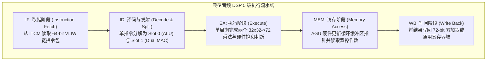

# 01 音频 DSP 指令集与流水线

## 1. 硬件解决什么问题：通用 CPU 处理音频信号时的架构短板

音频信号处理的核心是**密集的时域/频域卷积与内积运算**（如 FIR/IIR 滤波、短时傅里叶变换 FFT、矩阵加权求和）。通用 CPU（如 ARM Cortex-A）在执行这些负载时面临三大架构制约：
1. **指令吞吐不足**：执行单次复数乘累加需要多条分离的加载、乘法、累加、饱和截断与地址自增指令，发射开销巨大。
2. **流水线分支与停顿开销**：传统 CPU 循环判断每次都需要比较跳转，破坏流水线连续性。
3. **时钟动态功耗过高**：通用 CPU 主频通常在 1.5GHz 以上，即使轻载解码音频，整机功耗也在百毫瓦级，无法用于耳机与手表。

音频 DSP 采用轻量化时钟（100MHz ~ 500MHz），通过针对声学计算定制的专用硬件流水线，将能效比提升数十倍。

---

## 2. 硬件微架构与组成：VLIW 与 SIMD 混合指令流水线



### 工业界主流音频 DSP 架构对比

| 架构系列 | 典型代表芯片 | 指令并行模式 | 单周期 MAC 吞吐 | 典型应用领域 |
| :--- | :--- | :--- | :--- | :--- |
| **Cadence Tensilica** | HiFi 3 / 4 / 5 | VLIW (FLIX) + 宽向量 SIMD | 4 ~ 16 路 32x32 MAC | 智能手机主控、智能音箱、TWS 耳机主控 |
| **CEVA** | CEVA-BX2 / SensPro | 宽字长 SIMD / DSP 扩展 | 4 ~ 8 路 32x32 MAC | 车载座舱、专业声学音频处理器 |
| **RISC-V Audio P-Ext** | Andes / 阿里玄铁 | 紧凑 RISC-V 标量 + P 扩展 | 2 路 16x16 / 1 路 32x32 | 超低功耗可穿戴设备、智能硬件唤醒核 |

---

## 3. 软件可见接口：典型 HiFi DSP 内联汇编（Intrinsics）

在 DSP 软件开发中，工程师很少使用纯 C 语言编写乘加循环，而是直接调用编译器映射到单周期微架构指令的内在函数（Intrinsics）：

```c
#include <nature_dsp.h>

// 典型 32-bit FIR 滤波器的 DSP 内在函数加速核心内积循环
void fir_filter_optimized_hifi4(const int32_t *restrict x,
                                const int32_t *restrict h,
                                int32_t *restrict y,
                                int N, int M)
{
    // 利用 HiFi 4 的 72-bit 双累加器 (ae_f64) 与 SIMD 循环寻址
    for (int n = 0; n < N; n++) {
        ae_f64 acc0 = AE_ZERO64();
        ae_f64 acc1 = AE_ZERO64();

        const ae_int32x2 *pX = (const ae_int32x2 *)&x[n];
        const ae_int32x2 *pH = (const ae_int32x2 *)&h[0];

        // 硬件零开销循环: 每次迭代单周期完成两个 32x32 乘累加并自动指针前移
        for (int m = 0; m < M; m += 2) {
            ae_int32x2 vX = AE_L32X2_I(pX, 0); // 宽数据双加载
            ae_int32x2 vH = AE_L32X2_I(pH, 0);

            AE_MULAAFD32X2RA(acc0, vX, vH);    // 单周期并行 2 路乘累加
            pX--; pH++;
        }

        // 饱和截断并存盘
        y[n] = AE_ROUND32F64SS(acc0);
    }
}
```

---

## 4. 四流全链路分析：双操作数单周期加载与乘加流

1. **指令取指流**：程序计数器从 ITCM 读取一条 64-bit VLIW 指令，指令包含三个并行槽（Slot 0: 算术乘加，Slot 1: 数据加载，Slot 2: 地址指针递增）。
2. **双地址生成流（Dual AGU Flow）**：硬件内部的两个地址发生器分别计算输入信号指针 `*pX` 与滤波器系数指针 `*pH` 的物理地址，自动处理模循环回绕（Circular Modulo）。
3. **双端口 SRAM 并行读取流**：双端口 DTCM 在同一个时钟周期的上升沿，并行读出两个 32-bit 操作数并送入乘法器输入锁存器。
4. **乘累加与保护位累积流**：
   - 乘法器完成 $32\text{-bit} \times 32\text{-bit} \to 64\text{-bit}$ 有符号乘法；
   - 累加器将 64-bit 乘积与当前的 72-bit 累加寄存器相加；
   - 额外的 **8-bit 保护位（Guard Bits）**确保在连续 256 次乘加中绝对不会发生算术溢出。

---

## 5. 软硬件设计约束

- **指令与数据内存边界（Memory Alignment）**：SIMD 双加载指令（如 `AE_L32X2`）要求访问地址必须严格进行 **64-bit（8-byte）对齐**。若指针未对齐，在大多数 DSP 架构中会直接触发非对齐访问硬件异常（Alignment Fault）导致 DSP 崩溃死锁。
- **寄存器跨槽位写冲突（Structural Hazards）**：VLIW 指令包内的多个并行操作槽位严禁同时写入同一个物理目标寄存器，必须由编译器在代码生成阶段进行静态相关性分析并调度规避。

---

## 6. 现场排错与调试清单

- **故障：移植声学算法到 DSP 上运行，音质出现偶发剧烈爆音，但纯 PC C 仿真完全正常**
  1. 检查中间计算是否使用了标准 C 的 `int32_t` 累加；标准 C 发生正整数溢出时直接回绕（Wrap-around）变成极大的负数，引发毁灭性爆音。
  2. 确保在 DSP 上全部启用了硬件饱和算术（Saturating Arithmetic），溢出时强制锁定在 `0x7FFFFFFF`。

---

## 7. 实验与验证推演：DSP 能效比量化模型

评估 100 阶 FIR 滤波器在 48kHz 采样率下的算力开销：
$$N_{\text{ops}} = 100 \times 48000 \times 2 \text{ (乘加各算一次操作)} = 9.6\text{ MOPS}$$
- **在传统通用 CPU 上**：由于缺少专用指令，每次乘加需要循环跳转、地址计算、加载和累加，平均每个抽头需要 6~8 个时钟周期：
$$f_{\text{CPU}} \approx 100 \times 48000 \times 7 = 33.6\text{ MHz}$$
在 1.5GHz CPU 上，单核动态功耗约消耗 $30\text{ mW}$。
- **在双 MAC 音频 DSP 上**：单周期可并行执行 2 次乘累加 + 2 次数据加载 + 1 次指针回绕更新：
$$f_{\text{DSP}} = \frac{100}{2} \times 48000 \times 1 = 2.4\text{ MHz}$$
仅需 **$2.4\text{ MHz}$ 的极致主频**即可实时跑完 100 阶滤波器，片上功耗通常 **$< 0.3\text{ mW}$**。能效比实现了超过 **100 倍**的绝对代际优势。
