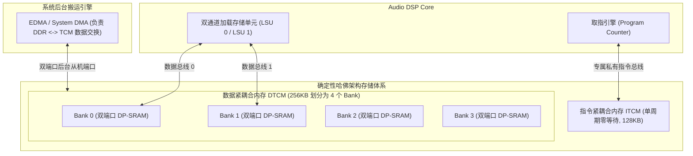

# 02 紧耦合内存 TCM 与无抖动存储

## 1. 硬件解决什么问题：消除 Cache 缺失带来的不可控声学丢帧

传统通用处理器广泛依赖指令 Cache（I-Cache）和数据 Cache（D-Cache）来隐藏访问外部 DRAM 的漫长延迟。然而，Cache 本质上是一种**基于统计概率的投机加速机制**：
当系统发生后台中断、多任务上下文切换或跨行访问时，Cache Miss（缓存缺失）的发生是不可预测的。一次 DDR 访存可能需要等待数十到数百个时钟周期。

在音频系统中，哪怕几微秒的流水线停顿导致当前音频帧未能按时交付，扬声器端就会发生不可逆的硬件 Underrun 爆音。因此，音频 DSP 普遍抛弃或弱化 Cache，采用**紧耦合内存（Tightly-Coupled Memory, TCM）/ 片上 Scratchpad SRAM**。

---

## 2. 硬件微架构与组成：哈佛结构 TCM 与双端口无冲突设计



### TCM 核心特性与 Cache 对比

| 架构特性 | 传统硬件 Cache 架构 | 紧耦合内存 TCM / Scratchpad 架构 |
| :--- | :--- | :--- |
| **访问延迟** | 命中时 1 周期，缺失时 50 ~ 200+ 周期（不可预测） | **严格、恒定、确定性的 1 个时钟周期**（绝对零等待） |
| **空间管理** | 硬件透明自动换出（LRU / 伪随机淘汰） | **由程序员与编译器显式绝对地址精准排布** |
| **实时抖动** | 存在伪共享（False Sharing）与随机颠簸（Thrashing） | **零时基抖动（Zero Jitter）** |
| **硅片能效** | 包含复杂的 Tag 比较阵列、有效位与淘汰逻辑 | 纯粹的静态 RAM 存储阵列，硅片能效极高 |

---

## 3. 软件可见接口：连接脚本（Linker Script）中的 TCM 段排布

在音频 DSP 固件开发中，软件工程师通过连接脚本显式将关键算法、高频音频循环和滤波抽头绑定在 TCM 物理地址空间内：

```ld
/* 典型音频 DSP 链接器脚本 memory.ld */
MEMORY
{
    /* 外部 DDR 空间 (存放不常用大文件、初始化代码) */
    DDR_CACHED (rwx) : ORIGIN = 0x80000000, LENGTH = 16M

    /* 片上高速 ITCM: 放置最高优先级中断向量与核心滤波函数 */
    ITCM_TEXT  (rx)  : ORIGIN = 0x00000000, LENGTH = 256K

    /* 片上高速 DTCM: 放置麦克风环形缓冲区与 AEC 自适应滤波器系数 */
    DTCM_DATA  (rwx) : ORIGIN = 0x00040000, LENGTH = 512K
}

SECTIONS
{
    /* 核心回声消除代码强制装载入 ITCM */
    .itcm_critical_text : {
        *(.text.aec_process_core)
        *(.text.fft_radix4_fast)
    } > ITCM_TEXT

    /* 算法环形缓冲区显式映射到 DTCM Bank 0/1 */
    .dtcm_audio_buffers : {
        *(.data.mic_ring_buf)
        *(.bss.aec_filter_taps)
    } > DTCM_DATA
}
```

---

## 4. 四流全链路分析：Ping-Pong 双缓冲后台 DMA 吞吐流

当算法模型超出 DTCM 物理容量时，采用**软件显式管理双缓冲（Ping-Pong Buffer）**在后台与 DDR 交换数据：
1. **计算流（DSP Core）**：DSP 核心正在全速处理 DTCM 中的 Buffer A（Ping 区），以零等待单周期速度执行滤波。
2. **后台传输流（EDMA）**：与此同时，后台音频 DMA 正在通过片上 NoC，悄悄将下一个时间片待处理的音频块从系统 DDR 搬运写入 DTCM 的 Buffer B（Pong 区）。
3. **完成握手流**：DMA 完成传输产生局部事件脉冲（Event）；DSP 此时正好处理完毕 Buffer A。
4. **乒乓角色反转**：DSP 瞬间将处理指针切换到 Buffer B，DMA 启动将 Buffer A 的处理结果异步写回 DDR。整个过程计算与访存 100% 异步并发重叠，**DSP 核心计算流水线永不因访存停顿（0 Bubble）**。

---

## 5. 软硬件设计约束

- **多 Bank 冲突（Bank Conflict）**：在 VLIW 双操作数加载（如同时加载信号 $x[n]$ 与系数 $h[n]$）时，若两个数组恰好落入同一个物理 SRAM Bank 的不同行，双端口 SRAM 发生端口竞争，硬件将强制插入 1 个周期的气泡停顿（Stall）。
- **优化法则**：通过链接器脚本或编译器对齐属性，将信号数组强制分配至 **Bank 0（偶数 Bank）**，将系数数组强制分配至 **Bank 1（奇数 Bank）**，物理隔离端口竞争。

---

## 6. 现场排错与调试清单

- **故障：DSP 固件在执行 FFT 运算时，主频足够但实际测得耗时比理论预期慢了近一倍**
  1. 使用硬件性能计数器（Performance Counter）读取 `STALL_BANK_CONFLICT` 寄存器。
  2. 发现由于 FFT 输入与旋转因子数组在内存中连续存放，两者的虚部与实部交叠命中同一 Bank，产生了密集的 Bank 冲突。
  3. 将旋转因子表声明为专有的对齐段，消除冲突后性能瞬间翻倍。

---

## 7. 实验与验证推演：双缓冲存储容量规划公式

规划 DSP片上 DTCM 所需最小安全物理容量：
$$S_{\text{DTCM}} \ge 2 \times (S_{\text{ping}} + S_{\text{pong}}) + S_{\text{algo\_state}} + S_{\text{stack}}$$
考虑一个多通道阵列降噪系统：
- 4 麦克风录音 + 2 参考通道，共 6 通道；
- 采样率 48kHz，以 256 点为一个处理帧；
- 单样点 32-bit（4 字节）；
- Ping-Pong 双缓冲单区容量：
$$S_{\text{buffer}} = 6 \times 256 \times 4\text{ Bytes} = 6.144\text{ KB}$$
双缓冲需要：$2 \times 6.144 = 12.288\text{ KB}$。
加上 512 点频域 FFT 复数缓存与 AEC 自适应滤波器状态空间（约 128KB）以及固件调用栈（32KB），系统规划 **256KB DTCM** 即可在片内从容运行全部复杂声学前处理算法，无需触碰片外 DDR。
