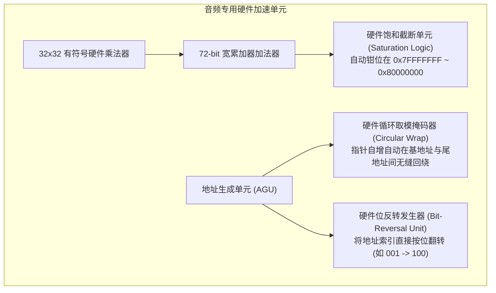

# 03 专用音频加速指令与循环寻址

## 1. 硬件解决什么问题：打破传统算术逻辑单元的效率瓶颈

在声学信号处理算法中，三种底层操作在传统指令集（如通用 x86/ARM）中极其耗费周期：
1. **溢出回绕（Overflow Wrap-around）**：普通加法 $0x7FFFFFFF + 1$ 会变成负数最小值 $0x80000000$，在声音上体现为最暴力的爆音。防止溢出在 C 语言中需要多条分支判断；
2. **循环缓冲区回绕（Circular Buffer Wrap）**：音频滑动窗滤波到达数组尾部时需要判断是否重置指针；
3. **快速傅里叶变换（FFT）位反转倒序（Bit-Reverse Addressing）**：时域抽取 FFT 的输入或输出需要按照二进制反转顺序寻址。

音频 DSP 通过在微架构中直接内嵌硬件**饱和算术单元、取模地址发生器（AGU）与位反转查找单元**，使上述复杂操作全部在**单周期内零开销完成**。

---

## 2. 硬件微架构与组成：专用音频加速硬件流水线



---

## 3. 三大核心音频加速指令与微架构机理

### 1. 定点饱和算术指令（Saturating Arithmetic）
在硬件中内嵌比较器与多路选择器：
```c
// 伪代码展示硬件单周期完成的饱和加法逻辑: QADD32
int32_t QADD32(int32_t a, int32_t b) {
    int64_t res = (int64_t)a + (int64_t)b;
    if (res > 0x7FFFFFFF) return 0x7FFFFFFF; // 正溢出饱和钳位
    if (res < -0x80000000LL) return -0x80000000LL; // 负溢出饱和钳位
    return (int32_t)res;
}
```
**价值**：无论滤波过程中输入多大冲击信号，声音仅发生平滑的削峰压缩，绝不发生相位反转爆音。

### 2. 零开销硬件循环与取模寻址（Zero-Overhead Loops & Circular Buffering）
音频 DSP 内部配备专用寄存器：`LC`（Loop Count 循环计数器）、`LB`（Loop Buffer 基地址）与 `LE`（Loop End 尾地址）。
在硬件取指阶段，当程序计数器 `PC == LE` 时，流水线控制器自动将 `PC` 复位至 `LB`，并将 `LC` 减 1。**完全消除了条件分支判断指令、流水线清空与跳转气泡（0 Cycle Overhead）**。

### 3. 硬件 FFT 位反转指令（Bit-Reverse Addressing）
在 Radix-2 蝶形运算中，数据索引按照二进制位镜像排列（如 8 点 FFT：000->000, 001->100, 010->010, 011->110...）。
DSP 提供专用位反转后增量寻址指令（如 Tensilica 的 `AE_L32_BR`），在读取当前样点的同时，地址寄存器直接自增为位反转后的下一个索引，使整个 FFT 计算阶段彻底摆脱重排数组的内存拷贝开销。

---

## 4. 软件可见接口：寄存器与汇编示例

```assembly
// 典型 HiFi DSP 汇编片段: 零开销单周期 MAC 与循环指针回绕
// 寄存器分配: a0=循环次数 M, a2=输入缓冲, a3=系数表, a4=累加器

    LOOP        a0, .loop_end       // 硬件配置 LC=a0, 启动零开销硬件循环
    MUL.AA      a4, a2, a3          // 单周期: a4 += a2 * a3, 同时饱和保护
    L32.C       a2, [a5++], 4       // 循环寻址加载: 指针 a5 递增 4 字节，达到边界自动模回绕
    L32         a3, [a6++], 4       // 正常指针自增加载
.loop_end:
    ROUND.SAT   r0, a4              // 将 72-bit 累加器平滑四舍五入并饱和截取为 32-bit Q31 输出
```

---

## 5. 软硬件设计约束

- **循环缓冲区基地址与尺寸对齐约束（Power-of-Two Alignment）**：为了以极简的逻辑门实现取模寻址，硬件 AGU 通常采用掩码比较（Bit-masking）：
$$\text{Effective Address} = \text{Base} \mid ((\text{Pointer} + \text{Step}) \ \& \ \text{Mask})$$
这要求循环缓冲区的**长度必须是 2 的整数次幂（$2^K$）**，且内存物理起始地址也必须按 $2^K$ 字节对齐。如果不满足对齐，硬件回绕逻辑将发生严重错乱。

---

## 6. 现场排错与调试清单

- **故障：FFT 输出频谱杂乱无章，类似严重白噪声失真**
  1. 检查输入数据缓冲区是否满足位反转寻址要求的物理对齐。
  2. 确认输入采样点是否在送入蝶形运算前发生了定点动态范围溢出；在每级蝶形运算后，应使用硬件右移指令进行尺度缩放（Scaling）。

---

## 7. 实验与验证推演：位反转逻辑门延迟分析

硬件位反转逻辑在物理实现上**不需要任何晶体管算术逻辑门**，它仅仅是一组在硅片布线层面上的**走线交叉物理转接（Hardwired Swizzling）**：
- 输入总线位：$D_0, D_1, D_2, \dots, D_{N-1}$；
- 输出总线位：$D_{N-1}, \dots, D_2, D_1, D_0$。
推论：**硬件位反转的传播延迟仅取决于单级金属走线的物理延迟（通常 $< 10\text{ ps}$）**，在纳秒级时钟周期内完全可以与其他算术操作并行无感穿透，这就是硬件加速在底层物理上的绝对优雅之处。
