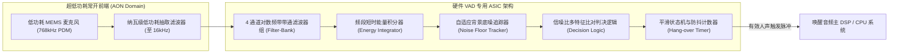
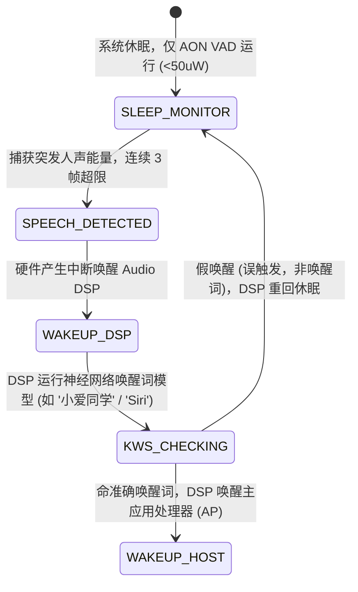

# 04 硬件 VAD 语音活动检测引擎

## 1. 硬件解决什么问题：在主芯片沉睡时以微安级电流监听世界

在智能音箱、TWS 耳机、智能手机和车载交互中，设备绝大部分时间处于静音或环境背景噪音中（待机率高达 $95\%$ 以上）。如果让高主频的 CPU 或复杂多核 DSP 持续唤醒运行语音识别模型，几百毫安的放电电流将在短短几个小时内耗尽移动设备电池。

**硬件语音活动检测器（Hardware VAD, Voice Activity Detector）**是一颗被深度硬化（Hardwired ASIC）在超低功耗常开电源域（AON Domain）中的专用数字状态机：
它常年以**几十微瓦（$< 50\mu\text{W}$）**的微弱能耗，持续分析环境声音的频域与时域特征，仅在真正有人类发声时，才通过硬件中断唤醒后续 DSP 进行唤醒词（KWS）识别。

---

## 2. 硬件微架构与组成：低功耗 VAD 硬件流水线



### 硬件 VAD 四大判决特征维度
1. **短时能量与长时底噪比（SNR Threshold）**：人类言语在特定频段具有突发能量；
2. **频谱质心（Spectral Centroid）**：人声声带基频通常分布在 $100\text{ Hz} \sim 4\text{ kHz}$，而风噪、流水等环境噪声多呈现平坦白噪声或超低频分布；
3. **过零率（Zero-Crossing Rate, ZCR）**：区分清音（高过零率）与浊音（低过零率，周期性强）；
4. **悬挂定时器（Hangover Time）**：人在说话单词之间会有微弱的生理停顿（$100\text{ ms} \sim 300\text{ ms}$），VAD 必须维持一段时间的判定状态，严禁在词间瞬间切断。

---

## 3. 软件可见接口：VAD 灵敏度与阈值寄存器组

```c
// 硬件 VAD 控制寄存器: HW_VAD_CTRL (Offset: 0x1000)
#define REG_VAD_CTRL              (*(volatile uint32_t *)(VAD_BASE + 0x1000))
#define VAD_ENABLE                (1U << 0)  // 开启常开 VAD 引擎
#define VAD_IRQ_EN                (1U << 1)  // 触发人声时向中断控制器产生中断
#define VAD_SENSITIVITY_MED       (2U << 4)  // 灵敏度配置: 00:低, 01:中, 10:高 (防误触)

// 动态信噪比门限与平滑延时寄存器: HW_VAD_THRES (Offset: 0x1004)
#define REG_VAD_THRES             (*(volatile uint32_t *)(VAD_BASE + 0x1004))
// 低 16 位为触发阈值 (dB)，高 16 位为 Hangover 持续时间 (毫秒)
#define VAD_SET_PARAMS(snr_db, hang_ms)  (((hang_ms) << 16) | ((snr_db) & 0xFFFF))
```

---

## 4. 四流全链路分析：从低功耗监听到唤醒 Host 的全状态转移流



1. **静默监听状态**：主 CPU 与多核 DSP 均处于 Power-Gated 彻底掉电状态。AON 域内的硬件 VAD 仅靠 $32.768\text{ kHz}$ 或 $768\text{ kHz}$ 极慢时钟维持自适应底噪追踪。
2. **状态突变触发**：用户开口说话，频带能量连续超过动态底噪门限达到 3 帧；
3. **时钟上电解复用**：VAD 控制器触发电源管理单元（PMU），给 Audio DSP 核心供电上电，并打开高速音频 PLL；
4. **历史音频回放（Pre-roll Buffer）**：硬件 VAD 内部集成了约 $250\text{ ms}$ 的超低功耗片上环形缓冲（Pre-roll FIFO），使得 DSP 醒来后能“倒带”读取用户开口前的那一段初始辅音，确保唤醒词首字不被吞字。

---

## 5. 软硬件设计约束

- **误唤醒率（False Alarm Rate, FAR）与漏判率（False Rejection Rate, FRR）的平衡**：若门限设得太低，关门声、打字声就会频繁唤醒 DSP，严重消耗待机电量；若门限太高，在嘈杂环境下用户必须大声喊叫才能唤醒。通常在硬件前端做粗筛，后续交由微型神经网络二次确认。
- **静态漏电流约束**：常开 VAD 模块在物理综合时，必须全部采用高阈值电压（HVT）晶体管单元库，牺牲翻转速度换取纳安（$\text{nA}$）级的极低漏电。

---

## 6. 现场排错与调试清单

- **故障：智能耳机放在安静桌面上，电池在 12 小时内迅速耗尽，待机功耗异常偏高**
  1. 使用逻辑分析仪抓取 VAD 唤醒中断引脚，发现每隔几秒钟就频繁触发一次中断。
  2. 检查底噪追踪器的时间常数（Adaptation Rate）：发现底噪更新速度过慢，导致环境白噪声被误判为人声突发。
  3. 调小信噪比触发灵敏度并加大预触发防抖帧数。

---

## 7. 实验与验证推演：整机待机功耗折算模型

假设产品配备 $500\text{ mAh}$ 锂电池（标称电压 $3.7\text{ V}$），总能量为：
$$E_{\text{bat}} = 500\text{ mAh} \times 3.7\text{ V} = 1850\text{ mWh}$$
- **方案 A（无硬件 VAD，主 CPU 保持轻度运行监听）**：
  - 整机平均工作电流：$I_{\text{active}} = 30\text{ mA}$；
  - 理论待机寿命：$T_{\text{standby}} = \frac{500\text{ mAh}}{30\text{ mA}} \approx \mathbf{16.7\text{ 小时}}$（不到一天）。
- **方案 B（配备硬件 VAD，主系统深度睡眠，VAD 待机电流仅 $30\mu\text{A}$）**：
  - 设每天误唤醒 50 次，每次唤醒 DSP 运行 500ms（工作电流 15mA）：
  - 唤醒额外平均电流：$I_{\text{wake}} = \frac{50 \times 0.5\text{s}}{86400\text{s}} \times 15\text{ mA} \approx 4.3\mu\text{A}$；
  - 整机综合待机电流：$I_{\text{total}} = 30\mu\text{A} + 4.3\mu\text{A} = 34.3\mu\text{A} = 0.0343\text{ mA}$；
  - 理论待机寿命：$T_{\text{standby}} = \frac{500\text{ mAh}}{0.0343\text{ mA}} \approx \mathbf{14577\text{ 小时}} \approx \mathbf{607\text{ 天}}$！
结论：**硬件 VAD 是智能语音终端能够拥有数周乃至数月真实待机续航的绝对基石**。
