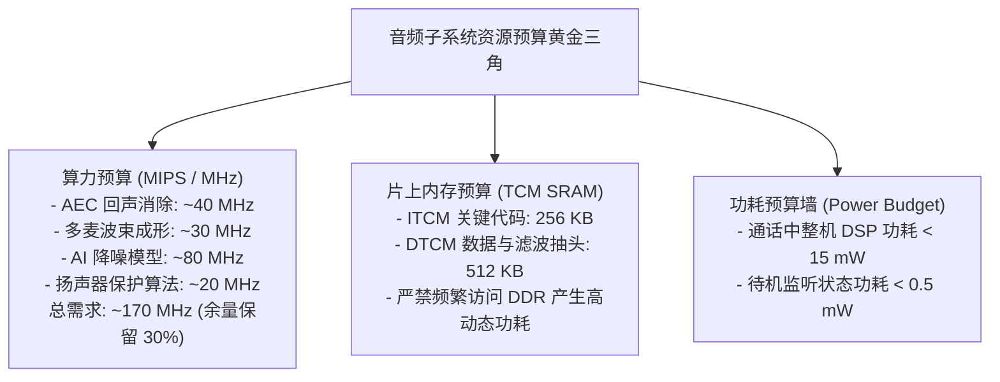

# 05 音频 DSP 软硬件协同设计指南

## 1. 硬件解决什么问题：DSP 算力、内存与整机功耗的精益预算

在实际工程落地中，算法工程师往往倾向于使用高精度、复杂的大型声学模型（如 1024 点频域滤波、深度残差降噪网络），而芯片硬件工程师受限于芯片面积与电池容量，仅能提供有限的 MHz 主频与片上 SRAM 容量。

如何在这对尖锐矛盾中完成软硬件协同架构定义与工程剪裁，是音频系统架构师的核心职责。

---

## 2. 硬件微架构与算力/存储协同预算模型

---

## 3. 算法定点化（Float-to-Fixed）与优化阶梯规范

| 优化阶段 | 代码实现形式 | 开发效率 | 运行效率与周期消耗 | 适用阶段 |
| :--- | :--- | :--- | :--- | :--- |
| **Stage 1** | 标准 ANSI C 浮点（`float / double`） | 极高（Matlab/Python 直译）| 极低（软浮点模拟消耗数十倍周期）| 算法理论验证 |
| **Stage 2** | Q31 / Q15 定点化 C 代码 | 中等（需手动处理饱和溢出） | 中等（利用标准 32-bit 整数算术）| 精度误差分析 |
| **Stage 3** | DSP 内在函数（Intrinsics SIMD） | 较高（利用 C 语言写汇编级语义）| **高（单周期并行完成 2~4 个乘累加）**| **工业界主力工程交付形态** |
| **Stage 4** | 手写极致汇编（Handcrafted Assembly）| 极低（需手动调度槽位与寄存器分配）| **极致（榨干流水线每一个气泡）** | 核心 FFT / FIR 最底层算子 |

---

## 4. 软硬件设计约束

- **循环体内严禁函数调用（No Function Calls in Inner Loops）**：在核心音频采样循环内部，严禁出现任何函数调用（包括 `printf` 或子模块分发）。函数调用会强制发生通用寄存器压栈、破坏流水线并摧毁硬件零开销循环（Zero-Overhead Loop）。所有底层算子必须声明为 `static inline`。
- **DMA 对齐与乒乓缓冲边界**：算法处理帧长必须设计为能被 DMA 突发长度（Burst Length）整除的数值。例如采用 128 点或 256 点，切忌采用如 137 点等质数帧长，否则会导致硬件 DMA 控制器无法执行高能效的连续突发传输。

---

## 5. 现场排错与调试清单

- **排查表：音频算法处理耗时超过了音频帧本身的自然时长（引发系统卡顿）**
  1. 使用硬件定时器（Timer）打点测量各算法模块执行耗时。
  2. 检查编译优化等级是否开启了 `-O3` 与专有 DSP 架构优化标志位（如 `-mvec`）。
  3. 检查代码是否意外触发了除法操作；在大多数 DSP 中，**硬件整数除法需要 20~40 个周期**。应改用乘法配合查找表（LUT）或倒数逼近。
