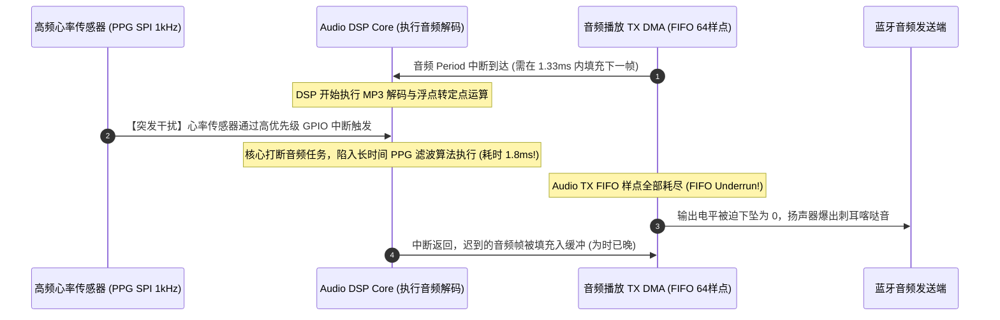

# 06 DSP 中断嵌套超时丢帧案例

## 1. 案例背景：高清音乐播放偶发突发性破音喀哒声

在某款智能手表研发中，用户在使用蓝牙耳机听本地高品质音乐时，每隔几十秒就会偶发出现一次轻微的“咔哒”（Click）爆音。
该手表搭载了一颗主频 200MHz 的音频 DSP，负责音频解码与 EQ 滤波。监控显示整体 DSP 平均 CPU 利用率仅为 $28\%$，理论算力十分富裕，系统从未发生过内存不足。

---

## 2. 调试定位全过程与追踪分析



### 深入分析三部曲

1. **硬件抓取 FIFO 错误状态**：
   - 爆音发生的当刻，读取音频控制器状态寄存器 `AUDIO_FIFO_STAT`，确认 `TX_UNDERRUN` 标志位由 0 变为 1。确诊为**硬件缓冲区欠载（Underrun）引发的爆音**。
2. **DSP 执行轨迹跟踪（Trace Profiling）**：
   - 使用 Lauterbach 抓取 DSP 中断嵌套执行时序图；
   - 发现系统存在一个心率传感器（PPG）的数据采集中断，其优先级被错误配置为 **Priority 1（最高优先级）**，而音频任务仅处于 **Priority 3**。
3. **中断执行时长测量**：
   - 心率算法团队在 PPG 中断服务例程（ISR）内部，竟然直接调用了一组极其耗时的 256 点 IIR 滤波与动态峰值检测函数，导致单次中断耗时高达 **$1.8\text{ ms}$**！
   - 而此时音频 DMA 缓冲区的水位线仅能维持 $1.33\text{ ms}$ 的播放。音频任务被活活饿死，导致爆音。

---

## 3. 根因剖析（Root Cause）

1. **中断优先级倒挂（Priority Inversion）**：非硬实时的生理健康传感器中断被赋予了高于确定性硬实时音频中断的物理优先级。
2. **中断服务例程违反微架构设计准则**：在中断上下文（ISR）中执行耗时计算。中断例程应当仅做极简的“读 FIFO、清标志、发信号量”，将具体计算下推至后台工作线程（Bottom-Half / Task）。

---

## 4. 解决方案与修复代码

### 1. 重构中断服务例程（ISR 剥离）
将心率计算剥离出 ISR，放入低优先级后台任务中：

```c
// 错误实现: 在中断例程内部跑复杂数学滤波
void ppg_sensor_irq_handler_bad(void) {
    read_sensor_raw_data();
    run_heavy_heart_rate_algorithm(); // 耗时 1.8ms，致命阻塞！
    clear_irq();
}

// 正确修复: 极简中断，单周期推送队列
void ppg_sensor_irq_handler_fixed(void) {
    ppg_raw_sample_t raw = read_sensor_raw_data_fast();
    // 仅压入环形缓冲并唤醒低优先级后台任务，总耗时 < 5 微秒
    xQueueSendFromISR(g_ppg_queue, &raw, NULL);
    clear_irq();
}
```

### 2. 重排硬件中断优先级
在 DSP 中断向量控制器中，将音频 DMA 中断提升为仅次于硬件致命错误（NMI）的 **Priority 1**，确保任何外设中断均无法剥夺音频数据流的推送。

---

## 5. 验证结果

重新运行 24 小时高品质音乐连续播放压力测试，`TX_UNDERRUN` 计数值始终为 0，偶发咔哒爆音缺陷被彻底根治。
