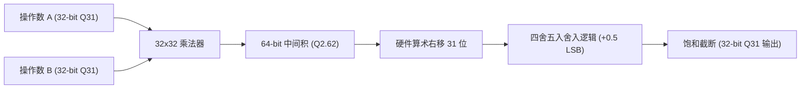

# 07 定点音频精度与量化误差推演

## 1. 硬件解决什么问题：有限字长效应与定点截断噪声数学模型

在音频 DSP 中，采用定点数（Fixed-Point）代替浮点数（Floating-Point）是换取极致能效的核心手段。然而，现实世界中的连续数字在经过有限位宽的定点量化、乘法截断与舍入时，会引入**有限字长效应（Finite Word-length Effects）**。

若设计不当，截断误差将在多级 IIR 滤波器中不断自激放大，导致信噪比严重劣变，甚至在完全静音时产生自发振荡。

---

## 2. Q31 定点表示与乘法位宽扩展

在 32-bit DSP 中，音频采样数据标准采用 **Q1.31（简称 Q31）**格式：
- 最高位（Bit 31）为符号位；
- 低 31 位为小数部分；
- 数值范围为：$[-1.0, +1.0 - 2^{-31}]$。

两个 Q31 定点数相乘：
$$x_{\text{Q31}} \times h_{\text{Q31}} \to \text{Result}_{\text{Q62}}$$
产生一个 62 位有效小数位的 64-bit 乘积。为了写回 32-bit 寄存器，硬件必须执行**向右位移 31 位并截断/舍入（Rounding & Truncation）**。

---

## 3. 截断误差（Truncation）与舍入误差（Rounding）统计特性

设截断阶距为 $\Delta = 2^{-31}$。
1. **直接截断（Truncation）**：直接丢弃低位。误差必然为负值，均值不为零：
   $$e \in [-\Delta, 0], \quad E[e] = -\frac{\Delta}{2}, \quad \sigma_e^2 = \frac{\Delta^2}{12}$$
   非零直流均值会在多级级联系统引入显著的**直流偏置累积（DC Offset Drift）**。
2. **无偏舍入（Convergent Rounding / Round to Nearest Even）**：向最接近的整数舍入，遇 0.5 时向偶数舍入：
   $$e \in \left[-\frac{\Delta}{2}, +\frac{\Delta}{2}\right], \quad E[e] = 0, \quad \sigma_e^2 = \frac{\Delta^2}{12}$$
   消除了直流偏置分量。

---

## 4. 二阶 IIR 滤波器的噪声增益数学推导

考虑经典的二阶音频双二阶 IIR 滤波器（Biquad Filter）：
$$y[n] = b_0 x[n] + b_1 x[n-1] + b_2 x[n-2] - a_1 y[n-1] - a_2 y[n-2]$$
在定点实现中，由于反馈乘法存在量化误差 $e[n]$，实际输出方程变为：
$$\tilde{y}[n] = \sum b_k x[n-k] - \sum a_k \tilde{y}[n-k] + e[n]$$
误差传输函数为纯全极点系统：
$$H_e(z) = \frac{1}{1 + a_1 z^{-1} + a_2 z^{-2}}$$
输出端的总噪声方差通过留数定理求闭环围线积分：
$$\sigma_{\text{noise, out}}^2 = \sigma_e^2 \cdot \frac{1}{2\pi j} \oint H_e(z) H_e(z^{-1}) z^{-1} dz = \sigma_e^2 \cdot \frac{1 + a_2}{(1 - a_2)[(1 + a_2)^2 - a_1^2]}$$

### 极端工况推演：低频高 Q 值低通滤波器
当采样率 $f_s = 48\text{ kHz}$，截止频率 $f_c = 100\text{ Hz}$ 时，极点极其靠近单位圆：
$$a_1 \approx -1.9816, \quad a_2 \approx 0.9820$$
代入分母公式计算噪声放大因子：
$$A_{\text{noise}} = \frac{1 + 0.9820}{(1 - 0.9820)[(1 + 0.9820)^2 - (-1.9816)^2]} \approx \frac{1.9820}{0.018 \times [3.9283 - 3.9267]} = \frac{1.9820}{0.018 \times 0.0016} \approx \mathbf{68819}$$
转换为分贝：
$$10 \log_{10}(68819) \approx \mathbf{48.38\text{ dB}}$$
**推论**：在设计低频 IIR 滤波器时，**定点舍入误差被环路内部极点放大了近 50dB（数万倍）！**
若仅使用普通 16-bit 定点计算，原本的 90dB 动态范围将被蚕食殆尽，输出全是刺耳的量化散粒噪声。

---

## 5. 原厂架构设计准则

为了对抗低频极点误差放大，现代音频 DSP 架构采取以下双重硬件防御：
1. **累加器使用 64-bit 或 72-bit 宽字长**：中间所有反馈乘加在 72-bit 累加器中完全保留全精度，仅在最终写出到 DAC 时执行一次无偏舍入；
2. **转置直接 II 型（Direct Form II Transposed）结构**：在算法实现上避免使用直接 I 型，降低节点状态变量的位宽敏感度。
