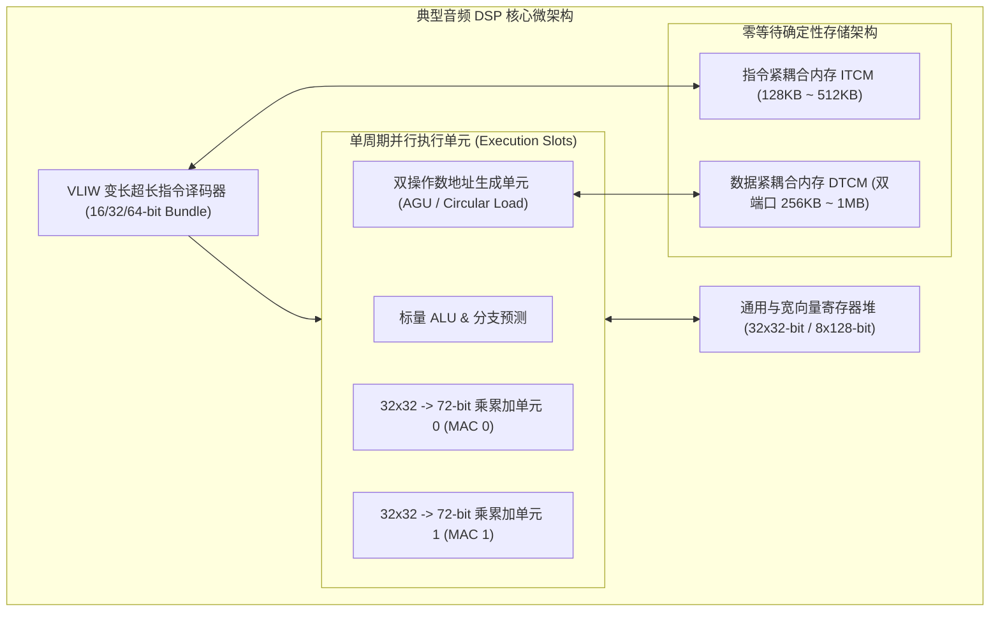

# 04 音频 DSP 微架构

## 模块导读与原厂定位

通用应用处理器（CPU）采用乱序发射、多级 Cache 与推测执行架构，旨在最大化通用代码吞吐，但在执行实时声学信号处理时，Cache 命中抖动与不可预测的中断抢占极易导致音频丢帧爆音。

**音频专用数字信号处理器（Audio DSP，如 Cadence Tensilica HiFi 3/4/5、CEVA-BX2、Andes 等）**采用 VLIW（超长指令字）加 SIMD 架构，配备硬件循环控制、定点双/四 MAC 算术单元与零等待紧耦合内存（TCM），以极高的能效比与确定性纳秒级延迟执行回声消除、降噪与空间音频算法。

---

## 模块文章索引

1. [音频 DSP 指令集与流水线](01-audio-dsp-isa-pipeline.md)：Tensilica HiFi / CEVA 架构特征、VLIW 宽指令发射与 5~7 级深度硬实时流水线
2. [紧耦合内存 TCM 与无抖动存储](02-dsp-memory-scratchpad-tcm.md)：双端口 SRAM（DP-RAM）、Bank 交叉寻址、DMA 异步后台刷新与无 Cache 抖动保障
3. [专用音频加速指令与循环寻址](03-specialized-audio-instructions.md)：定点饱和截断算术（Saturating Math）、硬件零开销循环（Zero-Overhead Loop）与 FFT 位反转（Bit-Reverse）
4. [硬件 VAD 语音活动检测引擎](04-hardware-vad-accelerator.md)：频段分频滤波、短时自适应能量估计、状态机判决与毫瓦/微瓦级超低功耗常开唤醒
5. [音频 DSP 软硬件协同设计指南](05-dsp-hardware-engineering-guide.md)：算力预算评估（MIPS/MHz）、片上 SRAM 内存切块规划与定点汇编优化准则
6. [DSP 中断嵌套超时丢帧案例](06-cases-debug.md)：实战案例：高优先级传感器中断嵌套打断音频算法流水线导致 DMA Underrun 爆音排查
7. [定点音频精度与量化误差推演](07-engineering-analysis.md)：Q31 / Q1.31 定点数乘累加截断舍入、扩展保护位（Guard Bits）与极限环振荡数学模型
