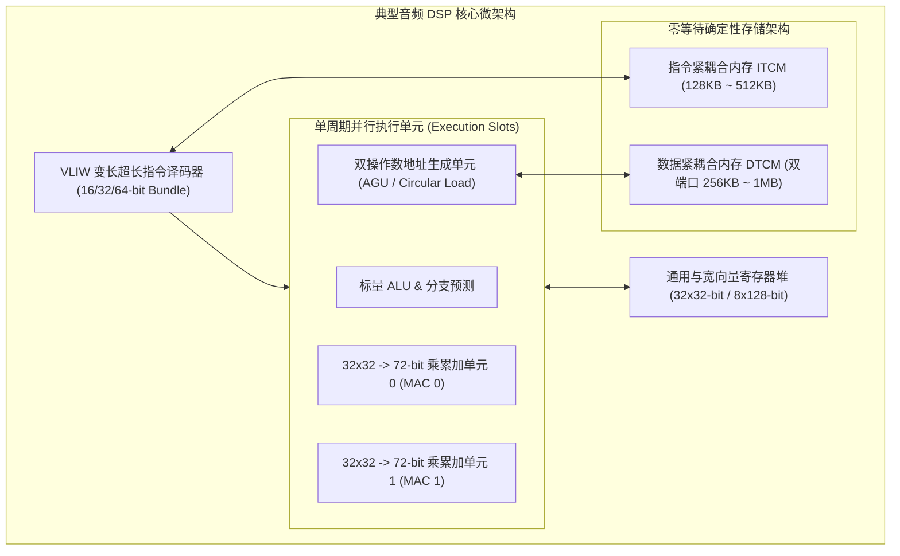

# 04 音频 DSP 微架构

## 模块导读与原厂定位

实时音频处理需要在每个采样周期内完成计算。在应用处理器上，Cache Miss、中断和调度等待都可能拉长处理时间，因此需要为算法预留足够的时间裕量。

**音频专用数字信号处理器（Audio DSP，如 Cadence Tensilica HiFi 3/4/5、CEVA-BX2、Andes 等）**通过 SIMD、乘累加指令、硬件循环与紧耦合内存（TCM）等机制支持信号处理。下文以 VLIW 加 SIMD 的设计为例，介绍回声消除、降噪和空间音频的执行约束。

```mermaid
graph TD
    subgraph Audio_DSP_Core["典型音频 DSP 核心微架构"]
        VLIW_DEC["VLIW 变长超长指令译码器 (16/32/64-bit Bundle)"]
        REG_FILE["通用与宽向量寄存器堆 (32x32-bit / 8x128-bit)"]

        subgraph Exec_Units["单周期并行执行单元 (Execution Slots)"]
            SLOT_ALU["标量 ALU & 分支预测"]
            SLOT_MAC0["32x32 -> 72-bit 乘累加单元 0 (MAC 0)"]
            SLOT_MAC1["32x32 -> 72-bit 乘累加单元 1 (MAC 1)"]
            SLOT_LOAD["双操作数地址生成单元 (AGU / Circular Load)"]
        end

        subgraph Storage["零等待确定性存储架构"]
            ITCM["指令紧耦合内存 ITCM (128KB ~ 512KB)"]
            DTCM["数据紧耦合内存 DTCM (双端口 256KB ~ 1MB)"]
        end
    end

    VLIW_DEC --> Exec_Units
    Exec_Units <--> REG_FILE
    SLOT_LOAD <--> DTCM
    VLIW_DEC <--> ITCM
```

---

## 模块文章索引

1. [音频 DSP 指令集与流水线](01-audio-dsp-isa-pipeline.md)：Tensilica HiFi / CEVA 架构特征、VLIW 宽指令发射与 5~7 级深度硬实时流水线
2. [紧耦合内存 TCM 与无抖动存储](02-dsp-memory-scratchpad-tcm.md)：双端口 SRAM（DP-RAM）、Bank 交叉寻址、DMA 异步后台刷新与无 Cache 抖动保障
3. [专用音频加速指令与循环寻址](03-specialized-audio-instructions.md)：定点饱和截断算术（Saturating Math）、硬件零开销循环（Zero-Overhead Loop）与 FFT 位反转（Bit-Reverse）
4. [硬件 VAD 语音活动检测引擎](04-hardware-vad-accelerator.md)：频段分频滤波、短时自适应能量估计、状态机判决与毫瓦/微瓦级超低功耗常开唤醒
5. [音频 DSP 软硬件协同设计指南](05-dsp-hardware-engineering-guide.md)：算力预算评估（MIPS/MHz）、片上 SRAM 内存切块规划与定点汇编优化准则
6. [DSP 中断嵌套超时丢帧案例](06-cases-debug.md)：实战案例：高优先级传感器中断嵌套打断音频算法流水线导致 DMA Underrun 爆音排查
7. [定点音频精度与量化误差推演](07-engineering-analysis.md)：Q31 / Q1.31 定点数乘累加截断舍入、扩展保护位（Guard Bits）与极限环振荡数学模型
