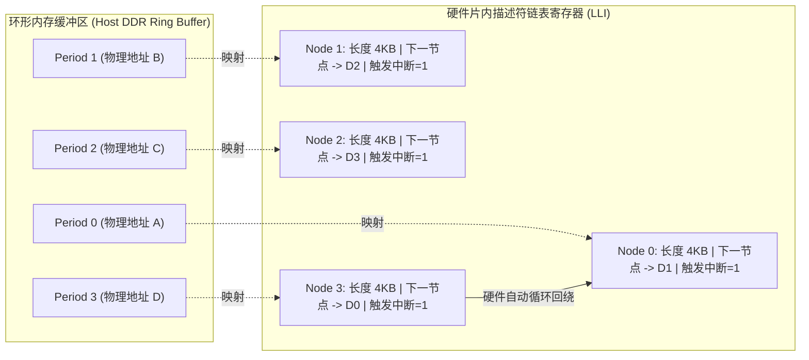

# 01 音频专用 DMA 与环形缓冲

## 1. 硬件解决什么问题：零 CPU 介入的无限循环音频流搬运

在音频播放和录音中，音频流在理论上是无限长的连续数据流（例如播放一首 4 分钟的无损音乐，由超过 $1150$ 万个样点构成）。

若采用传统的单次 DMA 传输，每次几千字节搬完后都必须由 CPU 重新配置物理源地址、目的地址并手动重启 DMA，这会导致两次传输之间出现不可避免的微秒级控制空隙，从而必然引发音频断音。

**音频专用的循环 Scatter-Gather DMA（Cyclic SG-DMA）**通过在硬件层面固化链表自循环回绕机制，实现了**只要启动一次，硬件永远自动周而复始搬运**的优雅架构。

---

## 2. 硬件微架构与组成：循环链表（Cyclic Linked List）描述符



---

## 3. 软件可见接口：Linux 内核 DMA 描述符结构体

在 Linux ALSA ASoC Platform 驱动（`sound/soc/`）中，音频 DMA 通常使用内核通用 DMAEngine 框架的 `dmaengine_prep_dma_cyclic()` 接口：

```c
// 硬件片内识别的 32-byte 紧凑 DMA 描述符结构定义
typedef struct audio_dma_lli {
    uint32_t src_addr;        // 源物理地址 (如 DDR 中的 PCM 内存页)
    uint32_t dst_addr;        // 目的物理地址 (如音频 TX FIFO 寄存器端口)
    uint32_t next_lli_addr;   // 下一个描述符的物理地址 (回绕形成环形环)
    uint32_t control;         // 传输长度 (Byte Count) 与属性标志
} __attribute__((aligned(32))) audio_dma_lli_t;

// 驱动向硬件提交循环传输请求
struct dma_async_tx_descriptor *desc;
desc = dmaengine_prep_dma_cyclic(
    dma_chan,
    substream->runtime->dma_addr,      // DDR 缓冲区物理起始地址
    substream->runtime->dma_bytes,     // 环形缓冲区总字节数 (Buffer Size)
    snd_pcm_lib_period_bytes(substream), // 单个周期字节数 (Period Size)
    DMA_MEM_TO_DEV,                    // 传输方向: 内存到设备
    DMA_PREP_INTERRUPT | DMA_CTRL_ACK  // 每个周期完成产生硬件中断
);
```

---

## 4. 四流全链路分析：Cyclic DMA 自动推进与指针轮转流

1. **自动取链流**：DMA 内部指针计数器从 SRAM 加载 `Node 0`，发起 AXI 突发读请求，将 Period 0 数据推入 FIFO。
2. **硬件中断流（Period Elapsed）**：当当前描述符的传输字节计数器递减至 0 时，硬件在**完全不停止数据流的前提下**，向 CPU 产生一个电平脉冲中断。
3. **内核指针推移流**：Linux ALSA 中断处理例程（ISR）调用 `snd_pcm_period_elapsed(substream)`，更新应用态可见的 `hw_ptr` 硬件播放指针。
4. **无缝回绕流**：搬运完毕 `Node 3` 后，DMA 硬件自动解引用 `next_lli_addr` 指针，直接重新装载 `Node 0`，无需任何 CPU 寄存器写操作，实现纳秒级平滑过渡。

---

## 5. 软硬件设计约束

- **总线突发对齐约束（Burst Alignment）**：AXI 总线要求突发传输的地址与长度必须对齐到突发边界（如 32 字节或 64 字节对齐）。若上层应用配置了一个奇数长度的 Period Size（如 1023 字节），DMA 尾部必须回退为单字节写（Single Beat），严重拉低总线利用率。
- **Cache 一致性维护（Cache Coherency）**：在非硬件一致性架构的嵌入式 SoC 上，CPU 写入 PCM 数据后，驱动**必须在 DMA 启动前显式调用 `dma_sync_single_for_device()` 刷新 D-Cache**，否则 DMA 从 DDR 读出的可能是陈旧的脏数据（引发偶发爆音）。

---

## 6. 现场排错与调试清单

- **故障：音频播放循环了一遍后，声音突然变成了死循环重复前 1 秒的片段**
  1. 检查描述符链表尾部的 `next_lli_addr` 指针是否误设为了 `0x00000000`（链表断开，变成了单次传输）。
  2. 检查应用层写指针（`appl_ptr`）是否停止推进，导致 ALSA 驱动一直在循环播放缓冲区陈旧样点。
