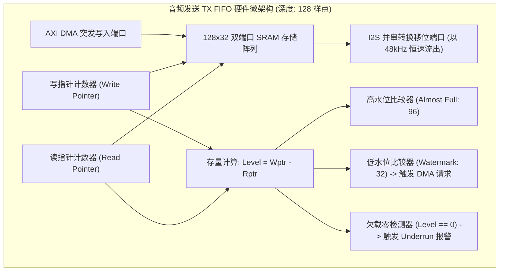

# 02 硬件 FIFO 水印与欠载保护

## 1. 硬件解决什么问题：微架构缓冲对冲总线瞬间抖动

芯片内部的 AXI/AHB 总线是一个共享资源，当 GPU 渲染大型场景、NPU 加载上亿参数模型或视频编解码器刷写 DDR 时，总线仲裁器可能会将音频 DMA 的读请求延迟几微秒至几十微秒。

硬件 FIFO（First-In, First-Out）作为物理接口与总线之间的蓄水池，其**水位线（Watermark）设置与微架构抗饥饿机制**直接决定了整机在极限总线高负载下的声音抗抖动能力。

---

## 2. 硬件微架构与组成：音频双向 FIFO 与水位线比较器



---

## 3. 软件可见接口：FIFO 水印与错误中断状态寄存器

```c
// FIFO 阈值配置寄存器: AUDIO_FIFO_CFG (Offset: 0x0040)
#define REG_FIFO_CFG              (*(volatile uint32_t *)(AUDIO_BASE + 0x0040))
#define TX_WATERMARK_32           (32U << 0)  // 当 TX FIFO 余量 <= 32 时，拉高 DMA Request
#define RX_WATERMARK_96           (96U << 8)  // 当 RX FIFO 存量 >= 96 时，拉高 DMA Request
#define TX_BURST_LEN_16           (1U << 16)  // 单次 DMA 突发搬运 16 个 32-bit 字

// FIFO 中断状态寄存器: AUDIO_FIFO_IRQ (Offset: 0x0044)
#define REG_FIFO_IRQ              (*(volatile uint32_t *)(AUDIO_BASE + 0x0044))
#define IRQ_TX_UNDERRUN           (1U << 0)   // TX 硬件欠载 (发音断续)
#define IRQ_TX_OVERRUN            (1U << 1)   // TX 硬件写溢出
#define IRQ_RX_OVERRUN            (1U << 8)   // RX 硬件满溢出 (录音丢点)
#define IRQ_RX_UNDERRUN           (1U << 9)   // RX 读空
```

---

## 4. 四流全链路分析：硬件欠载（Underrun）静音保护流

当最坏总线拥堵发生，TX FIFO 样点被 I2S 物理接口彻底读空（Level 降为 0）时：
1. **失步硬件报警**：欠载比较器拉高 `IRQ_TX_UNDERRUN`，锁定当前错误状态。
2. **自动静音保护（Hardware Auto-Mute）**：
   - 传统粗暴硬件：停止移位或持续输出最后一个采样点数值。**这将导致直流偏置持续输出，扬声器纸盆向单侧极度偏移并爆出刺耳爆音！**
   - 原厂优秀微架构：硬件状态机自动接管数据通路，**强制输出平滑平铺的零样点（Zero Padding）或执行微秒级淡出（Hardware Fade-Out）**，将爆音冲击能量降至最低。
3. **驱动恢复流**：CPU 在中断服务例程中读取 ALSA 状态，重置 FIFO 指针并调用 `snd_pcm_stop(substream, SNDRV_PCM_STATE_XRUN)` 进入恢复时序。

---

## 5. 软硬件设计约束

- **Watermark 与 Burst Length 的匹配准则**：
$$TX_{\text{Watermark}} \ge \text{DMA\_Burst\_Size}$$
若 TX FIFO 深度为 128，突发长度为 16 样点，Watermark 至少应设为 32。若 Watermark 设为 8，当 FIFO 跌至 8 时才发起请求，而此时 DMA 还在总线排队，几微秒后 FIFO 就会见底爆发 Underrun。

---

## 6. 现场排错与调试清单

- **故障：播放高清音乐时，系统日志频繁打印 `underrun occurred, at least 128 frames lost`**
  1. 查看 `/proc/asound/card0/pcm0p/sub0/xrun_debug` 查看实时丢帧时间戳。
  2. 增大硬件 TX FIFO 的 Watermark 触发阈值（由 16 提升至 64），为 DMA 总线调度争取更宽裕的缓冲时间。
