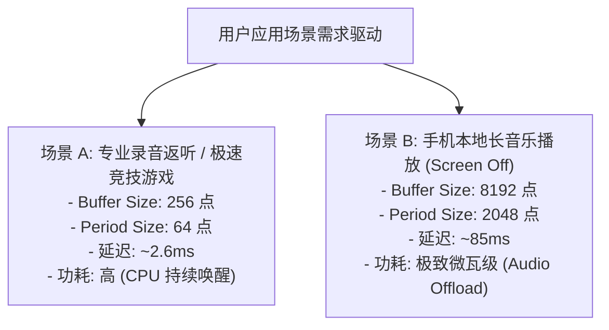

# 04 缓冲深度与实时时延设计准则

## 1. 硬件解决什么问题：低时延模式与极低功耗模式的架构平衡

在音频系统配置中，环形缓冲区大小（Buffer Size）与周期大小（Period Size）的设定，是**系统时延（Latency）与系统功耗（Power）**之间最剧烈的拉锯战：
1. **超小缓冲区（如 Period = 64 点 / 1.33ms）**：端到端延迟极低，适用于游戏、乐器演奏和专业监听；但 CPU 中断频率极高（每秒 750 次），CPU 无法进入深睡眠，整机功耗剧增。
2. **大缓冲区（如 Period = 2048 点 / 42.6ms）**：CPU 每秒仅醒来 23 次，可长期处于浅/深睡眠状态，功耗极低；但音频交互延迟高达上百毫秒，视频声画完全不同步。

---

## 2. 缓冲参数设计矩阵



---

## 3. 软件配置代码：ALSA 硬件参数（hw_params）约束设置

```c
static struct snd_pcm_hardware my_audio_hardware = {
    .info = SNDRV_PCM_INFO_MMAP |
            SNDRV_PCM_INFO_MMAP_VALID |
            SNDRV_PCM_INFO_INTERLEAVED |
            SNDRV_PCM_INFO_BLOCK_TRANSFER,
    .formats = SNDRV_PCM_FMTBIT_S16_LE | SNDRV_PCM_FMTBIT_S24_LE,
    .rates = SNDRV_PCM_RATE_48000 | SNDRV_PCM_RATE_96000,
    .channels_min = 2,
    .channels_max = 8,

    // 关键缓冲区参数区间约束
    .buffer_bytes_max = 128 * 1024,      // 最大缓冲区 128KB
    .period_bytes_min = 256,             // 最小周期 256 字节 (64样点立体声)
    .period_bytes_max = 32 * 1024,       // 最大周期 32KB
    .periods_min = 2,                    // 至少 2 个 Period 实现乒乓
    .periods_max = 16,                   // 最多 16 个分段
};
```

---

## 4. 架构设计指导准则

- **双模式自适应切换（Dynamic Buffer Scaling）**：现代操作系统（如 Android HAL）在息屏播放音乐时，动态切换为 **Audio Offload 模式**（开启数万点大缓存，下推至 Audio DSP 播放）；当检测到用户启动游戏或点击屏幕时，无缝重构为 **Low Latency 模式**，兼顾续航与响应。
