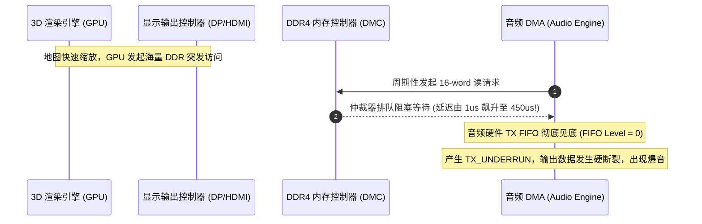

# 05 DDR 拥塞引起欠载爆音案例

## 1. 案例背景：运行大型 3D 游戏时背景音乐偶发破音

某款智能车机在中控屏全屏运行 3D 高清全景导航渲染的同时，播放高品质在线音乐。测试人员发现：
每当 3D 地图快速缩放、双屏高帧率联动刷新时，背景音乐就会发出连续沉闷的“哒哒哒”爆音与丢字现象。而在静态桌面听歌时，声音绝对平滑无任何瑕疵。

---

## 2. 调试定位全过程与指标追踪



### 深入排查三部曲

1. **ALSA 运行状态洞察**：
   ```bash
   cat /proc/asound/card0/pcm0p/sub0/status
   # 结果显示: state: XRUN, owner_pid: 2450
   ```
   确诊为 XRUN（硬件欠载）。
2. **总线延迟抓取（Bus Performance Monitor）**：
   - 挂接芯片原厂 NoC 性能监视模块，捕获 Audio DMA 从发起 AXI `ARVALID` 到收到首个 `RVALID` 的时间间隔：
   - 空闲时平均延迟：$0.8\mu\text{s}$；
   - 3D 地图极速缩放时最大峰值延迟：高达 **$485\mu\text{s}$**！
3. **FIFO 抵御时间推演**：
   - 当期系统配置采样率为 $96\text{ kHz}$，双声道 32-bit；
   - 硬件 FIFO 深度为 64 样点，Watermark 设为 16（仅剩 16 样点时才申请 DMA）：
   $$t_{\text{hold}} = \frac{16}{96000 \times 2} \approx 83.3\mu\text{s}$$
   - 硬件仅能维持 $83.3\mu\text{s}$，而总线延迟高达 $485\mu\text{s}$，欠载爆发概率为 $100\%$！

---

## 3. 根因剖析与软硬件解决方案

### 1. 硬件互联修复（NoC QoS 提权）
在 Bootloader 中修改 NoC 路由表，将 Audio DMA Master 端口的 `AxQOS` 寄存器由默认的 `0x0`（尽力而为 Best-Effort）提升为最高优先级 `0xD`。

### 2. 软件驱动配置优化（增大 Watermark 裕量）
修改驱动中的 FIFO 阈值配置，将发起 DMA 请求的水位线由 16 提升至 48：
$$t_{\text{hold, new}} = \frac{48}{96000 \times 2} = 250\mu\text{s}$$
同时在系统空闲内存允许的前提下，将 ALSA `period_size` 由 128 提升为 256。

---

## 4. 验证结果

重新运行 3D 极速渲染压测 48 小时，通过硬件逻辑分析仪持续监测 `IRQ_TX_UNDERRUN` 引脚，欠载中断触发次数**彻底降为 0**，破音现象彻底根除。
