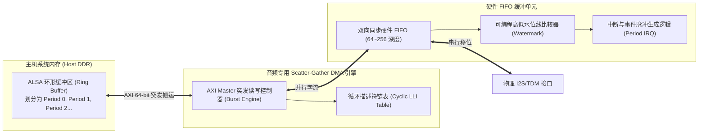

# 05 音频 DMA 与缓冲管理

## 模块导读与原厂定位

在现代 SoC 中，音频数据流具有“带宽小但绝对不可中断”的严苛实时特征。通用 DMA 控制器若直接用于音频，往往由于缺乏周期性链表循环加载（Cyclic Ring Buffer）、缺少防饥饿水位线（Watermark）与低功耗中断聚合机制，导致系统频繁被打断或发生音频断音（XRUN）。

**音频专用直接内存访问引擎（Audio DMA Engine）**与片上硬件 FIFO 是维系音频数据从系统 DDR 到物理引脚平稳流转的定海神针。

---

## 模块文章索引

1. [音频专用 DMA 与环形缓冲](01-audio-dma-scatter-gather.md)：Scatter-Gather 链表硬件自循环、环形内存拓扑与 Period 边界硬件中断
2. [硬件 FIFO 水印与欠载保护](02-fifo-watermark-underrun.md)：双向 FIFO 微架构、可编程阈值（Watermark）、欠载（Underrun）与过载（Overrun）保护机制
3. [片上互联 QoS 与突发延迟抑制](03-interconnect-qos-latency.md)：AXI NoC QoS 仲裁拓扑、高优先级抢占策略与多外设突发带宽争抢防御
4. [缓冲深度与实时时延设计准则](04-dma-buffer-engineering-guide.md)：Period Size 选取黄金平衡点：低时延（Sub-5ms）与省电降频（Power Saving）的架构权衡
5. [DDR 拥塞引起欠载爆音案例](05-cases-debug.md)：实战案例：GPU 4K 刷屏抢占 DDR 总线导致音频 DMA 饥饿引发持续咔哒破音诊断与修复
6. [Period 尺寸与中断开销推演](06-engineering-analysis.md)：Linux 中断上下文切换开销、CPU 利用率与缓冲区欠载概率统计数学模型
