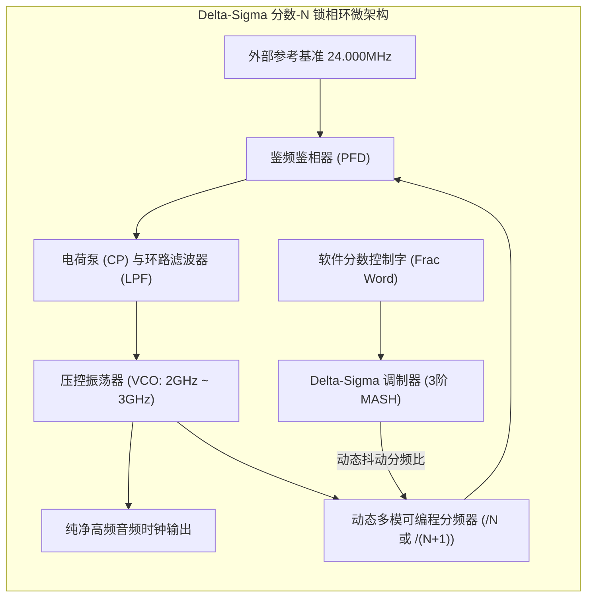

# 01 双音频时钟基准与分数 PLL

## 1. 硬件解决什么问题：不可调和的两大音频采样率家族

在数字音频发展史上，形成了两大互不兼容的采样率阵营：
1. **48kHz 家族（专业音视频与广电阵营）**：$48\text{ kHz}, 96\text{ kHz}, 192\text{ kHz}, 384\text{ kHz}$（包括语音通信 $8\text{ kHz}, 16\text{ kHz}, 32\text{ kHz}$）。其最小公倍数时钟基准为 **$24.576\text{ MHz}$**（$48000 \times 512$）。
2. **44.1kHz 家族（消费级 CD 唱片阵营）**：$44.1\text{ kHz}, 88.2\text{ kHz}, 176.4\text{ kHz}$。其最小公倍数时钟基准为 **$22.5792\text{ MHz}$**（$44100 \times 512$）。

两大基频互为互质的小数关系（$\frac{24.576}{22.5792} = \frac{160}{147}$）。若系统仅提供一颗固定时钟（如普通电脑的 24.000MHz 或 19.2MHz），通过整数分频根本无法精确分出 44.1kHz（会产生 $44.1176\text{ kHz}$，产生严重的累积频偏与音调跑偏）。

---

## 2. 硬件微架构与组成：Fractional-N 分数 PLL 锁相环



### 分数分频数学原理
设 VCO 输出频率为 $f_{\text{VCO}}$，参考时钟为 $f_{\text{ref}}$。分频比表示为整数部分与分数部分之和：
$$N_{\text{div}} = N_{\text{int}} + \frac{K}{2^M}$$
Delta-Sigma 调制器控制分频器在 $N_{\text{int}}$ 和 $N_{\text{int}} + 1$ 之间高速随机交替切换，使其统计平均分频比精确等于目标分数，同时将分频跳步产生的相位误差推向高频，由环路低通滤波器（LPF）彻底吸收滤除。

---

## 3. 软件可见接口：音频 PLL 寄存器配置

```c
// 音频 PLL 模式与分频控制寄存器: AUDIO_PLL_CFG (Offset: 0x0010)
#define REG_AUDIO_PLL_CFG        (*(volatile uint32_t *)(PLL_BASE + 0x0010))
#define PLL_INT_DIV(val)          (((val) & 0xFF) << 0)   // 整数分频比 N_int
#define PLL_FRAC_DIV(val)         (((val) & 0xFFFFFF) << 8)// 24-bit 精度分数字 K
#define PLL_LOCK_STATUS           (1U << 31)              // 1: 锁相环已锁定稳定
```

---

## 4. 四流全链路分析：无毛刺时钟切换流（Glitch-free MUX）

当用户上一首歌曲是 44.1kHz（Flac CD 抓轨），下一首切到 96kHz（Hi-Res 电影原声）时：
1. **准备流**：软件唤醒并配置 PLL 1 锁定至 24.576MHz，等待锁定状态位置 1。
2. **无毛刺切换流（Glitch-free Switch）**：
   - 普通 MUX 直接切换会在输出端切出极窄的亚稳态“高频毛刺脉冲”（Glitch），导致下游寄存器时序违规。
   - 硬件采用两级反相交锁触发器，**必须等待当前旧时钟处于低电平期间先切断，再等待新时钟同样处于低电平期间才合闸使能**，确保时钟波形完整平滑。
3. **分频器复位流**：时钟切换完成后，同步发出一个脉冲复位下游的 BCLK/LRCK 计数器，保证两者的起始相位绝对对齐。

---

## 5. 软硬件设计约束

- **严禁采用普通脉冲吞吐（Pulse-Swallowing）分频器**：脉冲吞吐会引入巨大的周期跳步抖动（数百皮秒），直接导致 DAC 模拟输出谐波失真严重劣化。
- **独立硬件双晶振方案**：在极致发烧级音频设计中（如独立 HiFi 播放器），工程师甚至拒绝使用单晶振分数 PLL，而是直接在板上焊接两颗超低相噪独立温补晶振（TCXO：24.576MHz 与 22.5792MHz），从物理源头上消灭分数合成误差。
