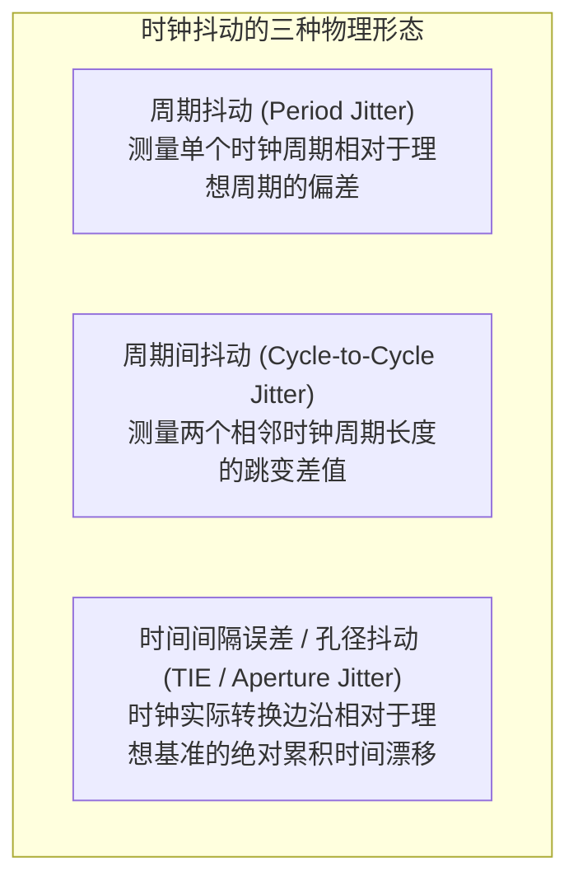

# 02 时钟抖动 Jitter 与相位噪声分析

## 1. 硬件解决什么问题：时钟抖动如何转化为可闻模拟音频失真

在纯数字电路中，时钟只需要满足在时钟沿到达时数据已经稳定建立。然而在音频 ADC 和 DAC 中，**时钟在时间轴上的任何微小偏移，都会直接被投影为电压轴上的误差**。

设输入音频信号为 $V(t) = A \sin(2\pi f_{\text{in}} t)$，若采样时钟存在时间抖动 $\Delta t$：
$$\Delta V = \frac{dV(t)}{dt} \cdot \Delta t = 2\pi f_{\text{in}} A \cos(2\pi f_{\text{in}} t) \cdot \Delta t$$
由此可见：**信号频率 $f_{\text{in}}$ 越高、抖动 $\Delta t$ 越大，产生的电压误差 $\Delta V$ 越巨大！**

---

## 2. 硬件微架构与组成：时钟抖动三大分类

### 孔径抖动（Aperture Jitter）对 ADC 转换的致命影响
- 在 ADC 内部采样保持电路（Track-and-Hold）断开的一瞬间，开关断开时刻的不确定性被称为**孔径抖动 $t_j$**；
- 无论 ADC 内部比较器分辨率多高，由孔径抖动引入的电压噪声将彻底锁死信噪比上限。

---

## 3. 理论信噪比天花板数学推导

设时钟的均方根时间抖动为 $t_j$（RMS Jitter），输入纯正弦信号频率为 $f_{\text{in}}$。由抖动引入的均方根电压误差为：
$$V_{\text{error, rms}} = 2\pi f_{\text{in}} V_{\text{rms}} t_j$$
由此推导出**仅由时钟抖动决定的最大理论信噪比（SNR）公式**：
$$\text{SNR}_{\text{jitter}} = 20 \log_{10} \left( \frac{V_{\text{rms}}}{V_{\text{error, rms}}} \right) = -20 \log_{10} (2\pi f_{\text{in}} t_j)$$

### 极限参数计算推演
设音频高频信号频率 $f_{\text{in}} = 20\text{ kHz}$：
- 若时钟抖动 $t_j = 1\text{ ns}$（常见于劣质系统时钟）：
  $$\text{SNR} = -20 \log_{10}(2\pi \times 20000 \times 10^{-9}) = -20 \log_{10}(0.00012566) \approx \mathbf{78.0\text{ dB}}$$
  **推论**：此时哪怕你采购了 24-bit 的顶级 DAC 芯片，整机实测信噪比甚至不如最廉价的 16-bit Codec！
- 若优化时钟树将抖动压至 $t_j = 10\text{ ps}$ RMS（专业级音频 PLL）：
  $$\text{SNR} = -20 \log_{10}(2\pi \times 20000 \times 10 \times 10^{-12}) \approx \mathbf{118.0\text{ dB}}$$
  方能真正发挥 24-bit 高保真音频的极致解析力。

---

## 4. 软硬件设计约束

- **禁止在音频时钟路径上串接通用 GPIO 复用引脚**：GPIO 的上拉电阻与施密特触发器存在明显的电源噪声调制，会引入严重的确定性抖动（DJ）。音频主时钟（MCLK）必须采用芯片专有的模拟低抖动时钟引脚直出。
