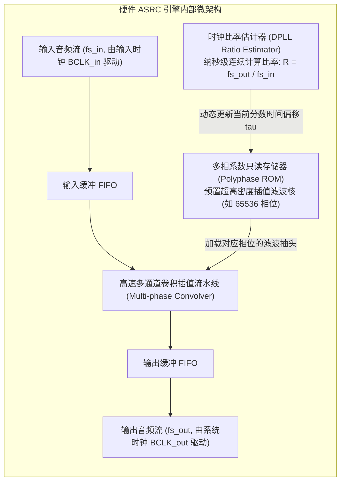

# 03 异步采样率转换 ASRC 硬件架构

## 1. 硬件解决什么问题：跨独立晶振系统的数字音频混音

在现代智能座舱或手机系统中，经常需要将来自不同物理设备的音频进行并发混合：
- 车机蓝牙电话输入：采样率由远端手机决定（标称 16kHz，实际由于晶振偏差为 15.998kHz）；
- 车辆本地导航提示音：由车机主控播放（标称 48kHz，基于车机晶振）；
- USB 音乐播放：基于外部 U 盘设备的声卡时钟。

由于各设备的物理晶振彼此独立，**即使标称采样率完全一致，也存在微小的晶振频率漂移（Clock Drift，通常 $\pm 50\text{ ppm}$）**。
若直接在软件中拷贝样点混音，每隔几秒钟就会因为数据产生速度与消费速度的不平衡，爆发一次严重的缓冲区溢出丢点或欠载断音！

**异步采样率转换器（ASRC, Asynchronous Sample Rate Converter）**在无需主系统介入的情况下，在全数字域完成任意非整数倍比率的时钟漂移追踪与无损重采样。

---

## 2. 硬件微架构与组成：ASRC 多相滤波与时钟比率估计引擎



---

## 3. 软件可见接口：ASRC 控制与比率状态寄存器

```c
// ASRC 状态与比率读取寄存器: ASRC_RATIO_STAT (Offset: 0x0140)
#define REG_ASRC_RATIO_STAT      (*(volatile uint32_t *)(ASRC_BASE + 0x0140))
// 读出的 32 位定点数值表示当前测得的时钟比率 (Q6.26 格式)
#define GET_ASRC_RATIO(val)       ((double)(val) / (double)(1U << 26))

// ASRC 锁相滤波速度配置: ASRC_CFG (Offset: 0x0144)
#define REG_ASRC_CFG             (*(volatile uint32_t *)(ASRC_BASE + 0x0144))
#define ASRC_TRACK_FAST           (0U << 4) // 快速跟踪 (适用于开机快速锁定)
#define ASRC_TRACK_SLOW           (2U << 4) // 极慢平滑滤波 (阻断抖动穿透)
```

---

## 4. 四流全链路分析：多相插值数学推算流

1. **时钟比率积分流**：数字锁相环（DPLL）以数百兆赫兹的内部基频计数器同时统计输入时钟沿与输出时钟沿的时间差，输出瞬时时间偏移：
   $$\tau = t_{\text{out}} - t_{\text{in, k}}$$
2. **多相索引寻址流**：将 $\tau$ 映射到多相滤波器组的子滤波器索引（Sub-filter Phase Index）：
   $$p = \text{floor}(\tau \times 65536)$$
3. **卷积插值计算流**：硬件从 ROM 中提取第 $p$ 相位的 64 个 FIR 抽头系数，与输入 FIFO 中的样点进行定点 MAC 卷积：
   $$y(t_{\text{out}}) = \sum_{m=-31}^{32} h[p, m] \cdot x[k - m]$$
4. **无缝输出流**：计算得到的音频新样点以绝对平滑的步调注入系统下行链路，**THD+N 抑制比高达 $-130\text{ dB}$，完全无任何可闻频响失真**。

---

## 5. 软硬件设计约束

- **DPLL 环路带宽约束（Loop Bandwidth）**：比率估计器的低通滤波带宽必须极低（通常 $< 1\text{ Hz}$）。如果估计器响应太快，它会将输入时钟本身的瞬态时基抖动（Jitter）误当做采样率漂移进行跟踪重采样，从而将物理时钟抖动固化为音频中的谐波失真。
