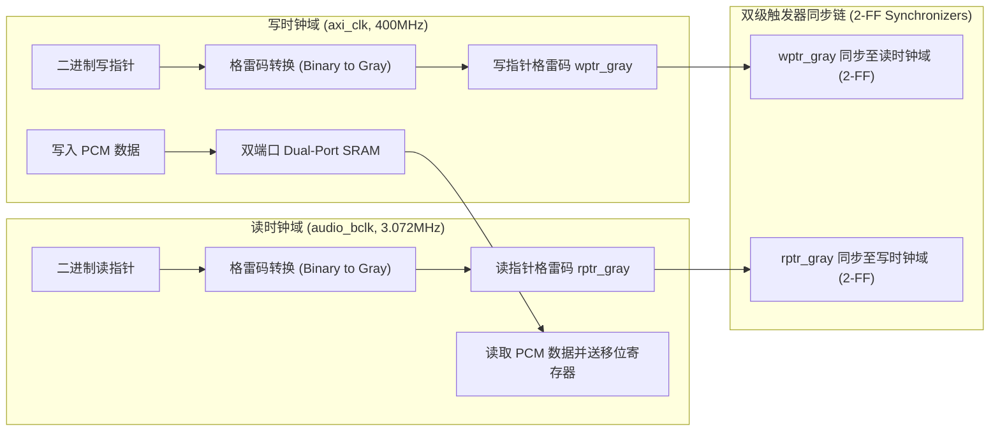

# 04 跨时钟域 CDC 与异步隔离

## 1. 硬件解决什么问题：亚稳态对音频采样数据的彻底毁灭

音频子系统中存在两个物理来源完全不同、没有任何相位关联的异步时钟域：
1. **系统总线时钟域（AXI / AHB Clock）**：频率通常为 $200\text{ MHz} \sim 800\text{ MHz}$，由系统主 PLL 生成。
2. **音频位时钟域（Audio BCLK）**：频率通常为 $1.536\text{ MHz} \sim 24.576\text{ MHz}$，由专用音频 PLL 生成。

当数据或控制信号跨越这两个异步时钟域时，若信号跳变正好落在目标时钟的建立/保持时间窗口内，接收端触发器将陷入**亚稳态（Metastability）**，导致寄存器在 0 和 1 之间剧烈震荡并输出随机伪电平。

---

## 2. 硬件微架构与组成：格雷码双端口异步 FIFO



### 为什么必须使用格雷码（Gray Code）？
- 普通二进制计数器在进位时会有**多个 bit 同时翻转**（例如从 `0111` (7) 变到 `1000` (8)，4 个 bit 全部反转）。由于走线物理延迟差异，同步器在采样中间态时可能捕获到 `0000` 或 `1111` 等荒谬数值，导致空满判断严重崩溃。
- **格雷码的核心特性**：相邻两组编码之间，**有且仅有 1 个 bit 发生状态跳变**（如 7: `0100` -> 8: `1100`）。即使同步器正好在边沿发生亚稳态，其采样结果要么是跳变前的值、要么是跳变后的值，绝对不会产生第三种未知畸变。

---

## 3. 硬件 RTL 关键设计代码：双触发器同步与格雷码

```verilog
// 经典格雷码异步 FIFO 读时钟域指针同步逻辑 (Verilog-2001)
module cdc_gray_sync #(parameter ADDR_WIDTH = 6) (
    input  wire                  clk_dst,
    input  wire                  rst_n,
    input  wire [ADDR_WIDTH:0]   async_gray_in,
    output reg  [ADDR_WIDTH:0]   sync_gray_out
);
    reg [ADDR_WIDTH:0] sync_stage1;

    // 两级级联触发器消除亚稳态 (MTBF > 1000 年)
    always @(posedge clk_dst or negedge rst_n) begin
        if (!rst_n) begin
            sync_stage1   <= {(ADDR_WIDTH+1){1'b0}};
            sync_gray_out <= {(ADDR_WIDTH+1){1'b0}};
        end else begin
            sync_stage1   <= async_gray_in;
            sync_gray_out <= sync_stage1;
        end
    end
endmodule
```

---

## 4. 软硬件设计约束

- **平均无故障时间（MTBF）准则**：在 28nm 及以下工艺中，对于亚稳态同步器，其两级触发器物理放置必须由后端物理设计（PD）施加专有约束（`set_max_delay`），将两级寄存器并排紧邻摆放，走线延迟 $< 0.1\text{ ns}$，确保 MTBF 达到 $10^9$ 小时以上。
- **单 bit 脉冲展宽（Pulse Stretcher）**：当系统从高速时钟域（400MHz）向低速时钟域（3MHz）传递单个周期的脉冲控制信号时，低速时钟极易漏采该脉冲。**必须采用电平翻转握手（Toggle Handshake）或脉冲展宽逻辑**，将脉冲拉长至至少 2 个低速时钟周期。
