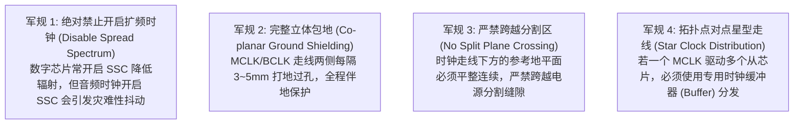

# 05 音频时钟树布线与屏蔽规范

## 1. 硬件解决什么问题：高频时钟对外电磁辐射与抗干扰走线规范

在 SoC 板级系统设计中，音频主时钟（MCLK，通常 12.288MHz 或 24.576MHz）往往是整块电路板上最主要的电磁辐射发射源之一。其陡峭方波的高次谐波不仅会破坏产品 EMC 认证，而且其回流路径若穿过敏感模拟区，将直接调制模拟基底产生底噪。

---

## 2. 音频时钟布线四大军规

---

## 3. 为什么严禁对音频时钟开启扩频（Spread Spectrum Clocking）？
- **普通数字芯片的做法**：为了通过 FCC/CE 的电磁兼容（EMC）测试，主板通常会对 CPU/DDR 时钟开启 $\pm 0.5\%$ 的扩频调制（SSC），将集中在单个频点的电磁辐射峰值在频域上“抹平”。
- **音频的灭顶之灾**：扩频调制在物理上就是一种**人为强加的周期性时钟抖动**（频率通常为 30kHz 三角波调制）。当这个时钟驱动 Sigma-Delta DAC 时，30kHz 的调制波与音频基波发生严重的互调失真（IMD），在音频带内激发出密集的啸叫峰值，使 THD+N 直接恶化 40dB 以上！
- **原厂铁律**：**所有供给音频子系统、Codec 与外挂功放的时钟源，必须在寄存器中永久强制关闭 SSC 功能！**
