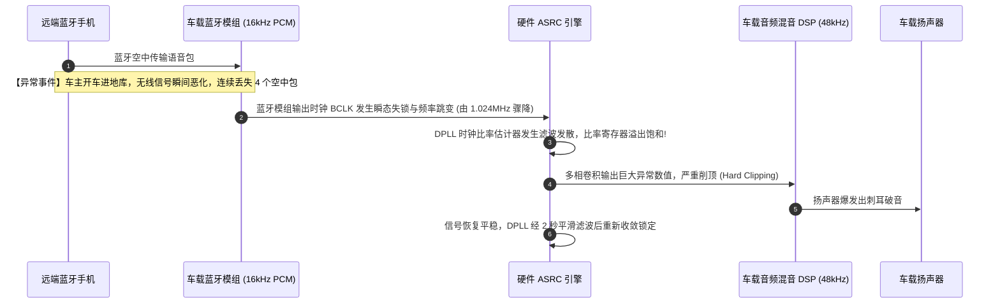

# 06 ASRC 采样率失锁破音案例

## 1. 案例背景：车载蓝牙电话与导航混音时爆发剧烈爆音

在某款智能座舱量产前夕的实车测试中，测试员报告了一个严重的偶发声学缺陷：
当用户手机通过蓝牙 Hands-Free 协议（HFP 16kHz mSBC 编码）进行通话，同时车机中控导航（48kHz 语音播报）切入播报前方路况时，扬声器中会突然爆发出一阵极度刺耳的“嘎啦嘎啦”剧烈金属破音，持续约 2 秒钟后才缓慢自行恢复正常。

---

## 2. 调试定位全过程与寄存器抓取



### 深入分析排查步骤

1. **ASRC 比率寄存器实时打点**：
   - 在爆音发生的一瞬间，读取寄存器 `REG_ASRC_RATIO_STAT`：
   - 正常比率值应稳定在 $R = \frac{48000}{16000} = 3.000000$（Q6.26 读数约为 `0x0C000000`）；
   - 而在爆音瞬间，读数竟然跳变到了 `0x3F800000`（比率异常飙升至近 15.8！），随后几秒钟缓慢滑落。
2. **时钟信号捕获**：
   - 示波器抓取蓝牙模组送给 ASRC 的 BCLK 引脚：发现由于弱信号丢包，蓝牙模组内部 PLL 重启失锁，导致 BCLK 在 50 微秒内完全停止翻转。
   - ASRC 硬件内部的 DPLL 在输入时钟断流时，时间差计数器直接除以接近 0 的数值，引发了**数字除零异常与滤波器状态机数值溢出发散**。

---

## 3. 根因剖析（Root Cause）

1. **硬件 ASRC 缺少时钟丢失快速检测与静音保护回路（Clock-Loss Detector）**：当输入采样时钟停止时，ASRC 没有立即冻结比率估计并开启自动静音，而是任由发散的比率去寻址错误的多相滤波系数。
2. **DPLL 环路参数过于激进**：配置了 `ASRC_TRACK_FAST`，导致外界输入一有风吹草动便剧烈震荡。

---

## 4. 解决方案与修复代码

### 1. 软件驱动加固：使能硬件时钟容错检测
修改 ASRC 初始化代码，开启时钟异常看门狗与输入防抖：

```c
void asrc_init_fault_tolerant(void __iomem *asrc_base)
{
    // 1. 设置 DPLL 跟踪速度为 Ultra-Slow (超平滑模式，抑制瞬态跳变)
    writel(ASRC_TRACK_SLOW | ASRC_RATIO_CHANGE_LIMIT_EN, asrc_base + REG_ASRC_CFG);

    // 2. 使能硬件时钟监控看门狗: 若连续 16 个周期未检测到输入 BCLK，硬件自动锁定为最近一次正常比率并淡出静音
    writel(CLK_LOSS_AUTO_MUTE_EN | CLK_LOSS_THRESH_16, asrc_base + REG_ASRC_CLK_LOSS_CTRL);

    // 3. 限制单次比率调整最大跳步斜率 (Slew-rate Limiter)
    writel(0x00000100, asrc_base + REG_ASRC_RATIO_MAX_SLEW);
}
```

---

## 5. 验证结果

模拟断开蓝牙射频天线造成强制丢包，ASRC 在时钟异常瞬间平滑淡出，未产生任何破音与尖叫，信号恢复后在 50ms 内平稳淡入，缺陷彻底根除。
