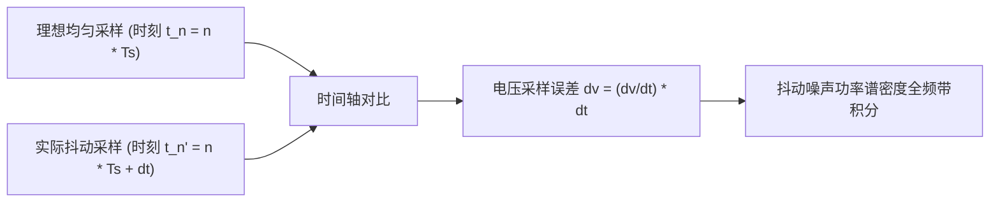

# 07 孔径抖动对高保真 DAC 极限推导

## 1. 硬件解决什么问题：时钟抖动对高解析度音频的物理性能禁锢

在音频系统的元器件选型中，很多工程师花费高昂成本采购了标称信噪比达 $125\text{ dB}$ 的顶级 DAC 芯片，然而在实板上测试却往往只能测得 $105\text{ dB} \sim 110\text{ dB}$。

其中最普遍的罪魁祸首正是**未在系统层面对时钟孔径抖动进行严密的预算分解**。

---

## 2. 严密数学推演与公式推导

设满量程纯正弦波输入信号为：
$$x(t) = V_{\text{FS}} \sin(2\pi f t)$$
信号最大电压变化率（斜率）出现在过零点处：
$$\left| \frac{dx(t)}{dt} \right|_{\text{max}} = 2\pi f V_{\text{FS}}$$
设采样时钟的时间抖动是一个均值为零、标准差为 $\sigma_t$（即 RMS Jitter $t_j$）的高斯随机过程。
时钟抖动引入的时域电压误差方差为：
$$\sigma_v^2 = E\left[ \left( \frac{dx(t)}{dt} \cdot \Delta t \right)^2 \right] = E\left[ \left( \frac{dx(t)}{dt} \right)^2 \right] \cdot \sigma_t^2$$
对于正弦波，其导数的均方值为：
$$E\left[ \left( \frac{dx(t)}{dt} \right)^2 \right] = \frac{(2\pi f V_{\text{FS}})^2}{2} = 2\pi^2 f^2 V_{\text{FS}}^2$$
而原始正弦波信号本身的平均功率为：
$$P_{\text{signal}} = \frac{V_{\text{FS}}^2}{2}$$
由此计算理论信噪比（SNR）：
$$\text{SNR}_{\text{jitter}} = 10 \log_{10} \left( \frac{P_{\text{signal}}}{\sigma_v^2} \right) = 10 \log_{10} \left( \frac{V_{\text{FS}}^2 / 2}{2\pi^2 f^2 V_{\text{FS}}^2 \sigma_t^2} \right) = 10 \log_{10} \left( \frac{1}{4\pi^2 f^2 \sigma_t^2} \right)$$
$$= -20 \log_{10} (2\pi f \sigma_t)$$

---

## 3. 抖动预算分配矩阵（在 $f = 20\text{ kHz}$ 高频端）

下表给出了在音频最高可闻频率（20kHz）下，不同目标信噪比对时钟 RMS 抖动的**绝对物理容限指标**：

| 目标系统信噪比 (SNR) | 允许的最大时钟抖动上限 (RMS Jitter $t_j$) | 对应的物理时钟实现难度与方案 |
| :--- | :--- | :--- |
| **96 dB (16-bit CD 品质)** | **$126.1\text{ ps}$** | 普通系统 PLL 或通用数字分频器即可轻松满足 |
| **108 dB (中端 Codec 水平)** | **$31.7\text{ ps}$** | 专有音频分数 PLL，需严格滤波设计 |
| **115 dB (高端车载与手机)** | **$14.1\text{ ps}$** | 超低相噪音频 PLL + 独立 LDO 纯净供电 |
| **120 dB (发烧级 HiFi)** | **$7.96\text{ ps}$** | 必须采用超高 Q 值专用音频温补晶振（TCXO） |
| **130 dB (专业录音棚声卡)** | **$2.52\text{ ps}$** | 昂贵的飞秒级恒温晶振（OCXO）与独立时钟分配芯片 |

---

## 4. 架构设计指导准则

推论：**如果芯片团队无法将片上音频 PLL 的闭环综合抖动压制到 15ps RMS 以下，那么研发团队在模拟前端宣称支持大于 115dB 的 24-bit 动态范围就是不切实际的空想。**
架构师在流片初期，必须首先对时钟源的相位噪声谱密度（Phase Noise PSD）进行积分仿真，确保时间抖动满足上述预算。
