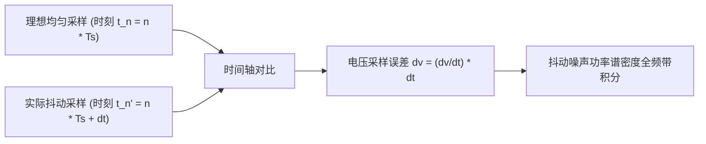

# 07 孔径抖动对高保真 DAC 极限推导

## 1. 硬件解决什么问题：时钟抖动对高解析度音频的物理性能禁锢

如果标称信噪比为 $125\text{ dB}$ 的 DAC 在实板上仅测得 $105\text{ dB} \sim 110\text{ dB}$，应先核对测试频率、带宽、加权与负载是否一致，再排查电源、布局和时钟。

时钟孔径抖动是可能的限制之一。下面按满量程正弦与小误差模型估算它单独造成的 SNR 上限；推导前提可参见 [Analog Devices MT-007](https://www.analog.com/media/en/training-seminars/tutorials/mt-007.pdf)。把模型用于 DAC 时，还需检查具体转换器对时钟抖动的传递特性。

---

## 2. 严密数学推演与公式推导

```mermaid
graph LR
    IDEAL["理想均匀采样 (时刻 t_n = n * Ts)"] --> CMP["时间轴对比"]
    ACTUAL["实际抖动采样 (时刻 t_n' = n * Ts + dt)"] --> CMP
    CMP --> DELTA_V["电压采样误差 dv = (dv/dt) * dt"]
    DELTA_V --> NOISE_PWR["抖动噪声功率谱密度全频带积分"]
```

设满量程纯正弦波输入信号为：
$$x(t) = V_{\text{FS}} \sin(2\pi f t)$$
信号最大电压变化率（斜率）出现在过零点处：
$$\left| \frac{dx(t)}{dt} \right|_{\text{max}} = 2\pi f V_{\text{FS}}$$
设采样时钟的时间抖动是一个均值为零、标准差为 $\sigma_t$（即 RMS Jitter $t_j$）的高斯随机过程。
时钟抖动引入的时域电压误差方差为：
$$\sigma_v^2 = E\left[ \left( \frac{dx(t)}{dt} \cdot \Delta t \right)^2 \right] = E\left[ \left( \frac{dx(t)}{dt} \right)^2 \right] \cdot \sigma_t^2$$
对于正弦波，其导数的均方值为：
$$E\left[ \left( \frac{dx(t)}{dt} \right)^2 \right] = \frac{(2\pi f V_{\text{FS}})^2}{2} = 2\pi^2 f^2 V_{\text{FS}}^2$$
而原始正弦波信号本身的平均功率为：
$$P_{\text{signal}} = \frac{V_{\text{FS}}^2}{2}$$
由此计算理论信噪比（SNR）：
$$\text{SNR}_{\text{jitter}} = 10 \log_{10} \left( \frac{P_{\text{signal}}}{\sigma_v^2} \right) = 10 \log_{10} \left( \frac{V_{\text{FS}}^2 / 2}{2\pi^2 f^2 V_{\text{FS}}^2 \sigma_t^2} \right) = 10 \log_{10} \left( \frac{1}{4\pi^2 f^2 \sigma_t^2} \right)$$
$$= -20 \log_{10} (2\pi f \sigma_t)$$

---

## 3. 抖动预算分配矩阵（在 $f = 20\text{ kHz}$ 高频端）

下表在 $20\text{ kHz}$ 正弦和上述模型下，将目标 SNR 换算为 RMS 抖动预算。实现方案仅供评估，并非某种 SNR 必须采用的器件类型。

| 目标系统信噪比 (SNR) | 允许的最大时钟抖动上限 (RMS Jitter $t_j$) | 对应的物理时钟实现难度与方案 |
| :--- | :--- | :--- |
| **96 dB (16-bit CD 品质)** | **$126.1\text{ ps}$** | 可评估系统 PLL 或数字分频方案，并测量输出抖动 |
| **108 dB (中端 Codec 水平)** | **$31.7\text{ ps}$** | 专有音频分数 PLL，需严格滤波设计 |
| **115 dB (高端车载与手机)** | **$14.1\text{ ps}$** | 超低相噪音频 PLL + 独立 LDO 纯净供电 |
| **120 dB (发烧级 HiFi)** | **$7.96\text{ ps}$** | 可评估低抖动时钟源与分配链路，TCXO 是候选方案之一 |
| **130 dB (专业录音棚声卡)** | **$2.52\text{ ps}$** | 需检查时钟源、分配及转换器内部抖动，不能仅凭 OCXO 类型判断 |

---

## 4. 架构设计指导准则

推论：在本例 $20\text{ kHz}$ 正弦模型中，115dB 的抖动 SNR 对应约 14.1ps RMS；15ps 的预算不满足这一特定目标。但这不能直接否定器件在其他输入频率、带宽或测试方式下的动态范围指标。
设计时可对相位噪声谱密度（Phase Noise PSD）在规定偏移频率范围内积分，并结合转换器内部抖动与板级测量分配预算。
